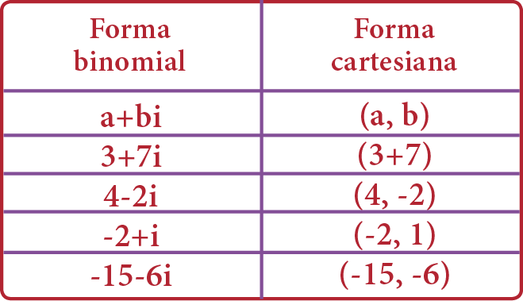
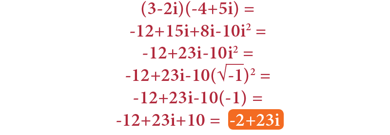
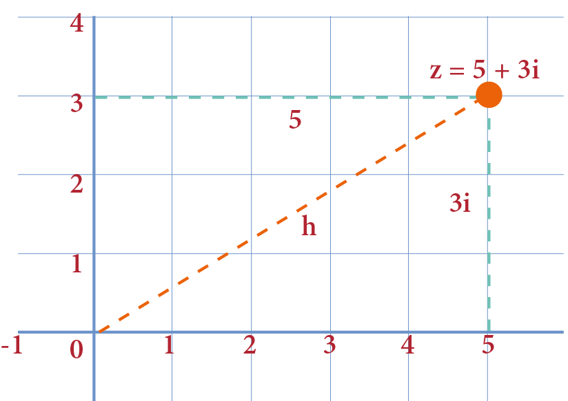
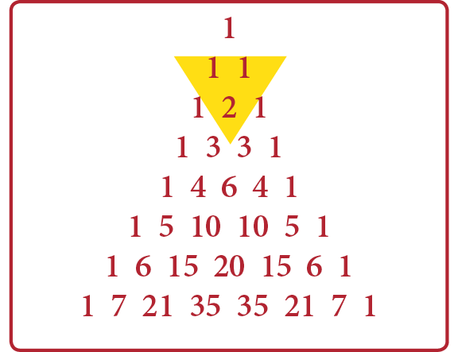
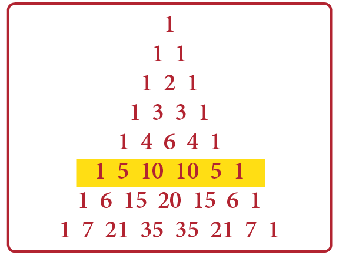
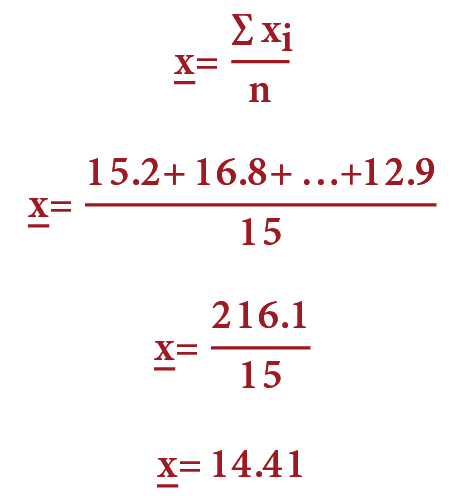
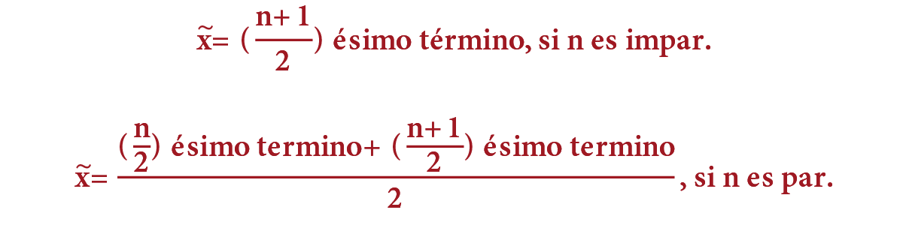
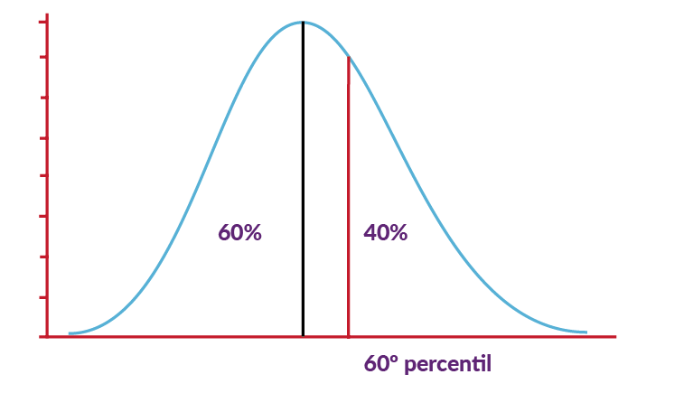
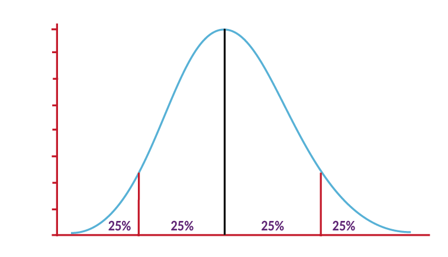

# Guía CENEVAL EXANI-II: Pensamiento matemático (Parte 1 de 12)

_Parte 1 de 12 de la serie Guía CENEVAL EXANI-II._

## Razonamiento algebraico

### Conocimientos básicos de álgebra

Álgebra proviene del árabe *al-ŷabar* y significa ecuación o restauración, y en latín, reducción.

علم الجبر (*al-ŷabar*) ecuación o restauración.

En sí, es una rama de las Matemáticas que utiliza números, letras y signos para formular operaciones con números desconocidos, llamados incógnitas.

### Monomios, binomios, trinomios y polinomios

Comencemos por aprender a reconocer las siguientes expresiones, utilizadas para cualquier operación algebraica: los **monomios, binomios, trinomios y polinomios**.

El **monomio** tiene un sólo término:

No importa cuántas letras tengamos siempre y cuando sea un sólo término.

También están los **binomios** que, como su nombre lo denota, tienen dos términos:

Un **trinomio** tiene tres términos, por ejemplo:

Por último, tenemos a los polinomios con más de tres términos:

Una expresión algebraica no sólo combina operaciones de suma y resta, ya que también mezcla la multiplicación, división, potencia y raíz.

Por ejemplo:

### Términos semejantes

Decimos que dos o más términos son semejantes cuando sus respectivas partes literales son idénticas.

Los términos 7x²y³ y −8x²y³ son semejantes porque sus partes literales son idénticas.

En el ejemplo, puedes ver que los términos no son semejantes, porque, aunque las letras son las mismas, los exponentes afectan a letras diferentes.

Recuerda que las partes literales deben ser idénticas, de lo contrario, los términos no serán semejantes.

−2a³b⁴ y 5a⁴b³ no son semejantes, porque los exponentes están en letras diferentes.

Es muy importante que observemos las expresiones algebraicas antes de definir si dos o más términos son semejantes. Recuerda que las literales, es decir, las letras, tienen que estar acomodadas en orden alfabético. −3bxa² = −3a²bx

¿Por qué hablamos de los términos semejantes?

En una operación algebraica, es muy común que encontremos términos semejantes, y para simplificar la expresión resultante, es necesario **reducir los términos semejantes**.

Pensemos en la expresión algebraica 5x+3y−2z+9x−4y+5z.

Es claramente una expresión larga y difícil de operar, ahora pensemos que, si reducimos términos semejantes, tendremos una expresión más corta y sencilla de operar.

De esta manera, obtendremos una expresión más corta y fácil de entender.

Únicamente, tenemos que sumar algebraicamente los términos semejantes, es decir, sumar los términos con x, los términos con y, y los términos con z.

5x+9x+3y−4y−2z+5z =

14x−y+3z

**Ejemplo:**

Simplificar 9a³b²c−5a²bc²−12a³b²c+3a²bc²+4a³b²c =

**Solución:**

9a³b²c−5a²bc²−12a³b²c+3a²bc²+4a³b²c =

Podemos acomodarlos juntos, para verlos más fácil.

9a³b²c−12a³b²c+4a³b²c−5a²bc²+3a²bc² =

a³b²c−2a²bc²

Recuerda que para que sean términos semejantes, la parte literal de los términos tiene que ser idéntica.

### Valor numérico

Podemos obtener el valor numérico de todo tipo de expresión algebraica, para ello se sustituyen las literales por un valor determinado y se realizan las operaciones aritméticas.

Por ejemplo, obtén el valor numérico de:

Si a = −1 y b = 2.

Primero se sustituyen los valores:

Se realizan las operaciones correspondientes:

Esto es igual a:

En este caso, la fracción no se puede simplificar, por lo tanto el valor numérico de la expresión algebraica es ese resultado.

### Operaciones con polinomios

Cuando se requiere simplificar o desarrollar una expresión polinómica podemos efectuar las operaciones de suma, resta, multiplicación y división.

**Multiplicación de expresiones algebraicas**

Para comenzar multipliquemos un monomio por un monomio:

Al multiplicar mismas variables sus exponentes se suman:

Ahora multipliquemos un monomio por un binomio:

Al multiplicar un monomio por cualquier polinomio es necesario distribuir este factor en cada uno de los términos de dicho polinomio resultando:

Ahora multipliquemos un polinomio por un polinomio:

En este caso, cada uno de los términos del binomio se multiplica por cada uno de los términos del polinomio. Al multiplicar el primer término obtendremos:

Y, al multiplicar el segundo término, obtenemos:

**División de expresiones algebraicas**

La división más sencilla es entre dos monomios, por ejemplo:

Aquí tan sólo hace falta recordar las leyes de los exponentes: el denominador sube como numerador cambiando el signo de su exponente y al multiplicarse con su numerador se suman los exponentes, el resultado es:

Otro caso es el de polinomios entre monomios, dividamos:

Vemos que el denominador se puede distribuir entre los términos del numerador, por lo tanto esta división resulta de la suma de divisiones de monomios dividiendo uno por uno:

Finalmente, tenemos el caso de la división de polinomios, este proceso es muy parecido a la división aritmética y se mostrará al resolver el siguiente ejercicio:

Primero se pone el numerador entre la caja divisora o galera y el denominador se pone afuera, entonces se toma el primer término del dividendo y se divide entre el primer término del divisor, éste es el primer valor del cociente:

Se multiplica por todo el denominador y el resultado se coloca dentro de la galera, pero con signo opuesto:

Al realizar la suma algebraica, vemos que las x se restan, y que 2x − 3x es igual a −x. A continuación, se baja el 12, y tendremos un residuo parcial, que será −x−12.

Luego se toma el primer término del residuo, se divide entre el primer término del divisor, el resultado es −1 y se pone en el cociente, se multiplica por x+3 y el resultado −x−3 se pone debajo de −x−12 con signo opuesto; se realiza la suma algebraica y la x se resta.

Al existir un residuo, éste se considera como parte de la respuesta.

La división de x²+2x−12 entre x+3 es igual al cociente x−1 más el residuo, que se expresa como la fracción. El resultado se expresa como:

### Números imaginarios

Un número imaginario es el que proviene de obtener la raíz cuadrada de un número negativo. Probablemente esto te suene extraño, pero en realidad es muy fácil de entender.

Pensemos que, para obtener una raíz cuadrada, tenemos que pensar en un número que, multiplicado por sí mismo dos veces da como resultado el radicando, por lo que, por ejemplo, la raíz cuadrada de 49 es 7. Porque si multiplicamos:

(7)(7) = 49

Fácil, ¿verdad? Pero ahora, tenemos que pensar en algunos detalles finos de la raíz cuadrada. El primero, una raíz cuadrada tiene dos resultados, uno positivo y uno negativo. Entonces, al obtener la raíz cuadrada de 49 tendremos que sus raíces son +7 y −7. Pues al multiplicar (7)(7) = 49, y lo mismo sucede al elevar (−7)².

El segundo detalle, es que no pueden obtenerse las raíces cuadradas de números negativos, pues como vimos en el ejemplo pasado, si elevamos al cuadrado un número negativo, por la ley de signos, al multiplicarlo se vuelve positivo.

Es aquí cuando entran los números imaginarios. Como lo mencionamos al principio, un número imaginario proviene de la raíz cuadrada de un número negativo. Para obtener dicha raíz, utilizamos las leyes de los radicales.

Sabemos que un radicando puede separarse por factores, de esta manera, si queremos obtener una raíz imaginaria, separamos el número de su signo negativo:

Las leyes de radicales nos dicen que podemos separar la raíz de una multiplicación en la raíz de cada uno de los factores:

Podemos evaluar:

como no podemos obtener:

la dejamos expresada:

Sustituimos la raíz cuadrada de menos uno por la letra i, y ¡listo! Tenemos una raíz imaginaria.

±7i

De ahora en adelante, sabemos que:

La i, como cualquier número, puede operarse.

También podemos multiplicar y dividir números imaginarios, sólo tenemos que conocer las leyes de los radicales.

**Ejemplo:** Multiplicar

**Solución:** Por leyes de radicales, sabemos que podemos unir ambas raíces en una sola raíz, siempre que el índice de la raíz sea igual.

### Números complejos

Un número complejo se forma de sumar un número real con un número imaginario.

a+bi

Existen dos maneras de representar un número complejo, la primera, es en su forma binomial, en la que se representa la suma algebraica de la parte real con la parte imaginaria.

La segunda forma se llama forma cartesiana, el número complejo se representa como una pareja ordenada, donde el eje de las abscisas le pertenece a la parte real, y el eje de las ordenadas pertenece a la parte imaginaria. Lógicamente, un número complejo puede representarse en un plano cartesiano.

Los números complejos pueden operarse. Para sumarlos y restarlos, simplemente es necesario reducir términos semejantes.

**Ejemplo:** Reducir (−5−4i) − (−6+i).

**Solución:**

(−5−4i) − (−6+i) =

−5−4i+6−i =

−5+6−4i−i = 1−5i

Al multiplicar números complejos, únicamente debemos recordar las reglas básicas de la multiplicación de polinomios, pero también deberemos recordar que, al elevar i, puede convertirse en un número real.

**Ejemplo:** Multiplicar (3−2i)(−4+5i).

**Solución:**

Recordemos también que un número complejo puede representarse por medio del plano cartesiano. El eje de las abscisas le corresponde a la parte real, y el eje de las ordenadas corresponde a la parte imaginaria. La magnitud de un número complejo se obtiene trazando un segmento que vaya desde el origen a la coordenada del número complejo.

## Productos notables y factorización

Un producto notable es una multiplicación algebraica que, por sus características, puede resolverse sin necesidad de hacer todo el procedimiento de multiplicación.

### Binomio al cuadrado

Es muy fácil identificar un binomio al cuadrado, pues, como su nombre lo indica, es un binomio elevado a la dos.

(a+b)²

Para desarrollar un binomio al cuadrado, podemos aprendernos fácilmente su fórmula: **el primero al cuadrado, más o menos dos veces el primero por el segundo, más el segundo al cuadrado.**

El primer término al cuadrado:

(a+b)² = a²

Más o menos:

(a+b)² = a²±

Dos veces el primero por el segundo:

(a+b)² = a²±2ab

Más el segundo término al cuadrado:

(a+b)² = a²±2ab+b²

**Ejemplo:** Elevar (x+5)².

**Solución:**

El primer término al cuadrado:

(x+5)² = x²

Como es una suma, pondremos el signo +:

(x+5)² = x²+

Dos veces el primero por el segundo:

(x+5)² = x²+2(x)(5)

(x+5)² = x²+10x

Más el segundo al cuadrado:

(x+5)² = x²+10x+25

**Ejemplo:** Elevar (a−4)².

**Solución:**

El primero al cuadrado:

(a−4)² = a²

Menos:

(a−4)² = a²−

Dos veces el primero por el segundo:

(a−4)² = a²−2(a)(4)

(a−4)² = a²−8a

Más el segundo al cuadrado:

(a−4)² = a²−8a+16

El resultado de elevar un binomio al cuadrado se llama trinomio cuadrado perfecto.

(a+b)² = a²±2ab+b²

*Binomio al cuadrado → Trinomio cuadrado perfecto*

### Binomios conjugados

Cuando tenemos la multiplicación de la suma de dos números por la resta de los mismos números, se dice que tenemos binomios conjugados.

(a+b)(a−b)

Para multiplicar binomios conjugados, tomamos como referencia a la resta. El resultado será el primer término al cuadrado menos el segundo término al cuadrado.

(a+b)(a−b) = a²−b²

**Ejemplo:** Multiplicar (x²+3)(x²−3).

**Solución:**

El primero al cuadrado menos el segundo al cuadrado.

(x²+3)(x²−3) = x⁴−9

El resultado de multiplicar binomios conjugados se conoce como diferencia de cuadrados.

(a+b)(a−b) = a²−b²

### Binomios con término común

Es la multiplicación de dos binomios en los que sólo hay un término igual.

Para multiplicarlos, utilizamos una fórmula muy sencilla. Primero, elevamos el término común al cuadrado.

(x+a)(x+b) = x²

Ahora, sumemos algebraicamente los términos no comunes. El resultado, se multiplica por el término común.

(x+a)(x+b) = x²+(a+b)x

Por último, se multiplican los términos no comunes, respetando la ley de los signos, y ¡hemos terminado!

(x+a)(x+b) = x²+(a+b)x+ab

**Ejemplo:** Multiplicar (x+5)(x+3).

**Solución:** Elevemos la x al cuadrado:

(x+5)(x+3) = x²

Sumemos +5+3, el resultado +8 lo multiplicamos por x:

(x+5)(x+3) = x²+(+5+3)x

(x+5)(x+3) = x²+8x

Multipliquemos (+5)(+3):

(x+5)(x+3) = x²+8x+(+5)(+3)

(x+5)(x+3) = x²+8x+15

Recuerda que la suma de los términos no comunes es una suma algebraica, por lo que podrás tener sumas o restas.

**Ejemplo:** Multiplicar (x+5)(x−9).

**Solución:** Elevar x²:

(x+5)(x−9) = x²

Sumar algebraicamente +5−9, el resultado se multiplica por x:

(x+5)(x−9) = x²+(+5−9)x

(x+5)(x−9) = x²−4x

Multiplicar (+5)(−9):

(x+5)(x−9) = x²−4x+(+5)(−9)

(x+5)(x−9) = x²−4x−45

### Binomio a la n

Elevar un binomio a cualquier potencia puede ser un proceso muy largo, pero si conocemos la **pirámide de Pascal**, podemos hacerlo de forma muy sencilla.

Una pirámide de Pascal es un triángulo de números, encabezado por el número 1 en la cima, después, por un par de unos en el segundo renglón, a partir del tercer renglón, cada número es la suma de los números que tiene arriba. Por ejemplo, en el tercer renglón, el 2 se obtiene de sumar los unos que tiene arriba. Esto aplica para todos los números de la pirámide.

Los extremos siempre serán el número 1.

Ahora ya sabemos armar una pirámide de Pascal, pero ¿para qué sirve? No te preocupes, en un momento la utilizaremos.

Elevemos el binomio (a−b)⁵.

Empecemos escribiendo el primer elemento, primero a⁵, luego a⁴, y así hasta llegar a a⁰. Dejemos un espacio medianamente grande entre los términos.

a⁵ a⁴ a³ a² a¹ a⁰

Ahora, hagamos lo mismo con el segundo término, pero al revés, empecemos desde b⁰ (b a la cero) hasta b⁵ (b a la quinta). Nos quedará una expresión así:

a⁵b⁰ a⁴b¹ a³b² a²b³ a¹b⁴ a⁰b⁵

¿Te acuerdas de la pirámide de Pascal? Pues ahora es su turno. Como estamos elevando un binomio a la quinta, iremos al quinto renglón de la pirámide, el segundo número de la pirámide siempre es igual al exponente al que estamos elevando. En la pirámide, podremos ver que el quinto renglón tiene los números 1, 5, 10, 10, 5 y 1.

Estos números los acomodaremos en la expresión que ya teníamos anteriormente, entonces, nos quedará:

1a⁵b⁰ 5a⁴b¹ 10a³b² 10a²b³ 5a¹b⁴ 1a⁰b⁵

El siguiente paso es sencillísimo, como estamos elevando una resta, pondremos alternados los signos de más y menos. Si el binomio fuera una suma, todos los signos serán positivos.

+1a⁵b⁰ − 5a⁴b¹ + 10a³b² − 10a²b³ + 5a¹b⁴ − 1a⁰b⁵

Hemos terminado, lo único que resta, es quitar los 1 que están multiplicando pues no son necesarios. Recordemos que elevar un número a la cero es igual a uno.

+1a⁵b⁰−5a⁴b¹+10a³b²−10a²b³+5a¹b⁴−1a⁰b⁵ =

a⁵−5a⁴b+10a³b²−10a²b³+5ab⁴−b⁵

### Factorización

La factorización es el proceso por el cual descomponemos una expresión algebraica en los factores que generan dicha expresión.

Básicamente, existen dos tipos de factorizaciones, las que tienen factor común y las que se obtienen identificando el producto notable. Estudiemos cada una.

**Factorización por factor común**

El factor común es la expresión algebraica contenida en todos los términos de un polinomio.

**Ejemplo:** Factorizar a²+2a.

**Solución:** El factor común es a, para factorizar, escribimos la a, posteriormente, abrimos un paréntesis:

a²+2a = a(

A continuación, dividimos cada término de nuestro polinomio entre el factor común, es decir, dividimos a²+2a entre el factor común. Al terminar la división, cerramos el paréntesis:

a²+2a = a(a+2)

**Ejemplo:** Factorizar 18mxy²−54m²x²y²+36my².

**Solución:** Para hallar el factor común, encontramos el máximo común divisor del 18, el 54 y el 36. Encontraremos que todos son divisibles entre 18, también encontramos que todos los términos del polinomio contienen my², por lo tanto, el factor común será 18my².

18mxy²−54m²x²y²+36my² = 18my²(

Al dividir la expresión algebraica entre el factor común, tendremos la expresión factorizada:

**Factorización por agrupación de términos**

A veces, para encontrar el factor común debemos hacer un paso extra, pues no es tan fácil observarlo.

**Ejemplo:** Factorizar ax+bx+ay+by.

**Solución:** Seguro ya notaste que no existe un factor común en todos los términos, pero si dividimos la expresión en dos mitades, la historia es diferente. Podremos notar que los primeros dos términos tienen a la x como factor común, y en la segunda mitad, el factor común es y.

ax+bx+ay+by =

Al factorizar las dos mitades, nos queda:

x(a+b)+y(a+b) =

Esta nueva expresión tiene un factor común, que es el paréntesis (a+b) y podemos factorizarlo. Para ello, escribimos el factor común una sola vez, y en el siguiente paréntesis, escribimos (x+y):

(a+b)(x+y)

**Factorización de productos notables**

En muchas ocasiones una expresión no tiene factor común, aun así, puede factorizarse si conocemos los productos notables. Estudiemos algunos casos.

**Trinomio cuadrado perfecto:**

Para factorizar un trinomio cuadrado perfecto, primero tenemos que identificarlo como tal. Para ello, debemos identificar, primero, que el primero y último términos del trinomio tengan raíz cuadrada entera. También debemos asegurarnos de que estos términos sean siempre positivos.

Prueba para identificar un trinomio cuadrado perfecto:

- Obtenemos las raíces del primer y del tercer término.
- Multiplicamos ambas raíces y multiplicamos el resultado por 2.
- Si el resultado es igual al término de en medio, el trinomio es cuadrado perfecto.

¿Cómo factorizar un TCP?

- Comprobar que la expresión sea TCP.
- Obtener las raíces del primer y tercer término.
- Obtener el signo del segundo término.
  - Si el signo es una suma, escribir la suma de las raíces obtenidas.
  - Si el signo es una resta, escribir la resta de las raíces obtenidas.
- Encerrar el resultado entre paréntesis y elevar al cuadrado.

**Ejemplo:** Factorizar x²+14x+49.

**Solución:** Comprobar que la expresión sea un TCP:

x²+14x+49 =

x 7

(x)(7)(2) = 14x

¡Sí es TCP!

Obtener las raíces del primer y tercer término:

x²+14x+49 = (x 7)

Obtener el signo del segundo término:

x²+14x+49 = (x+7)

Encerrar el binomio entre paréntesis y elevar al cuadrado:

x²+14x+49 = (x+7)²

**Diferencia de cuadrados**

Es muy fácil identificar una diferencia de cuadrados, primero, como su nombre lo dice, es una diferencia, es decir, una resta y, por último, es una diferencia de cuadrados porque los números que se restan están elevados a la potencia 2.

¿Cómo identificar una diferencia de cuadrados?

Como lo dice su nombre, una diferencia es una resta.

Una diferencia de cuadrados se factoriza como binomios conjugados. Abrimos dos paréntesis. En el primero, ponemos la raíz del primer término más la raíz del segundo término, en el segundo hacemos lo mismo, pero usando una resta.

a²−b² = (a+b)(a−b)

**Ejemplo:** Factorizar x²−25.

**Solución:** Se escribe la raíz del primer término más la raíz del segundo, por la resta de las mismas raíces:

x²−25 = (x+5)(x−5)

**Factorización de trinomios de la forma ax²+bx+c**

Cuando el trinomio no puede factorizarse como un TCP, podemos utilizar este método, conocido como el método de las tijeras.

**Ejemplo:** Factorizar

**Solución:**

Debajo de la primera columna, escribamos dos números que multiplicados den x², hagamos lo mismo para la tercera columna, busquemos dos números que multiplicados den 14:

Tracemos cuatro flechas, como se muestra a continuación:

Multipliquemos los factores obtenidos, siguiendo el sentido de las flechas, primero, multipliquemos x por 2, y luego x por 7, el resultado se pondrá donde indiquen las flechas de la derecha:

Observemos que el último término tiene signo de resta, entonces, restaremos el 7x menos el 2x, y el resultado debe ser igual al término de en medio, si es así, entonces hemos encontrado los factores correctos.

Escribimos los signos que van en medio de los binomios, para ello, tomamos el signo del segundo término, y se lo ponemos al número más grande de la última columna:

Multiplicamos los signos del segundo y tercer término, el signo resultante se le escribe al número menor:

Recorremos los signos a la derecha, en el sentido contrario de las flechas y se colocan entre las columnas:

Encerramos los binomios resultantes entre paréntesis, y llegamos al resultado:

**Ejemplo:** Factorizar

**Solución:**

Empecemos buscando dos números que multiplicados den 6x², sus factores serán 3x y 2x, para la última columna, pondremos el 5 y el 3:

Tracemos las flechas y multipliquemos:

Como el signo del último término es positivo, sumaremos los términos para comprobar que los factores elegidos son los correctos:

Escribimos los signos, el signo del segundo término es negativo, y se le pondrá al número mayor. Multiplicamos el signo del segundo término por el signo del tercer término, el resultado se pone en el número más chico, recorremos los signos a la izquierda:

Cerramos los paréntesis y obtenemos el resultado:

**Factorización de más de dos factores**

Es común encontrar expresiones que se descompongan en más de dos factores.

**Ejemplo:** Factorizar

**Solución:** Siempre debemos empezar buscando el factor común:

A continuación, buscamos productos notables:

Al factorizar el producto notable, completamos el proceso:

## Medidas descriptivas

Es muy común que exista un conjunto de diferentes resultados para una observación dada, ya sea por las características de la muestra o población estudiada, o por diferencias en los métodos de medición.

Para tener **información más precisa y objetiva de las observaciones** que se estudian, se utilizan las medidas descriptivas, éstas son:

**Medidas de tendencia central:** Permiten el estudio de las observaciones localizadas en la parte más concurrida del conjunto de observaciones.

**Medidas de variabilidad:** Estudian el rango en el que se presentan las observaciones, buscando determinar la validez de cada resultado, así como determinar los valores que se entienden como aceptables.

**Medidas de posición relativa:** Estudian a las observaciones de acuerdo con su posición dentro del conjunto de observaciones.

### Medidas de tendencia central

En ocasiones, nos interesa centrar nuestra atención en medidas que nos den un resumen de los datos obtenidos. Nos preguntamos ¿Qué características de tal conjunto de números son de más interés y merecen más atención? Una de las características que más nos interesan es dónde se encuentra su centro.

**Media aritmética**

La media aritmética o promedio de un conjunto de n mediciones es igual a la suma de las mediciones dividida entre n. También es conocida como media muestral.

La media muestral x̄ de un conjunto de números x₁, x₂, …, xₙ está dada por la fórmula:

El valor de la media es más preciso que la exactitud asociada con cualquier observación individual, por esto, habitualmente reportamos el valor de la media usando un dígito de mayor exactitud decimal a la empleada en las individuales.

Cuando estudiamos a una muestra o población, una de las comparaciones más comunes es visualizar si una observación se encuentra por encima o por debajo de la media.

**Ejemplo:** La cantidad de reflectancia de luz de las hojas se ha utilizado para varios fines, incluyendo la evaluación del color de la tierra, la estimación de la condición del Nitrógeno y medidas de biomasa. El artículo científico *Leaf reflectance – Nitrogen – Chlorofyll relations in buffelgrass* dio las siguientes observaciones, obtenidas mediante espectrofotogrametría en reflectancia de hojas bajo condiciones experimentales especificadas:

15.2 16.8 12.6 13.2 12.8 13.8 16.3 13.0 12.7 15.8 19.2 12.7 15.6 13.5 12.9

Hallar la media muestral para las observaciones obtenidas.

**Solución:** La muestra está formada por n = 15 elementos. Para obtener la media muestral, deberán sumarse las 15 observaciones y dividirlas entre 15, de manera que:

**Mediana**

La mediana de un conjunto de n mediciones es el valor de x que cae en la posición media cuando las mediciones son ordenadas de menor a mayor.

La mediana muestral se obtiene al ordenar primeramente las n observaciones de menor a mayor, incluyendo valores repetidos, de manera que cada observación muestral aparezca en la lista ordenada. Entonces:

**Ejemplo:** El riesgo de desarrollar deficiencia de hierro es especialmente alto durante el embarazo. El problema para detectar esta diferencia es que algunos métodos para determinar el contenido de hierro pueden ser afectados por el mismo estado de embarazo. Considera los siguientes datos sobre la concentración de globulina receptora, para una muestra de mujeres con pruebas de laboratorio de evidente anemia por deficiencia de hierro (*Serum Transferrin Receptor for the Detection of Iron Deficiency in Pregnancy*, Amer J. of Clinical Nutrition 191, pp. 1077–1081):

15.2 9.3 7.6 11.9 10.4 9.7 20.4 9.4 11.5 16.2 9.4 8.3

**Solución:** La lista de valores ordenados es:

7.6 8.3 9.3 9.4 9.4 9.7 10.4 11.5 11.9 15.2 16.2 20.4

Como n = 12 es par, promediamos el sexto y séptimo valores ordenados para obtener la mediana muestral.

Observemos que si la observación mayor, 20.4, no hubiera aparecido en la muestra, la resultante de la mediana muestral para las n = 11 observaciones hubiera sido el único valor medio 9.7. La media muestral x̄ es un poco mayor que la mediana, debido a los valores inusuales 15.2, 16.2 y 20.4.

La mediana, a diferencia de la media, es una medida insensible a las observaciones. Sucede a menudo que en un conjunto de observaciones hay medidas que son muy grandes o pequeñas.

Estas medidas afectan a la media, pues una medida muy alta puede recorrer la media a la derecha, o una muy pequeña, mover la media a la izquierda. Esto no sucede con la mediana, al ser una medida insensible, se mantendrá en su lugar sin importar las medidas poco comunes.

En una situación ideal, la media y la mediana deben estar en el mismo lugar, cuando existe un sesgo, es decir, la existencia de medidas poco comunes, la media se recorre hacia un lado.

**Moda**

La moda es la categoría que se presenta con más frecuencia o el valor de x que se presenta con más frecuencia. Cuando las mediciones en una variable continua se han agrupado como histograma de frecuencia, o de frecuencia relativa, la clase con el pico más alto o frecuencia se llama clase modal, y el punto medio de esa clase se toma como la moda.

La medida modal nos **indica el valor que más veces se repite dentro de los datos**; es decir, en la serie ordenada, la moda es 2. Es posible que en algunas ocasiones se presenten dos o más valores con mayor frecuencia, en estos casos, se dice que el conjunto es **multimodal.**

En estudios actuales, la moda es el valor menos útil, pues puede darse el caso de que un valor se repita dos o tres veces, y no estar cerca de la media y la mediana.

## Medidas de posición

### Medidas de posición relativa

Las medidas de posición dividen un conjunto de datos en subgrupos con el mismo número de observaciones, con el objetivo de estudiar las características de dicho grupo.

**Percentiles**

Los percentiles permiten agrupar los datos en centésimas, de tal manera que cada percentil representa el valor que se encuentra en el grupo del tanto por ciento.

Un conjunto de n mediciones de la variable x se ha reacomodado en orden de magnitud. El p-ésimo **percentil** es el valor de x que es mayor a p% de las mediciones y es menor que el restante (100−p)%.

**Ejemplo:** Has sido notificado que tu calificación es de 610 en el examen verbal de graduación, dicha evaluación te ha colocado en el 60° percentil en la distribución de calificaciones. ¿Dónde está tu calificación de 610 en relación a las calificaciones de los otros que tomaron el examen?

**Solución:** Calificar en el 60° percentil significa que 60% de todas las calificaciones de examen fueron más bajas que tu calificación y 40% fueron más altas.

Al localizar el 60° percentil, entendemos que la calificación obtenida en el ejemplo fue mayor que el 60% de la población estudiada, y el 40% restante obtuvo una calificación más alta.

Para todo conjunto de mediciones, se puede obtener desde el percentil 1 hasta el 100, éste último representa la totalidad de la población.

**Cuartiles**

Los percentiles 25°, 50° y 75° dividen a la población estudiada en las respectivas cuartas partes. El percentil 25° se conoce como primer cuartil, y se representa como Q1, el percentil 75° se conoce como tercer cuartil y se representa como Q3. El percentil 50°, que divide a la población en dos mitades, es la mediana.

Un conjunto de n mediciones en la variable x se ha acomodado en orden de magnitud. El cuartil inferior Q1 es el valor de x que es mayor a un cuarto de las mediciones y es menor que los restantes tres cuartos. El cuartil superior Q3, es el valor de x que es mayor a tres cuartos de las mediciones y menor que el cuarto restante.

Cuando las mediciones están dispuestas en orden de magnitud:

Cuando Q1 y Q3 no son enteros, los cuartiles se encuentran por interpolación, usando los valores de las dos posiciones adyacentes.

**Ejemplo:** Encuentra los cuartiles inferior y superior para el siguiente conjunto de mediciones:

16, 25, 4, 18, 11, 13, 20, 8, 11, 9

**Solución:** Ordenando las n = 10 mediciones de menor a mayor:

4, 8, 9, 11, 11, 13, 16, 18, 20, 25

Posición de:

Como estas posiciones son enteras, el cuartil inferior se toma como el valor 3/4 de la distancia entre la segunda y tercera mediciones ordenadas, y el cuartil superior se toma como el valor 1/4 de la distancia entre la octava y novena mediciones ordenadas, por tanto:

Q1 = 8+.75(9−8) = 8+.75(1) = 8.75

Q3 = 18+.25(20−18) = 18+.25(2) = 18.5

**Rango intercuartil**

Como la mediana y los cuartiles dividen a la distribución de datos en cuatro partes, cada una de ellas contiene el 25% de las mediciones, Q1 y Q3 son las fronteras que concentran al 50% de las mediciones centrales, y dentro de éstas se encuentran la mediana y la moda. **Podemos medir el largo de este 50% de mediciones con la medida llamada rango intercuartil.**

**El rango intercuartil (IQR)** para un conjunto de mediciones es la diferencia entre los cuartiles superior e inferior; esto es:

IQR = Q3−Q1

Para el ejemplo anterior, en que Q1 = 8.75 y Q3 = 18.5, tendremos que:

IQR = 18.5−8.75 = 9.75

---

Con esto cierras la primera parte de tu preparación: el pensamiento matemático es la base de todo el examen, y dominar el álgebra, los productos notables y la estadística descriptiva te dará una ventaja enorme el día de la prueba. Sigue practicando cada tema hasta que los procedimientos te salgan de forma natural.

Continúa tu preparación con la siguiente parte de la serie.
