# Guía CENEVAL EXANI-II: Pensamiento analítico (Parte 2 de 12)

_Parte 2 de 12 de la serie Guía CENEVAL EXANI-II._

## Integración de la información

### Pensamiento analítico

Cuando generamos ideas hacemos uso de la lógica, la cual nos permite relacionar y asociar pensamientos. Estas asociaciones se realizan en situaciones nuevas y tienen el potencial de generar ideas más complejas.

**Analogías**

En Lógica, una analogía es un fenómeno lingüístico que nos permite comparar las semejanzas o diferencias entre dos conceptos o hechos.

**Ejemplo:**

Caballo es a jinete, como auto es a conductor.

La relación que existe entre estos conceptos es que el caballo es el medio de transporte del jinete, así como el auto es el medio de transporte del conductor.

**Frases con el mismo sentido**

Son aquellas palabras o frases que guardan el mismo sentido cuando se leen de izquierda a derecha y de derecha a izquierda; éstas son conocidas como palíndromos.

Algunos ejemplos de palabras palíndromas son:

Reconocer

Sometemos

Y como ejemplos de frases palíndromas, tenemos:

Somos o no somos.

Ligar es ser ágil.

Observa que, al leer de derecha a izquierda, las palabras y frases conservan el mismo sentido.

**Pares de palabras con una relación equivalente**

Son palabras distintas que guardan una relación de equivalencia entre ellas, es decir, son análogas. Para determinar esta equivalencia es necesario identificar cuál es la relación que guardan entre sí.

Algunas de estas relaciones son:

**Analogías de sinonimia**

Expresan significados semejantes.

**Ejemplo:**

Sereno − Ecuánime

Alegre − Feliz

**Analogías de antonimia**

Expresan ideas opuestas.

**Ejemplo:**

Día − Noche

Blanco − Negro

**Analogías de género**

Expresan pertenencia a una misma clase o categoría.

**Ejemplo:**

Paloma − Ave

Rana − Anfibio

**Proposiciones particulares y universales**

Una proposición es un enunciado que **busca demostrar una verdad**, también puede afirmar o negar algo, es decir, existen proposiciones afirmativas y negativas.

**Proposiciones particulares:**

Son aquellas que se refieren a elementos específicos de un mismo grupo.

**Ejemplos:**

La proposición *“Algunos cisnes son blancos”* es **particular y afirmativa** porque nos dice que, de todos los cisnes que existen, sólo algunos son blancos.

La proposición “Algunos estudiantes no entregan tarea.” es **particular y negativa** porque nos dice que, de todos los estudiantes que existen, sólo algunos no entregan tareas.

**Proposiciones universales:**

Son aquellas que se refieren a todos los elementos de un universo o grupo.

**Ejemplos:**

La proposición *“Todos los cisnes son aves”* es **universal y afirmativa** porque nos dice que cualquier cisne pertenece al grupo de las aves.

La proposición *“Ningún estudiante es inmortal”* es **universal y negativa** porque nos dice que no hay ningún estudiante que no sea mortal.

**Mensajes y códigos**

Un mensaje es un **conjunto de signos, símbolos o señales que comunican un contenido**, por otra parte, un código consiste en un mensaje oculto que sustituye el contenido por otros signos, símbolos o señales.

**Traducción y decodificación**

Para que exista la comunicación necesitamos de un emisor, un receptor y un mensaje, sin embargo, en ocasiones este mensaje puede contener un código que requiera ser traducido, por lo que en ese caso será necesario que el receptor lo **traduzca o decodifique.**

**Ejemplo:**

Si perro es *kviil* y gato es *tzgl*, entonces ratón es...

Para descifrar este mensaje, necesitamos identificar la relación que existe entre las letras que conforman las palabras perro, gato y ratón. Lo primero que tenemos que hacer es escribir el abecedario completo, y debajo de él escribir el mismo abecedario, pero al revés.

Así podemos darnos cuenta de la coincidencia entre las letras:

Si reemplazamos las letras con base en la tabla para escribir *ratón*, vemos que las letras *r-a-t-ó-n* coinciden con *i-z-g-l-n*.

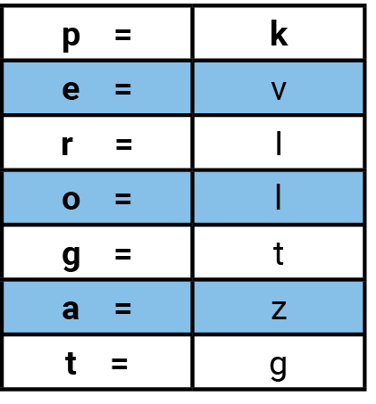

**Completamiento de elementos encriptados**

Cuando el mensaje que se transmite tiene información delicada o contiene información que no está disponible para cualquier persona, se dice que los elementos de este mensaje están **encriptados**, es decir, se encubren para que no puedan ser interpretados fácilmente.

No obstante, existen formas de **desencriptarlos** o regresarlos a su estado original. Una de estas formas es mediante el método de sustitución de letras, símbolos, caracteres o números, así como el método del abecedario que usamos en el ejercicio anterior.

Cabe mencionar que no todos los ejercicios usan siempre este procedimiento, por lo que es importante identificar cuál es la relación que tiene la palabra con el orden de sus letras equivalentes para que encontremos el código correcto que descifra el mensaje.

### Información textual y gráfica

## Representación espacial

La representación espacial es el uso de símbolos, signos y figuras para evaluar la habilidad de representar e imaginar un cuerpo en el espacio, en diferentes posiciones y sin perder sus características.

En esta lección nos enfocaremos en la representación espacial de las figuras y objetos. Debido a la diversidad de las aplicaciones del tema, se mostrarán diferentes ejercicios a manera de práctica.

### Figuras y objetos

La **perspectiva** se define como la representación espacial de los objetos y figuras en la forma y disposición en las que aparecen a la vista, es decir, si dos personas miran un objeto desde dos posiciones distintas, seguramente interpretarán el objeto de manera diferente.

Además, la perspectiva ayuda a crear efectos de profundidad en imágenes de dos dimensiones y a dimensionar el tamaño de las mismas. Los elementos que generan la perspectiva son:

Las **sombras**, los **reflejos**, las **vistas** y la **rotación**.

Analicemos el siguiente ejercicio de rotación.

Observa la siguiente figura:

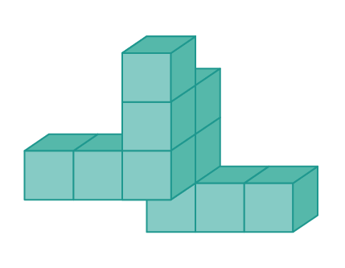

¿Cuál de las siguientes figuras corresponde a la anterior después de ser rotada?

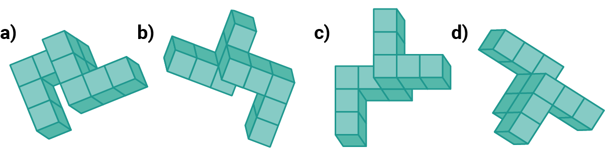

Las opciones a y b se descartan porque los cubos laterales de la figura apuntan hacia la misma dirección.

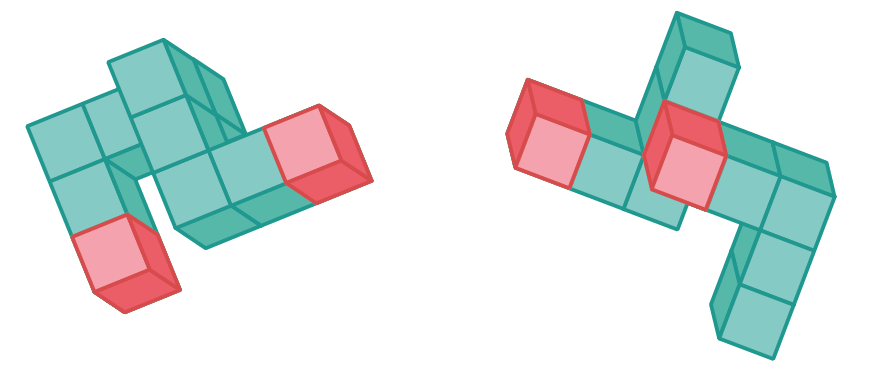

Además, las figuras están unidas por dos cubos.

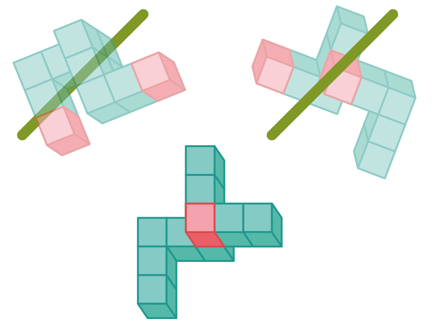

Por lo tanto, la respuesta correcta es la **opción d**.

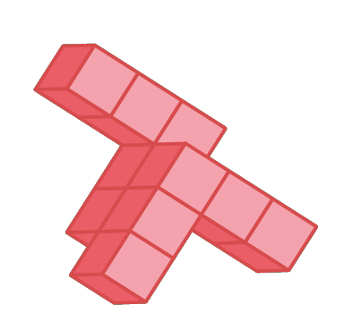

Para ejemplificar cómo la vista y la posición desde donde miramos un objeto puede cambiar la perspectiva, observemos la siguiente figura:

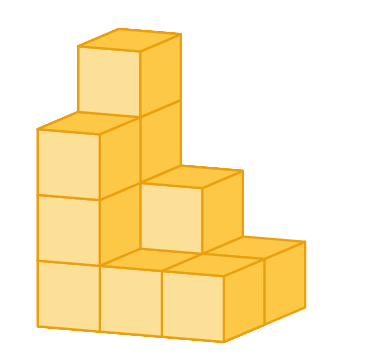

¿Cuál de las siguientes figuras corresponde a la vista lateral de la figura anterior?

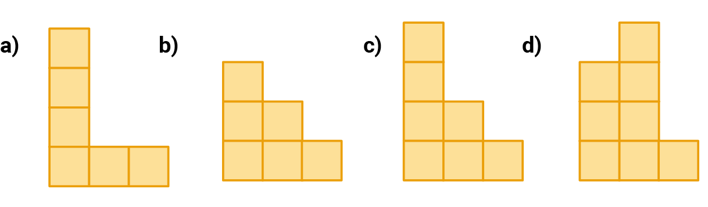

La respuesta correcta es el **inciso c**.

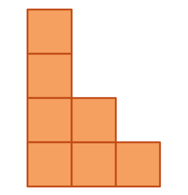

Ya que si contamos los cubos posteriores vemos que son cuatro cubos en la primera columna.

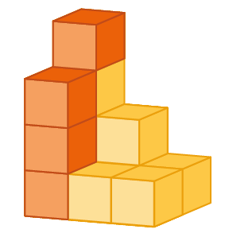

Dos en la segunda.

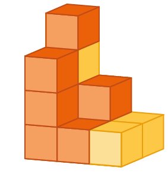

Y uno en la última.

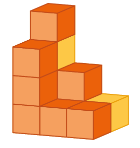

Vista de manera lateral coincide con la imagen mostrada en la opción c.

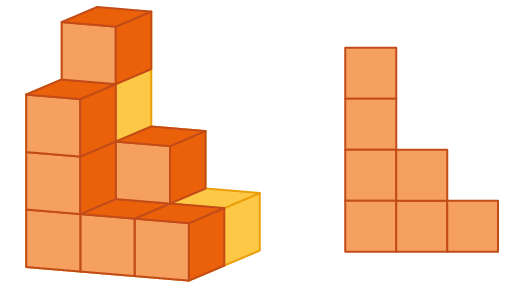

Por otro lado, cuando se hace la combinación de figuras, la perspectiva da como resultado una nueva o varias figuras.

**Ejemplo:**

Si juntamos 2 triángulos opuestos, el resultado es un hexágono y 6 triángulos, semejantes a la estrella de David.

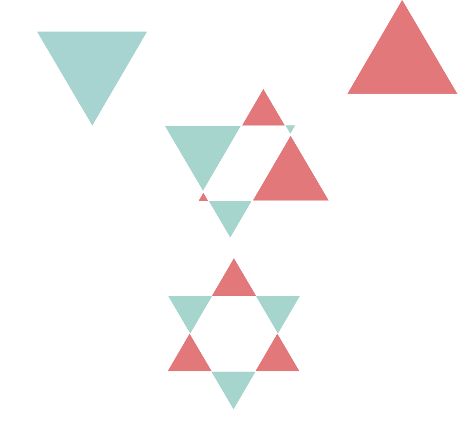

Revisemos otro ejemplo con esta figura:

Vemos cómo se conjuntan 4 círculos de diámetro igual a 1, ¿puedes saber cuál es el perímetro externo de toda la figura?

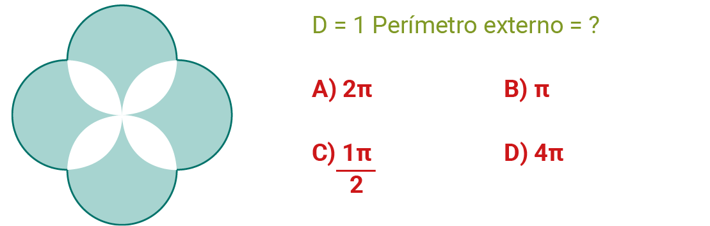

Si observas bien, los círculos se unen justo por la mitad de cada uno.

Por lo tanto, cada círculo expone sólo la mitad de su perímetro al exterior.

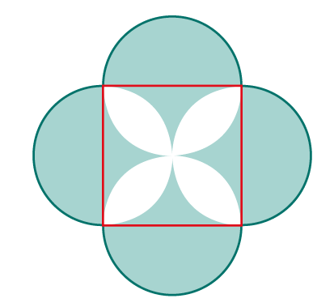

Si el perímetro es π por D (diámetro), y son un total de cuatro círculos, entonces el perímetro externo es 2π.

### Modificaciones a objetos

Una habilidad espacial es la capacidad de determinar a partir de observar una figura armada o desarmada.

**Ejemplo:** En la siguiente figura desarmada, es importante que observes todos los lados. En este caso son 6. Una vez observados e identificados puedes imaginarte la figura armada desde diferentes perspectivas.

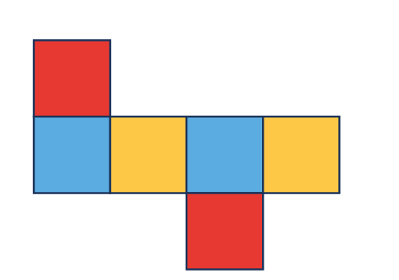

En este caso, el resultado es un cubo.

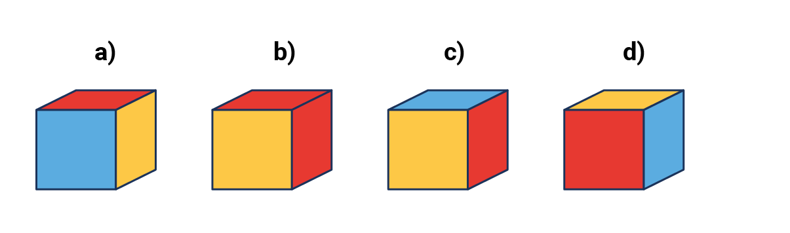

¿Cuál de las siguientes figuras armadas no corresponde con la figura desarmada?

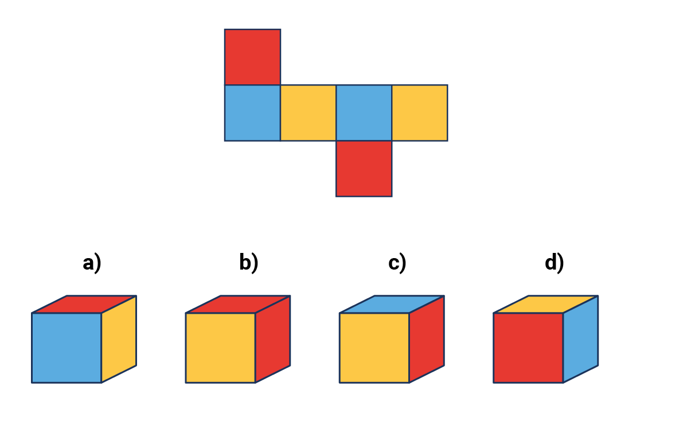

Podemos ver que es el **inciso b.**

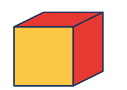

Pues de acuerdo con la posición de los colores en el cubo, no es posible que dos caras rojas se encuentren juntas.

Ahora observemos una figura armada.

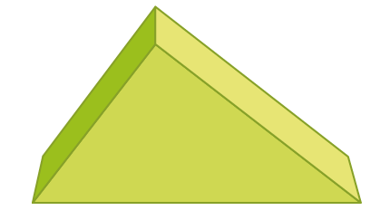

¿Cuál de las siguientes figuras desarmadas crees que corresponde a la figura armada?

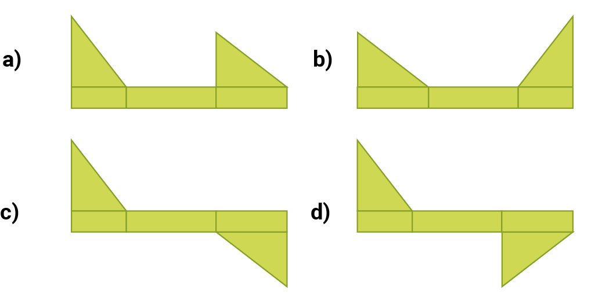

Los incisos a y b, no coinciden debido a que las dos caras laterales se encuentran del mismo lado, y al momento de armarlos se encimarían una con la otra.

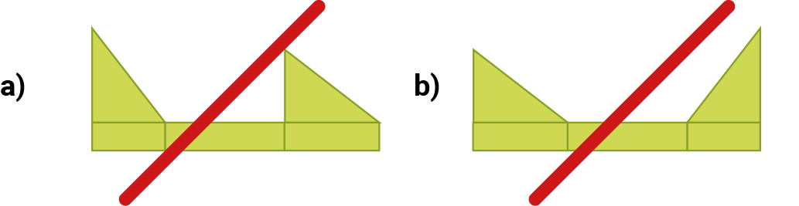

El inciso d tampoco es correcto ya que uno de los lados de un triángulo no coincide con uno de los lados del rectángulo central.

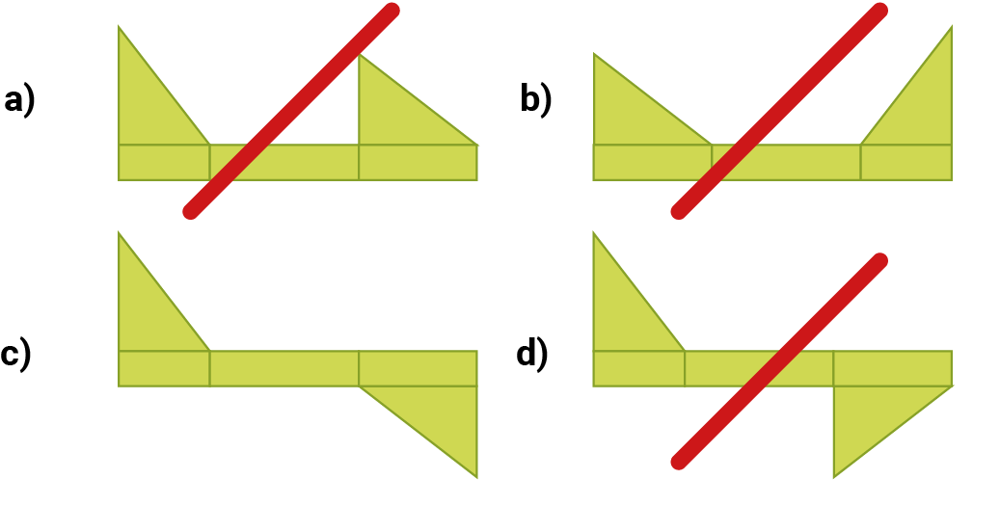

Por lo tanto la respuesta correcta es el **inciso c.**

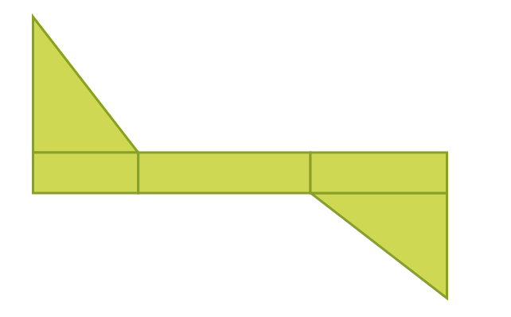

Otra de las modificaciones que existen son los objetos resultantes de cortes.

**Ejemplo:**

En una hoja doblada dos veces se hace un corte de manera angular en la esquina donde convergen todos los dobleces.

¿Cómo se vería la hoja al ser desdoblada?

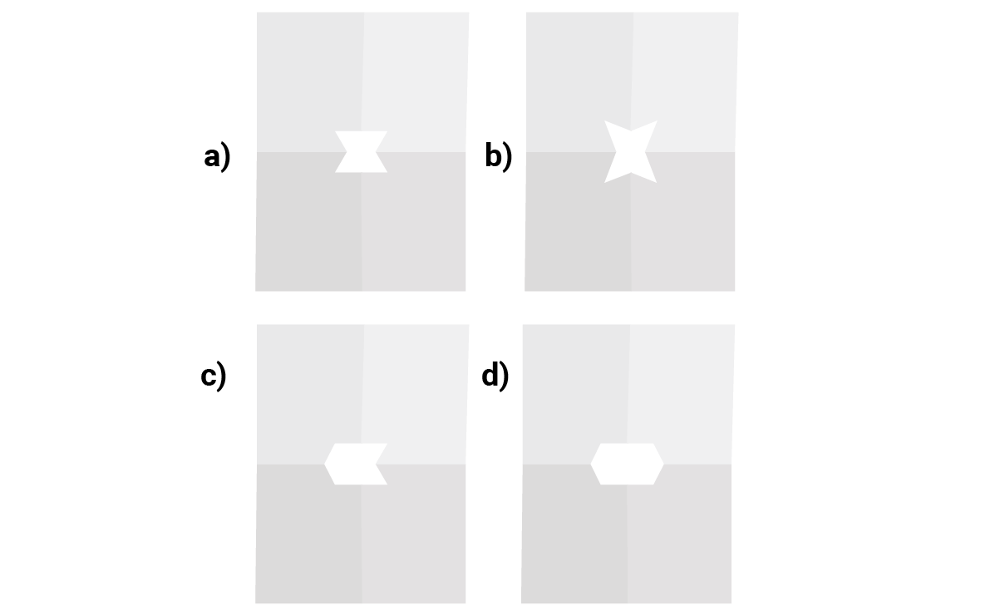

La respuesta correcta es el **inciso a**, porque uno de los cortes es paralelo a la parte inferior de la hoja.

Y al desdoblar una vez, se forma un trapecio.

Por último, al desdoblar la segunda vez, se forma la imagen del inciso a.

### Operaciones con figuras y objetos

Es posible realizar juicios en figuras u objetos de acuerdo a sus componentes, al orden, y a la posición en la que éstos se encuentran.

En el ejemplo siguiente se puede observar una figura incompleta.

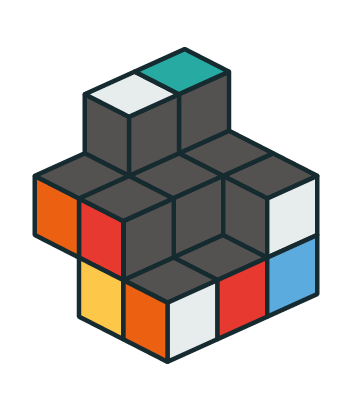

Determinemos el número de cubos que hacen falta para completar la figura.

En este caso se forma un cubo, y para completar la figura se necesitan 9 cubos pequeños.

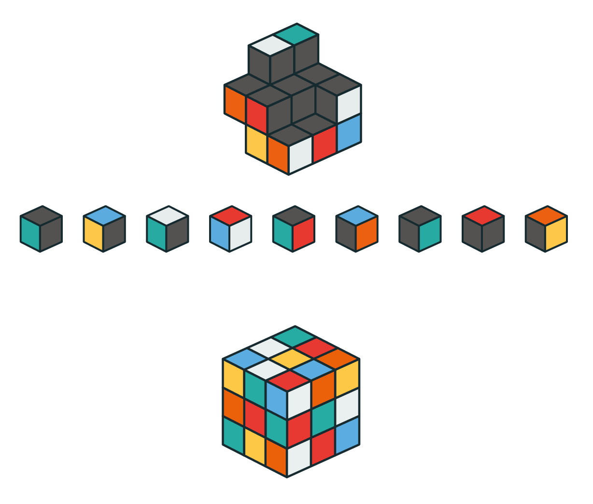

También existen objetos en los que ciertos elementos se encuentran **sombreados.** En este tipo de objetos existen diferentes retos.

Un ejemplo de esto es la siguiente figura:

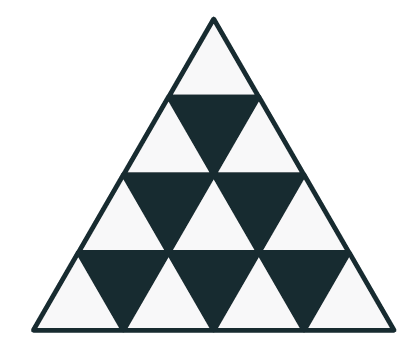

Como puedes observar, contiene 6 triángulos sombreados.

Pero, ¿cuántos triángulos sombreados tendría esta figura si se le añaden 2 filas más en el triángulo?

a) 21 b) 10 c) 15 d) 14

Si observas bien, el número de triángulos blancos es igual al número de filas, y el número de triángulos sombreados es igual al número de triángulos blancos menos 1.

**# ∆ blancos = # filas; # ∆ sombreados = # ∆ blancos − 1**

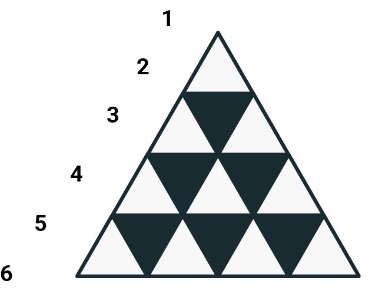

Por lo tanto, si son 6 filas de triángulos, la respuesta es la suma del número de filas menos uno:

**# ∆ blancos = # filas; # ∆ sombreados = # ∆ blancos − 1**

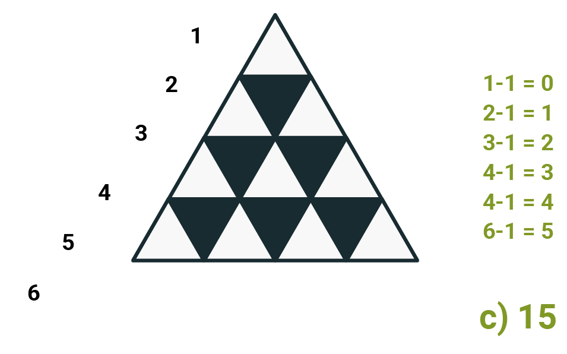

---

El pensamiento analítico se entrena como un músculo: entre más analogías resuelvas, más códigos descifres y más figuras rotes en tu mente, más rápido responderás el día del examen. No te desanimes si al principio cuesta trabajo visualizar las figuras en el espacio; con práctica constante se vuelve natural.

Continúa tu preparación con la siguiente parte de la serie.
