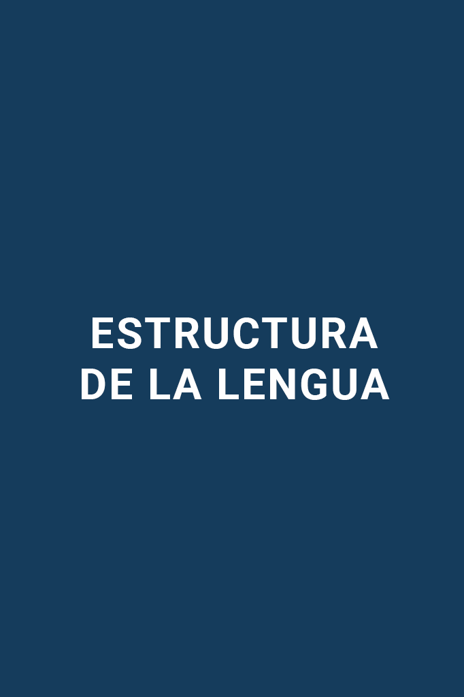

# Guía CENEVAL EXANI-II: Estructura de la lengua (Parte 3 de 12)

_Parte 3 de 12 de la serie Guía CENEVAL EXANI-II._

## Reglas ortográficas

### Mayúsculas

Las letras mayúsculas son aquellas de **mayor tamaño** que sirven para **resaltar, jerarquizar y enfatizar**. Es importante mencionar que las mayúsculas se acentúan si la palabra lo requiere.

Se escribirán con inicial mayúscula:

**1.** La primera letra de una oración o párrafo.

**Ejemplo:**

En la colonia hay muchos turistas.

**2.** Nombres propios de personas, animales, ciudades, países, calles, apellidos y siglas.

**Ejemplo:**

En la colonia Roma hay un turista de Brasil que tiene un perro llamado Samba.

**3.** Sobrenombres o apodos.

**Ejemplo:**

María Félix, La Doña.

**4.** Títulos, cargos y dignidades.

**Ejemplo:**

El Rector se reunió con el Duque de Rivas.

**5.** Siglas y acrónimos.

**Ejemplo:**

Con Unitips puedes estudiar para tu examen de admisión de la UNAM.

### División silábica

Las palabras se pueden dividir en sílabas y, para hacerlo correctamente, debes considerar que hay grupos de vocales que forman **diptongos, hiatos y triptongos**. Para poderlos identificar debes saber que existen dos tipos de vocales:

- Fuertes o abiertas: a, e, o.
- Débiles o cerradas: i, u.

**Diptongos**

Se forma cuando dos vocales cerradas, una abierta y una cerrada, o una cerrada y una abierta forman una sílaba.

**Ejemplo:**

- Cerrada + cerrada = Ciu-dad, Cui-da-do
- Abierta + cerrada = Pai-sa-je, Trein-ta, Cau-sa, Eu-ro-pa, Esta-dou-ni-den-se
- Cerrada + abierta = Pe-rió-di-co, Ta-nia, Tien-da, A-gua, Cuer-da, A-ve-ri-guo

**Hiatos**

Se forman con los grupos de vocales: **ae, ao, ea, ee, oa, oe y oo**. Si la vocal cerrada (la **i** o la **u**) del diptongo está acentuada, el diptongo se deshace.

**Ejemplo:**

- Abierta + abierta = A-e-ro-puer-to, Pe-le-a.
- Abierta + cerrada (con acento) = A-ú-lla
- Cerrada (con acento) + abierta = Co-mí-a, Pú-a

**Triptongos**

Se construyen cuando **tres vocales forman una sola sílaba.**

**Ejemplo:** A-li-viáis, U-ru-guay, I-ni-ciéis

Pon atención en que si la *y* suena como *i*, entonces se forma triptongo, como en la palabra *Uruguay*.

### Reglas de ortografía

Las reglas de ortografía son muy diversas y por lo general la práctica hace al maestro. Aquí te dejamos algunas reglas principales de ortografía para que practiques. Vamos a empezar con las reglas de S, C y Z.

**Regla 1:** Cuando las palabras son adjetivos y terminan en *so* se escriben con S.

Ambicioso, Ansioso.

**Regla 2:** Las terminaciones en *erso* y *ersa* se escriben con S.

Adverso, Perverso.

**Regla 3:** Cuando una palabra se vuelve superlativo se agrega la terminación *ísimo*.

Poderosísimo, Gordísimo.

**Regla 1:** Se escriben con C las palabras que terminan en *ción* y derivan de la familia léxica que contiene CT.

Acto − Acción.

**Regla 2:** Terminan en *ción* las palabras que provienen de sustantivos derivados de infinitivos terminados en AR.

Condensar − Condensación.

**Regla 3:** Los verbos terminados en *cir* se escriben con C.

Conducir, Introducir.

**Regla 1:** Se escriben con Z los sustantivos abstractos terminados en *anza*.

Adivinanza, Esperanza, Matanza.

**Regla 2:** Se escriben con Z los sustantivos abstractos que terminan en *ez* y *eza*.

Tristeza, Pereza, Escasez.

**Regla 3:** Cuando un verbo termina en *zar* se debe cambiar la **C** por la Z.

Cruce, Cruzar, Avance, Avanzar, Empiece, Empezar.

La próxima regla que veremos es el uso de la **B** y **V**.

**Regla 1:** Se escriben con B las palabras que utilizan combinaciones **BL, BR y MB.**

Oblea, Ebrio, Embajada.

**Regla 2:** Se escriben con B las palabras que comienzan en *ab*, *sub* y *ob*.

Obtuso, Abdomen, Submarino.

Sigamos ahora con algunas reglas que te ayudarán a saber cuándo escribir las palabras con V.

**Regla 1:** Se escriben con V las palabras que empiecen con *div*, *priv* y *prov*.

divino, privado, provincia.

**Regla 2:** Se escriben con V los prefijos *vice* y *villa*.

Viceversa, Villano.

A veces confundimos la G con la J, los siguientes Unitips ayudarán a evitar este tipo de errores.

**Regla 1:** Después de *al*, *an* y *ar* se escribe con **G** y no con **J**.

**Álg**ebra, **Áng**el, **Arg**elia.

**Regla 2:** Las palabras que empiezan con *In* se escriben con **G.**

**Indíg**ena, **Indig**estión, **Indig**esto.

**Regla 3:** Se escriben con **G** las palabras que se comienzan con *Geo*.

**Geo**grafía, **Geo**logía, **Geo**metría.

Ahora veamos cuándo se usa la **J** en lugar de la **G**.

**Regla 1:** Se escriben con J las palabras que terminan en *jear*.

Can**jear**, Co**jear**, Flo**jear**.

**Regla 2:** Se escriben con **J** las palabras que terminen en *aje* y *eje*.

Traba**je**, Here**je**, Via**je**.

Veamos ahora algunas reglas de la **R** que nos ayudan a saber cuándo se escriben las palabras con una y cuándo se escriben con dos.

**Regla 1:** Se escribe con doble **R** los sonidos fuertes que van entre vocales.

Pe**rro**, Ferroca**rri**l, Ba**rri**l.

**Regla 2:** La doble **R** nunca se usa al inicio de una palabra.

**R**ata, **R**otunda.

**Regla 3:** Se usa una **R** cuando la palabra tiene sonido suave.

Creer, Saber.

¿Cómo sabemos cuándo se escriben las palabras con **Y** y cuándo se escriben con LL? Veamos algunas reglas que nos ayudarán a aclarar esto.

**Regla 1:** Se escriben con **LL** las palabras que empiezan con *fa*, *fo* y *fu*.

**Fa**llar, **Fu**elle, **Fo**llaje.

**Regla 2:** Todas las palabras terminadas en *illo* e *illa* se escriben con doble **LL.**

Cuch**illo**, Past**illa**, Si**lla**.

Veamos ahora algunas reglas de la **Y**.

**Regla 1:** Todas las palabras con la sílaba *yec* se escriben con **Y**.

Inyección, Proyección, Trayecto

**Regla 2:** Las palabras con prefijos *ad*, *dis* y *sub* se escriben con **Y**.

Adyacente, Disyuntiva, Subyuga.

### Reglas de acentuación

Existen cuatro maneras de clasificar las palabras de acuerdo con su **sílaba tónica**, que es en la que se pone mayor fuerza en la voz al pronunciarlas. Éstas son: **agudas, graves, esdrújulas y sobresdrújulas.** Aunque existen otras reglas de acentuación, las siguientes son las más básicas:

**Las palabras agudas:** son aquellas que tienen **la sílaba tónica en la última sílaba y se acentúan si terminan en n, s** o **vocal**. Por ejemplo:

Salm**ón**, Par**ís**, Caf**é**.

**Las palabras graves:** tienen el sonido fuerte en la **penúltima sílaba** y se **acentúan únicamente cuando terminan en consonante**, excepto cuando terminan en **n** o **s**. Ejemplos:

**Ár**bol, **Cár**cel, **Cés**ped.

**Las palabras esdrújulas:** tienen el sonido fuerte en la **antepenúltima sílaba y siempre van acentuadas**. Por ejemplo:

Es**drú**jula, **Éx**tasis, **Bró**coli.

**Las palabras sobresdrújulas:** son palabras que tienen la sílaba tónica **antes de la antepenúltima sílaba** y siempre se acentúan. Ejemplos:

**Gá**natela, **Quí**micamente, Reco**mién**dasela.

### Puntuación

Los signos de puntuación son **marcas gráficas que sirven para estructurar ideas cuando escribes, y para identificar la entonación y las pausas del discurso escrito cuando lees.** Además, son indispensables en el texto, pues su uso correcto nos permite comprender el contenido del mismo de manera coherente y sin generar confusión.

El español utiliza los siguientes signos de puntuación:

**El punto**

El punto se utiliza **al terminar una oración o un párrafo.** Después del punto se escribe una letra mayúscula.

**Punto y seguido**

**Separa y da continuidad entre las oraciones de un mismo párrafo.** Cuando lo utilizamos debemos dejar un espacio después del punto y comenzar a escribir el siguiente enunciado en la misma línea.

**Punto y aparte**

El punto y aparte **señala el final de una idea de un mismo tema y el inicio de otra.** Indica también el final de un párrafo, por lo que después del punto y aparte debemos dejar un espacio entre cada uno y comenzar con una mayúscula.

También los puntos se utilizan después de:

- Abreviaturas.

**Ejemplo:** Dra.

- Iniciales de nombres propios.

**Ejemplo:** T.S. Eliot fue un poeta innovador.

- Paréntesis, corchetes y comillas; sin embargo, si la oración que está dentro de los paréntesis, corchetes o comillas es independiente del párrafo, llevará los puntos correspondientes.

**Ejemplo:**

El tiempo está horrible, con viento y grandes chaparrones. Los meteorólogos dicen que se trata de una **gota fría.** (Informa el Larousse que **gota fría** es el nombre de las corrientes frías que quedan aisladas de su origen en el frente polar.)

**La coma**

Sirve para **indicar pausas breves dentro de un enunciado sin cambiar de idea.**

Se utiliza en los siguientes casos:

- Para enumerar, separar palabras, grupos de palabras y oraciones. **Ejemplo:** En Unitips puedes estudiar Español, Matemáticas, Historia, Geografía y otras materias para tu examen de ingreso.
- Para introducirle información extra a una oración, sin importar que esta información sea una palabra, una frase o toda una oración simple o compuesta. **Ejemplos:** Sor Juana Inés, la Décima Musa, es una de las grandes poetas de la literatura en español. Los obreros, quienes se declararon en huelga, no recibieron su aguinaldo.
- Cuando nos dirigimos a alguien. Sólo se usa cuando usamos la segunda persona del verbo. **Ejemplos:** Buenas tardes, profesor. Camarero, un café, por favor.
- Para sustituir un verbo que aparece anteriormente, o que se sobreentiende. **Ejemplo:** Julián estudió Historia; Carmen, Teatro; yo, Literatura.
- Para separar la oración principal de las oraciones subordinadas. **Ejemplo:** Si no estudias, vas a reprobar.
- Al intercalar dentro de una oración un pensamiento o cita con su autor. **Ejemplo:** Si supiera que mañana se acabaría el mundo, como dijo Martin Luther King, yo hoy todavía plantaría un árbol.
- Antes de las siguientes conjunciones: aunque, a pesar de, pero, sino. **Ejemplo:** Quería llegar presentable a la entrevista, pero me caí en un charco.
- Al escribir el lugar y la fecha. **Ejemplo:** París, 14 de julio de 1789

**El punto y coma**

El punto y coma se utiliza **cuando es necesario hacer una pausa menor que el punto, pero mayor que la coma.**

**También se utiliza cuando:**

- Separamos oraciones, periodos o cláusulas que tienen relación inmediata entre ellas.

**Ejemplo:**

Pero en el fondo de su espíritu continúa trabajando; el poeta conoce esta fecundidad del ocio; sus trabajos más fecundos, más felices; sus versos más bellos; sus cuentos más originales dependen de sus ocios; si Félix no dispusiera de estos ratos en el que él no hace nada, no podría escribir, no se le ocurriría nada; en agitación perpetua, en constante vida de acción, su espíritu sería estéril.

- Unimos series que están separadas por comas entre sí.

**Ejemplo:**

En la celebración de Año Nuevo, participaron cuatro poetas con los siguientes poemas: Agustín Goytisolo, "Una revelación"; José Ángel Valente, "El adiós"; María Victoria Atencia, "La rueda"; Aurora Luque, "Al encontrar en Internet un mapa del mundo subterráneo".

- Cuando la oración contiene las siguientes conjunciones: aunque, mas, pero, sin embargo, etc.

**Ejemplo:**

Su pastel estaba muy bien hecho, pues siguió la receta al pie de la letra; pero no consiguió el primer lugar de los jueces.

**Los puntos suspensivos**

Normalmente **se utilizan para generar suspenso en un texto.** Siempre deben escribirse sólo tres y sin espacio entre ellos, pero con un espacio antes de la siguiente palabra.

También se pueden utilizar para:

- Dejar una idea incompleta.

**Ejemplo:**

Desde hace mucho te quiero decir que… no, mejor no te lo digo.

- Expresiones conocidas o sobreentendidas, dichos, refranes, lugares comunes que el lector debe completar.

**Ejemplo:**

Camarón que se duerme…

- Sustituir la palabra etcétera para indicar que una enumeración continúa.

**Ejemplo:**

Los principales aspectos que se deben conocer al redactar son: ortografía, sintaxis, gramática, vocabulario…

- Evitar palabras malsonantes.

**Ejemplo:** Es un…

**Los paréntesis**

Son utilizados para **introducir información adicional dentro de una oración** como aclaraciones, fechas, notas y citas textuales.

**Ejemplo:**

El león (considerado el rey de la selva) vive en la sabana africana y duerme hasta 20 horas al día.

En este caso "considerado el rey de la selva" está dentro de paréntesis, ya que es información adicional que ayuda a contextualizar y a darle profundidad al enunciado.

## Lógica textual I

### Oraciones simples y compuestas

Toda oración está formada por un sujeto y un predicado que, a su vez, se construye con un verbo conjugado y sus complementos.

La **oración simple** tiene un sólo verbo conjugado, y la **oración compuesta** es la unión o relación de dos o más oraciones simples.

**Ejemplo de oración simple:**

**Las personas trabajan de lunes a viernes.**

En esta oración "las personas" son el **sujeto** y "trabajan de lunes a viernes", el **predicado**.

**Ejemplo de oración compuesta:**

Las personas trabajan de lunes a viernes y descansan los fines de semana.

### Tipos de oraciones compuestas

Existen tres relaciones que establecen las oraciones compuestas: **yuxtaposición, coordinación y subordinación.**

**Oraciones compuestas yuxtapuestas**

En las oraciones compuestas yuxtapuestas **las oraciones simples se unen mediante signos de puntuación como la coma y el punto y coma.** En estos casos ninguna oración está subordinada o es dependiente de otra.

**Ejemplo en una conversación:**

Todos estábamos muy emocionados, sólo esperábamos los resultados finales.

**Oraciones compuestas coordinadas**

Son las oraciones que se unen por medio de conjunciones; es decir, las palabras **y, e, ni, no, o, u, pero, sin embargo, así pues, etc.**

Se clasifican en:

- **Copulativas:** Expresan adición o suma de acciones, y se unen por medio de los nexos *y*, *e*, *ni*.

**Ejemplo:**

Alma **ni** picha, **ni** cacha, **ni** deja batear.

- **Disyuntivas:** Presentan opciones o alternativas, y utilizan los nexos *o*, *u*, *bien*.

**Ejemplo:**

¿El pepino es verdura **u** hortaliza?

- **Adversativas:** Se conforman por oraciones que se contradicen entre sí parcial o totalmente, y utilizan los nexos *pero*, *sin embargo*, *no obstante*.

**Ejemplo:**

Tomemos dos oraciones simples que se contradicen:

Tengo ganas de acostarme.

No estoy cansado.

Si las unimos con el nexo **sin embargo** el resultado es el siguiente:

Tengo ganas de acostarme; **sin embargo**, no estoy cansado.

- **Distributivas:** Reparten las acciones entre los sujetos correspondientes, y utilizan los nexos **aquí… allá, unos… otros, ya… ya, unas veces… otras.**

**Ejemplo:**

**Unas veces** ando a pie, **otras** voy en taxi.

**Oraciones compuestas subordinadas**

Este tipo de oraciones **se da cuando el sentido de uno de los enunciados depende de otro.** Si las oraciones subordinadas se separan, dejan de tener sentido.

**Ejemplo:**

Los que viajaron a Estados Unidos trajeron las traducciones ayer.

La oración principal es **"trajeron las traducciones ayer"** y separada tiene sentido; no obstante, si dejamos sola la oración subordinada **"Los que viajaron ayer"** nos falta información, pues no hay una acción que determine al sujeto.

Hay de tres tipos:

**1. Sustantiva:** Son aquellas que **sustituyen al sustantivo en la oración principal**; es decir, son aquellas oraciones que sirven como un sustantivo.

**Ejemplo:**

**Los que fueron al campamento** regresarán a la ciudad el martes.

En este ejemplo, la oración subordinada sustantiva **"Los que fueron al campamento"** podría sustituirse por el sustantivo **"Los campistas"**.

**2. Adjetiva:** Son las oraciones que **modifican a un sustantivo de la oración principal,** ya sea explicándolo o especificándolo. Los nexos más comunes son **que, cual, cuyo.**

**Ejemplo:**

Podemos convertir la oración simple:

Quiero un perro inteligente.

En una oración compuesta adjetiva, se sustituye el adjetivo **"inteligente"** con una oración subordinada adjetiva.

Así la oración queda de la siguiente forma:

Quiero un perro **que haga trucos.**

**3. Adverbial:** Es cuando **el enunciado secundario o dependiente funciona como adverbio del enunciado principal;** es decir, como modificador del verbo. Pueden ser temporales cuando usan los nexos **antes** o **después,** y causales cuando aparecen los nexos *por*, *porque*, o *debido a*.

**Ejemplo:**

Podemos convertir la oración simple:

Los alumnos entregaron la tarea **formalmente.**

En una oración compuesta adverbial, sustituyendo el adverbio **formalmente** con otra oración subordinada adverbial.

Así la oración queda de la siguiente forma:

Los alumnos entregaron la tarea **como explicó la profesora.**

## Lógica textual II

Redactar párrafos es una habilidad que requiere del **dominio de la lengua y un esfuerzo intelectual mayor al que hacemos cuando hablamos,** pues al escribir debemos elegir las palabras adecuadas, el orden en que presentamos nuestras ideas y los argumentos más convenientes.

**El párrafo es un conjunto de oraciones relacionadas con el mismo tema, y representa cada una de las partes en las que está dividido un texto.** Todos los párrafos tienen características formales y características de contenido.

### Características formales de un párrafo

- Inician con letra mayúscula y terminan con un punto y aparte.
- Ocasionalmente, al inicio de cada párrafo puede haber una sangría.

### Características de contenido de un párrafo

- Ideas expresadas en oraciones principales y secundarias.
- Unidad, precisión y coherencia en cada frase.

**Oraciones principales y secundarias**

Todos los párrafos tienen **una oración principal que contiene su idea central.** Esta idea principal está complementada por **oraciones secundarias, las cuales suelen ser explicaciones, ejemplos, comparaciones o datos generales que dan respaldo y solidez a la idea principal.**

**Ejemplo:**

La leche, como cualquier alimento que contenga triptófano, resulta útil cuando queremos combatir el insomnio. El triptófano es un aminoácido fundamental para el funcionamiento del organismo y está involucrado en la producción de serotonina y melatonina, neurotransmisores necesarios para dormir bien. No obstante, para que este aminoácido funcione, necesitamos que emprenda un camino desde el estómago y el intestino delgado hasta el cerebro y este proceso no es tan sencillo porque compite con otros aminoácidos.

En este ejemplo, **la idea principal es la que está en rojo, mientras que las secundarias están en azul.** En ellas se brindan datos y explicaciones que respaldan la información de la oración principal.

**Unidad, precisión y coherencia**

En un párrafo existe la **unidad** cuando **sólo hay una idea principal y todo lo que se dice en éste gira en torno a un mismo tema**.

Por su parte, la **precisión** de un párrafo **consiste en el uso de expresiones claras y breves, evitando dar vueltas innecesarias al tema**.

Nos referimos a la **coherencia** cuando **todas las ideas que contiene un párrafo están relacionadas entre sí y con el tema principal del texto**.

Leamos el siguiente párrafo para distinguir sus características formales y de contenido, también diferenciaremos la idea principal de las secundarias y, finalmente, verificaremos si el párrafo tiene unidad, precisión y coherencia.

Sólo de manera fugaz y coyuntural es el nacionalismo una ideología progresista. Ocurre cuando prende en los países colonizados por una potencia imperial, que explota y discrimina a los nativos, y anima a éstos a defender su lengua, sus usos y costumbres, sus creencias, impregnándolos de una "conciencia nacional". Este tipo de nacionalismo ha ido decreciendo con la descolonización y convirtiéndose en la ideología ultrarreaccionaria con que sátrapas sanguinarios como Mobutu en el ex-Congo belga y el Mugabe de la excolonia británica Zimbabue se eternizaron en el poder, saquearon sus países y los bañaron de sangre y cadáveres.

Vargas Llosa, Mario (16 de diciembre de 2017), "El nacionalismo en Cataluña", El País, versión en línea.

Como podemos observar señalado en color verde, este párrafo inicia con una letra mayúscula y termina con un punto y aparte; además, en la primera línea hay sangría, es decir, un espacio en blanco a la izquierda antes de iniciar el párrafo.

Por otro lado, la oración principal de este párrafo es:

- El nacionalismo es pocas veces una ideología progresista.

Mientras que las oraciones secundarias son:

- El nacionalismo anima a los explotados a defender su lengua, sus usos y costumbres.
- El nacionalismo progresista ha ido decreciendo con la descolonización.
- Mobutu en el ex-Congo y Mugabe en Zimbabue han convertido el nacionalismo en una ideología reaccionaria.

A partir de lo anterior, podemos decir que este párrafo tiene **unidad** porque hay **sólo una idea principal: "El nacionalismo es progresista sólo en ocasiones".**

De la misma manera, es posible afirmar que el párrafo tiene **precisión**, pues Vargas Llosa se vale de expresiones claras y sencillas, en lugar de utilizar palabras confusas o tecnicismos.

Finalmente, identificamos la **coherencia** del párrafo al verificar que las ideas secundarias se relacionan con la idea principal dando ejemplos, definiciones e información general sobre lo que se busca comunicar.

---

La lengua es tu herramienta más poderosa en el examen: cada punto, cada acento y cada oración bien construida cuentan. Domina estas reglas y la sección de español dejará de ser un obstáculo para convertirse en tu mejor aliada.

Continúa tu preparación con la siguiente parte de la serie.
