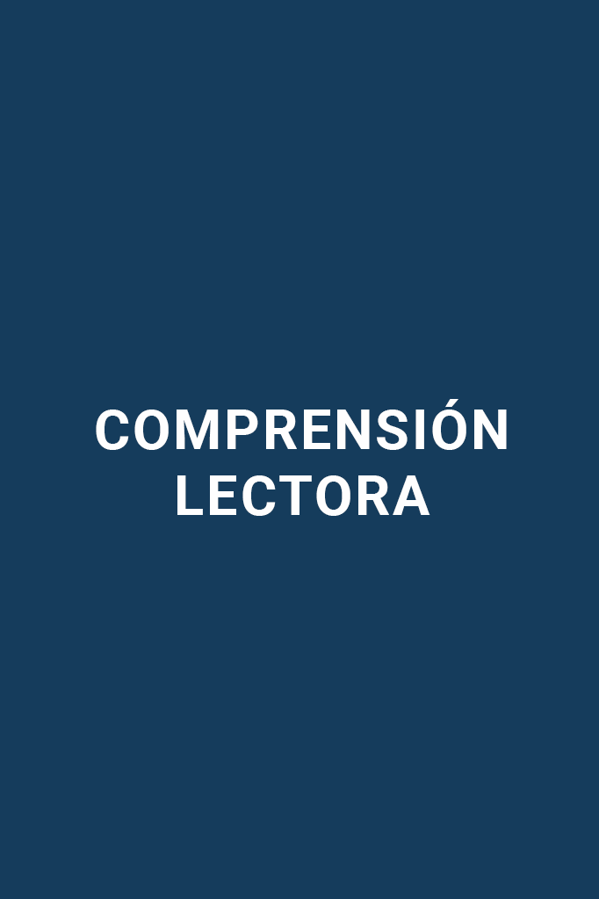

# Guía CENEVAL EXANI-II: Comprensión lectora (Parte 4 de 12)

_Parte 4 de 12 de la serie Guía CENEVAL EXANI-II._

## Intención del texto

### El contexto

Nosotros nos comunicamos para transmitir mensajes, y lo hacemos hablando, con señas o con textos. Cada vez que nos comunicamos el mensaje va a ser diferente según el contexto, es decir, la situación en la que nos encontramos.

Por ejemplo, no nos comunicaremos igual con nuestros amigos en la biblioteca que con unos conocidos en una fiesta.

En el ámbito textual, el contexto se refiere a la estructura en la que se acomoda la información, por ejemplo en una página de internet.

### Adecuación a la función

Para que un texto cumpla el objetivo de comunicar, es necesario que cuente con la propiedad de la adecuación. Ésta consiste en adaptar un texto tomando en cuenta el contexto en el que se expresa y al público al que va dirigido.

Por ejemplo:

Un médico utilizará una forma de comunicarse con otros médicos; o sea, con un lenguaje técnico que se adecúa a su profesión.

Sin embargo, tendrá que adaptar ese lenguaje técnico si tiene que explicarle una enfermedad compleja a un paciente.

El concepto de la adecuación en los textos podría ser aplicable en los libros de la escuela primaria que están adaptados para que los niños comprendan el contenido, en lugar de que consulten un texto científico universitario.

## Léxico que corresponde al texto

Los textos se pueden adaptar considerando lo siguiente:

Como ya lo mencionamos, los textos se pueden adecuar según al público al que van dirigidos, al tema del que tratan y a su propósito o intención. Es por eso que existen diferentes tipos de textos.

**Científicos:** Usan lenguaje técnico y especializado, y están dirigidos a un público conocedor o especialista en el tema.

**Ejemplo:**

Artículos, ensayos y manuales científicos.

**Cultos:** Utilizados para transmitir conocimientos, explicar datos o expresar pensamientos complejos.

**Ejemplo:**

Diccionarios, biografías y enciclopedias.

**Coloquiales:** Utilizan lenguaje informal y se emplean en la comunicación cotidiana.

**Ejemplo:**

Mensajes de texto o cartas personales entre familiares y amigos.

**Textos literarios:** Son aquellos que usan la función poética o literaria para expresar un mensaje de manera imaginativa y original.

**Ejemplo:**

La novela, el cuento, la poesía y el ensayo literario.

## Fragmentos adaptados según el tipo de lector

Cada lector entiende un texto de diferente manera dependiendo su edad, su escolaridad o sus gustos personales, motivo por el que algunos textos son adaptados para transmitir un mensaje a cada tipo de lector.

Por ejemplo, El ingenioso Hidalgo Don Quijote de la Mancha, de Miguel de Cervantes Saavedra, ha sido adaptado para niños y jóvenes debido a su complejidad.

## Elementos paratextuales

Son mensajes o expresiones que complementan el contenido principal de un texto, organizan su estructura y aportan mayor información sobre la obra.

**Título:** Considerado el elemento paratextual más externo de todos. Se refiere al contenido del texto.

**Dedicatoria:** Se coloca en la página siguiente del título, y en ella el autor agradece a quienes lo apoyaron durante su proceso creativo.

**Epígrafe:** Es una frase o cita ubicada en la siguiente página a la dedicatoria, y se usa para sugerir algún elemento contenido en el texto, o alguna frase que ha inspirado al autor.

**Citas textuales:** Son expresiones parciales de ideas que se incluyen en un texto con referencia a otra fuente, es decir, cuando se retoma un texto o fragmento de otro autor.

**Referencias o bibliografía:** Es una lista ordenada alfabéticamente que contiene a los autores y los títulos de las obras consultadas o referidas en el texto. El listado se ubica al final del texto.

**Paráfrasis:** Es la explicación de una cita o idea retomada de otro autor con palabras propias.

## Utilidad del texto

La utilidad del texto se refiere al objetivo por el cual fue creado. Todos los textos contienen un mensaje y lo comunican de manera específica.

Dependiendo de su objetivo, existen diferentes tipos de textos:

- Narrativos: Son aquellos que cuentan o relatan un acontecimiento, hecho o historia.

**Ejemplo:** un cuento, una novela o una crónica.

- Argumentativos: Son discursos coherentes que pretenden persuadir sobre un tema o punto de vista mediante el uso de razones.

**Ejemplo:** discursos políticos o artículos periodísticos.

- Descriptivos: Son aquellos que construyen la representación de una persona, situación o cosa, enumerando sus características y usando adjetivos calificativos como: interesante, bello, complicado, entre otros.

**Ejemplo:** discursos políticos o artículos periodísticos.

- Informativos: Son los que nos ofrecen datos sobre un evento o hecho.

**Ejemplo:** un artículo u nota periodística.

- Dialogados: Son los que se generan de forma espontánea y natural cuando las personas platican. Son los más comunes en la comunicación.

**Ejemplo:** una conversación o un mensaje de texto a nuestros amigos o familiares.

- Literarios: Son todos aquellos que utilizan los elementos de algún género literario para comunicar un mensaje. Su propósito es entretener, generar algún sentimiento o emoción, o generar alguna reflexión.

**Ejemplo:** la poesía, el teatro, la novela o el ensayo.

Dominar la comprensión lectora es una de las habilidades que más puntos te dará en el examen: cada texto es una oportunidad de demostrar que sabes leer entre líneas. Sigue practicando y verás cómo mejora tu velocidad y tu precisión.

Continúa tu preparación con la siguiente parte de la serie.
