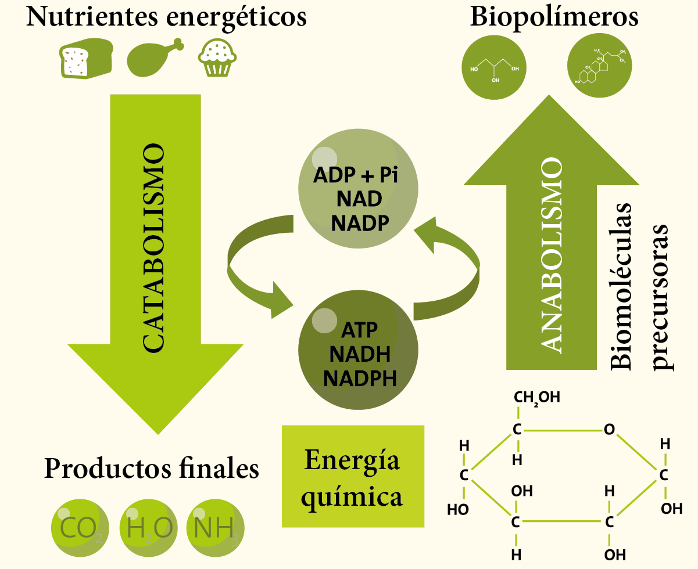
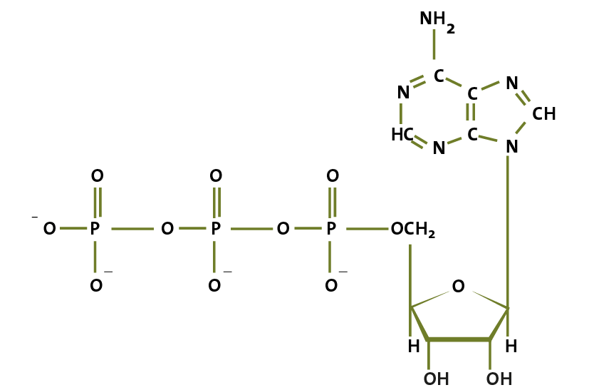
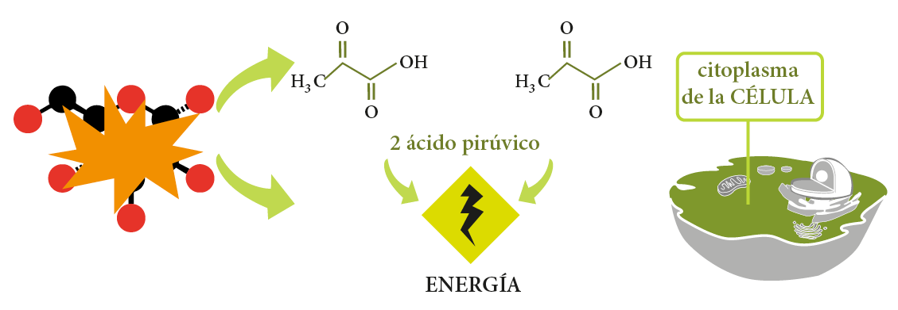
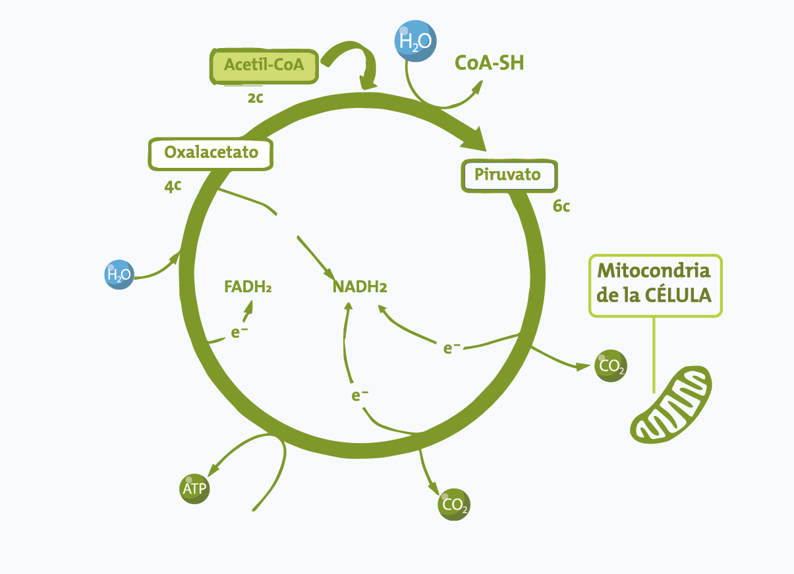

# Guía CENEVAL EXANI-II: Biología (Parte 5 de 12)

_Parte 5 de 12 de la serie Guía CENEVAL EXANI-II._

## Metabolismo celular

### Anabolismo y catabolismo

Se le conoce como metabolismo celular a **todos los procesos físicos y químicos que permiten que la célula tenga un balance funcional**. Este balance lleva el nombre de **homeostasis.** El metabolismo celular se divide en anabolismo y catabolismo.

El **anabolismo** implica rutas metabólicas que permiten la **formación de sustancias complejas a partir de sustancias más simples**. Los procesos anabólicos requieren energía para llevarse a cabo. En contraste, el **catabolismo** implica rutas metabólicas en las que **sustancias complejas se degradan a sustancias más simples** liberando así energía.

En el metabolismo celular existen sustancias fundamentales llamadas **enzimas**. Éstas son proteínas encargadas de **controlar la velocidad en la que suceden los procesos metabólicos**. En términos estrictos las enzimas son moléculas orgánicas que actúan como catalizadores de las reacciones químicas del metabolismo.

Cada enzima tiene una función específica en cada reacción del metabolismo; sin embargo, en ocasiones requieren de otros factores como las vitaminas y los minerales llamados **co-enzimas**. Las enzimas y las co-enzimas aceleran o frenan las reacciones en sustancias llamadas sustratos.

### Adenosín trifosfato (ATP)

Uno de los procesos catabólicos más importantes que se lleva a cabo en la respiración celular es la formación de moléculas de adenosín trifosfato o ATP. Estas moléculas son la principal fuente de energía de todos los seres vivos y se utilizan en procesos metabólicos de todas las células.

### Fotosíntesis

La fotosíntesis es un proceso en el cual los organismos que contienen clorofila transforman la energía del sol a energía química. Es un proceso crucial para que todos los seres vivos puedan existir, ya que la glucosa generada en este proceso permite que las plantas se nutran, lo cual mantiene la cadena alimenticia. Además, el oxígeno liberado por las plantas en la fotosíntesis nos permite respirar.

**Fase luminosa**

La fase luminosa se da en los cloroplastos cuando utilizan la energía del sol y el agua para formar ATP y NADPH.

**Fase oscura**

En la fase oscura, que sucede en los estromas, el NADPH, el ATP y el dióxido de carbono son utilizados para generar moléculas de glucosa que se utiliza para nutrir a estas células.

### Respiración celular

La respiración celular es el proceso metabólico por medio del cual los seres vivos obtienen energía. Existen dos tipos: **la respiración aerobia** y **la respiración anaerobia.**

Su principal diferencia es la presencia de oxígeno en la primera y la falta de éste en la segunda. Veamos más a fondo cada una.

**Respiración anaerobia**

Para entender el proceso de respiración anaerobia hay que comprender los siguientes conceptos: glucólisis, fermentación láctica y alcohólica, y balance energético.

Glucólisis: Es el proceso mediante el cual se degrada la glucosa. Como residuo se produce energía en forma de ATP y ácido pirúvico. Este ácido se procesa a través de la fermentación.

Fermentación láctica y alcohólica: Dependiendo del organismo y las enzimas que posee, el ácido pirúvico proveniente de la glucólisis puede pasar a formar parte de dos procesos de fermentación: la fermentación alcohólica y la fermentación láctica.

En la fermentación alcohólica, el ácido pirúvico sufre una transformación en la que se convierte en acetaldehído y después en alcohol etílico.

Al final de todos estos procesos de la respiración anaerobia el balance energético generado es de 2 ATP netos producidos, ya que por cada 2 ATP que se gastan, se generan 4.

**Respiración aerobia**

La respiración aerobia es la forma en la que las células obtienen energía involucrando en este proceso al oxígeno. El proceso se divide en tres pasos: la glucólisis aerobia, el ciclo de Krebs y la cadena respiratoria.

- Glucólisis aerobia: Es muy similar a la anaerobia, ya que se rompe la molécula de glucosa de la misma manera, y genera dos moléculas de ácido pirúvico y energía. Este proceso ocurre en el citoplasma.

- Ciclo de Krebs: Ocurre en la mitocondria y constituye una serie de reacciones que inician con el piruvato proveniente de la glucólisis. El piruvato se convierte por medio de enzimas en acetil co-enzima. Éste entra a un ciclo de reacciones que tienen como producto moléculas de NADH (dinucleótido de niacina-adenina reducida), FADH (dinucleótido de flavin-adenina reducida) y ATP.

.png)

- Cadena respiratoria: Se lleva a cabo en la membrana de la mitocondria. El proceso consiste en un flujo de electrones a lo largo de moléculas transportadoras.

Este flujo tiene como consecuencia el paso de protones de un lado de la membrana hacia otro. Dentro de las moléculas que participan en este proceso están el NADH y FADH, provenientes del ciclo de Krebs, y el oxígeno que respiramos como aceptor final del flujo de electrones debido a su característica oxidante. Al final de la respiración aeróbica se producen 38 ATP netos.

El paso de protones se lleva a cabo a través de una molecula llamada ATP sintasa encargada de convertir ADP en ATP, es decir energía.

## Reproducción celular

Para que los seres vivos se mantengan en homeostásis, es decir en un balance funcional, sus células deben de reproducirse constantemente. Esta reproducción implica la división de una célula en dos células hijas que mantienen el mismo ADN. Existen dos principales procesos de división celular: **mitosis** y **meiosis**.

### Mitosis

La realizan todas las células del cuerpo con excepción de las células sexuales. En la división, las células hijas conservan el ADN de las células madres. Para que esto suceda, la mitosis se divide en 4 fases:

Profase, Metafase, Anafase y Telofase.

Veamos cuáles son las características de cada una.

Profase: La membrana nuclear y el nucléolo se desintegran, el material genético se condensa y se forma el huso acromático, el cual se encargará de guiar a los movimientos de los cromosomas durante la mitosis.

Metafase: Los cromosomas se ordenan en la línea media del huso acromático.

Anafase: Los cromosomas individuales se dividen y se empiezan a mover hacia los polos del huso acromático.

Telofase: El huso acromático comienza a desaparecer y se empieza a regenerar el núcleo que contendrá a los cromosomas encontrados en los polos. Al mismo tiempo, se inicia la formación de la membrana celular de ambas células.

### Meiosis

Es un proceso de reproducción que se realiza únicamente en células sexuales y a diferencia de la mitosis se reduce el número de cromosomas a la mitad y se producen 4 células hijas que no son genéticamente iguales a la célula original, permitiendo así la variabilidad de las especies. La reproducción meiótica tiene dos divisiones las cuales contienen cuatro fases cada una, resultando un total de ocho pasos. Las fases de la primera división son:

Profase I, Metafase I, Anafase I y Telofase I

Aunque se llaman de la misma forma que las fases de la mitosis, no deben confundirse. A continuación estudiaremos lo que sucede en cada una.

Profase I: En esta fase al igual que en la mitosis el material genético se condensa, el nucléolo desaparece y se forma el huso acromático. A diferencia de la mitosis, en la Profase I de la meiosis los cromosomas que contienen la misma información genética se entrelazan formando cuatro extremidades llamadas tétradas.

Metafase I: Las tétradas se alinean en la línea media del huso acromático.

Anafase I: Las tétradas se mueven hacia los polos del huso acromático.

Telofase I: En esta fase las células se dividen, el huso acromático desaparece y las tétradas se vuelven a alojar en el núcleo regenerado.

Al terminar la Telofase I se tienen dos células que pasarán a la división Meiótica 2, esta división también contiene 4 fases: Profase II, Metafase II, Anafase II y Telofase II.

Profase II: Es casi igual a la Profase I, en donde el material genético se condensa, el nucléolo desaparece y aparece el huso acromático. La diferencia es que en esta fase los cromosomas no se duplican.

Metafase II: Al igual que en la Metafase I, las tétradas se alinean en la línea media del huso acromático.

Anafase II: En esta fase, las extremidades de las tétradas se dividen y viajan hacia los polos de la célula. Debido a que no se replicaron los cromosomas en la Profase II cada extremo tendrá la mitad del material genético.

Telofase II: Se regenera el nucléolo, la membrana del núcleo y la membrana celular.

Al final de la Meiosis se tendrán 4 células llamadas haploides, debido a que contienen la mitad del material genético de la célula madre.

## Taxonomía

### Clasificación de organismos

La Taxonomía es la ciencia que se encarga de clasificar a los organismos con base en características similares, particularmente desde el punto de vista de relaciones evolutivas. Para establecer las categorías a las que pertenecen los organismos, los biólogos evalúan las siguientes características de cada ser vivo:

- Su estructura anatómica y las similitudes con otros organismos en este aspecto.
- Las similitudes en comportamiento biológico con otras especies.
- Los restos de fósiles que muestran pistas sobre las relaciones evolutivas.
- Las semejanzas en estructuras de secuencias de aminoácidos en las proteínas de organismos similares.
- La información genética que comparten ciertas especies.

Utilizando estos cinco criterios, los taxónomos se dan a la tarea de clasificar a los organismos en jerarquías que van de características generales a particulares. En orden de general a particular las jerarquías son: reino, filum, clases, familia, género, especie.

### Características de los cinco reinos

Debido a que existen miles de especies en el planeta Tierra, es complicado hablar sobre las características de cada una de ellas. Sin embargo, si nos enfocamos en el nivel jerárquico más alto, es decir, los reinos, podemos englobar las características de cada especie en cinco reinos principales: Monera, Protista, Fungi, Plantae y Animalia.

Los miembros del reino monera se reproducen por medio de bipartición en forma de reproducción asexual.

Reino Monera: También se le conoce como reino procariota y abarca todos los organismos unicelulares que no tienen un núcleo bien definido. Algunos de sus miembros se alimentan de forma autótrofa, es decir, producen su propio alimento y otros de forma heterótrofa que consumen sustancias orgánicas producidas por otros organismos. Algunos ejemplos de organismos que pertencecen al reino monera son las bacterias y las algas verde-azules.

Reino Protista: Este reino abarca todos los organismos unicelulares de tipo eucarionte. Sin embargo, existen organismos que presentan reproducción sexual por medio de fusión. Sus miembros presentan respiración aerobia y, en su mayoría, se reproducen por bipartición. Algunos son heterótrofos y otros son autótrofos. Los parásitos son ejemplos de organismos que pertenecen al reino protista.

Reino Fungi: Gran parte de este reino lo abarcan hongos y levaduras. Se distinguen de las plantas en que son heterótrofos; y de los animales en que poseen paredes celulares constituidas de quitina.

Reino Plantae: Como podrás adivinar, a este reino pertenecen principalmente las plantas, aunque en un aspecto más generalizado, abarca organismos pluricelulares, eucariontes y autótrofos que presentan células con pared celular formada por celulosa. Además, pueden presentar reproducción asexual o reproducción sexual.

Reino Animalia: El reino animalia abarca a todos los animales. Sus miembros son eucariontes, pluricelulares, heterótrofos y con reproducción sexual. Por ejemplo, los humanos se encuentran dentro de este reino.

Son exclusivamente heterótrofos, presentan reproducción sexual y asexual, y pueden ser organismos unicelulares o pluricelulares.

La biología del examen premia a quien entiende los procesos, no a quien los memoriza: si logras explicar con tus palabras cómo la célula obtiene energía y cómo se divide, ya tienes gran parte de esta materia dominada. ¡Sigue así!

Continúa tu preparación con la siguiente parte de la serie.
