# Guía CENEVAL EXANI-II: Química (Parte 6 de 12)

_Parte 6 de 12 de la serie Guía CENEVAL EXANI-II._

## La tabla periódica

### Números de oxidación

En Química utilizamos los **números de oxidación**, también conocidos como **estados de oxidación**, para saber cuántos electrones recibe o dona un átomo al formar un compuesto. Los números de oxidación no siempre corresponden a las cargas reales de las moléculas, pero podemos calcular los números de oxidación de los átomos que están involucrados en un enlace.

En la tabla periódica puedes encontrar los diferentes números de oxidación que puede tener cada elemento:

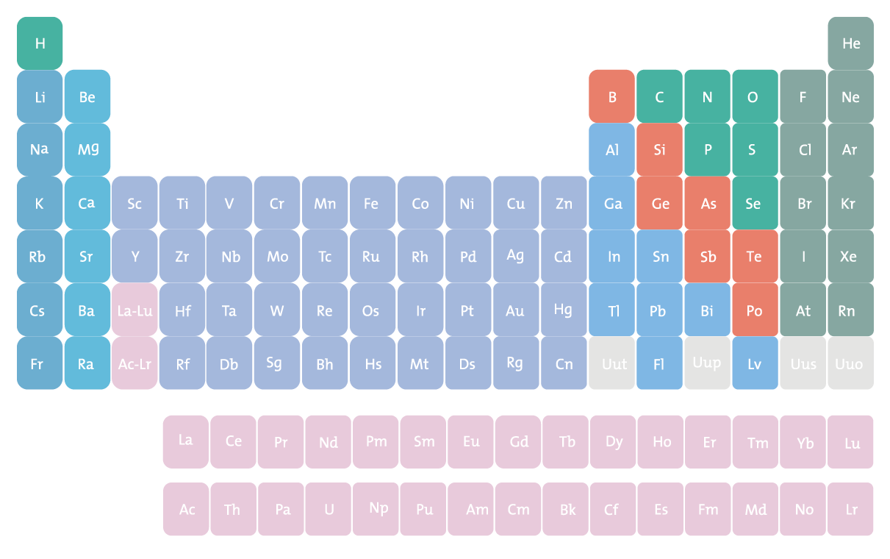

Los números de oxidación casi siempre se escriben usando primero el signo y luego la magnitud, que es lo opuesto a la carga de los iones. Para determinar el número de oxidación debes tener en cuenta las siguientes instrucciones:

**Paso 1:** Los átomos en estado elemental tienen un número de oxidación de 0.

**Paso 2:** Los átomos en iones monoatómicos (es decir, de un sólo átomo) tienen un número de oxidación igual a su carga.

**Paso 3:** En los compuestos, al flúor se le asigna un número de oxidación de -1; al oxígeno se le suele asignar un número de oxidación de -2 (excepto en compuestos con peróxido, en donde es -1, y en compuestos binarios con flúor, en donde es positivo); al hidrógeno se le asigna un número de oxidación de +1, excepto cuando está como el ion hidruro.

**Paso 4:** Los metales alcalinos tienen un número de oxidación de +1 y los metales alcalinotérreos de +2.

**Paso 5:** En los compuestos, a todos los demás átomos se les asigna un número de oxidación de forma que la suma de los números de oxidación de todos los átomos es igual a la carga total del compuesto.

En la siguiente figura encontrarás diez compuestos con sus números de oxidación ya asignados. En color rojo puedes observar el número de oxidación que utiliza el elemento en cuestión, mientras que en color azul encontrarás el resultado total de la carga al multiplicar el número de oxidación por el número de átomos del elemento presente en el compuesto. De tal forma que el fluoruro de potasio (KF) tiene un átomo de potasio y uno de flúor, siguiendo las reglas antes mencionadas encontramos que el flúor trabaja con -1 y el potasio con +1, al hacer el balance general encontramos que la carga total del compuesto es de 0.

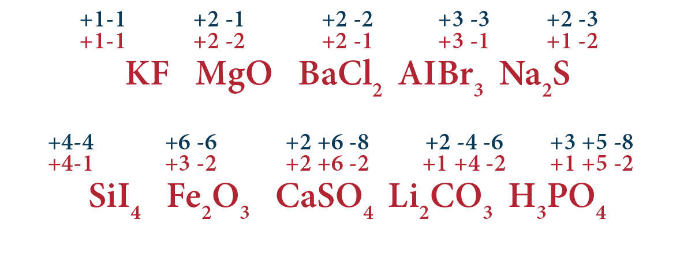

El ácido fosfórico (H₃PO₄) posee 3 átomos de hidrógeno, uno de fósforo y 4 átomos de oxígeno. Siguiendo las reglas encontramos que el oxígeno trabaja con -2 y el hidrógeno con +1, estos números de oxidación deben ser multiplicados por el número de átomos correspondientes de cada elemento, de tal forma que -2 del oxígeno lo multiplicamos por 4, resultando en -8. Mientras que para el hidrógeno multiplicamos +1 por 3, resultando en +3. Al realizar la suma entre -8 + 3 encontramos que la diferencia de electrones es de -5, por tanto, el fósforo deberá trabajar con un número de oxidación de +5 para que el compuesto se encuentre neutro, es decir una carga total de 0.

**Observa y ejercítate resolviendo los demás compuestos.** Los números de oxidación son importantes para el balanceo de reacciones químicas, así como para saber nombrar los compuestos.

### Nomenclatura en Química Inorgánica

La nomenclatura química nos ayuda a nombrar e identificar a los compuestos, respecto a los átomos que los conforman y de su función química. En esta lección nos enfocaremos en la **nomenclatura IUPAC** para nombrar a compuestos inorgánicos.

La Química Inorgánica estudia los elementos y compuestos inorgánicos, es decir, los que no poseen enlaces de carbono-hidrógeno, sino que involucra diversos tipos de elementos, casi todos los conocidos de la tabla periódica. Los compuestos inorgánicos presentan gran variedad de estructuras, pero pueden ser clasificados de acuerdo a los elementos que los constituyen de la siguiente manera:

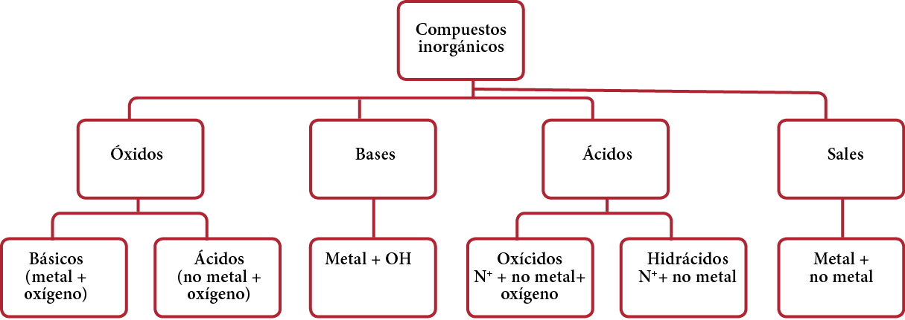

Para nombrar los compuestos inorgánicos es importante saber la cantidad de átomos que se combinan. Para uno, dos, tres y cuatro, se usan los prefijos: mono, di, tri y tetra, respectivamente.

**Óxidos**

Los óxidos son compuestos formados por un elemento de la tabla periódica unido al oxígeno. Se clasifican en básicos y ácidos.

**1. Óxidos básicos**

Los óxidos básicos están **formados por un metal unido a un ion óxido.** En todos ellos, el metal actúa con un número de oxidación positivo y el oxígeno con su número de oxidación negativo (–2). Debido a la mayor electronegatividad del oxígeno, con respecto a cualquier metal, en la fórmula aparece siempre el metal en primer lugar y, a continuación, el oxígeno. Los óxidos se pueden nombrar, de manera general, siguiendo la estrategia de leer la fórmula de derecha a izquierda:

**Nomenclatura:** óxido de + nombre del elemento metálico.

Sin embargo, como son muchos los metales que pueden actuar con más de un número de oxidación distinto, éste debe especificarse en el nombre cuando sea necesario:

- Anteponiendo prefijos multiplicadores (mono–, di–, tri–, etc.) a la palabra óxido y/o al nombre del metal (antigua nomenclatura sistemática).
- Indicando el número de oxidación del metal (antigua nomenclatura de Stock).
- Indicando el número de carga del catión metálico, en números arábigos y con el signo, entre paréntesis, inmediatamente después de nombrarlo.

Ejemplos (prefijos multiplicadores / números de oxidación / números de carga):

- **Na₂O:** Óxido de sodio / Óxido de sodio / Óxido de sodio
- **Cu₂O:** Monóxido de dicobre / Óxido de cobre (I) / Óxido de cobre (1+)
- **FeO:** Monóxido de hierro / Óxido de hierro (II) / Óxido de hierro (2+)
- **Co₂O₃:** Trióxido de dicobalto / Óxido de cobalto (III) / Óxido de cobalto (3+)
- **PtO₂:** Dióxido de platino / Óxido de platino (IV) / Óxido de platino (4+)

**2. Óxidos ácidos**

Son aquellos óxidos que **están formados por un metal unido a un ion óxido.** En ellos, el oxígeno actúa con número de oxidación –II, por lo que al no metal le corresponde un número de oxidación positivo con excepción de flúor, pues es el único elemento más electronegativo que el oxígeno, y sólo puede actuar con número de oxidación negativo (–1), por lo que, en combinación con él, el oxígeno será el que actúa con número de oxidación positivo.

Las combinaciones binarias del oxígeno con elementos no metálicos se nombran como óxidos del elemento considerado. En la nomenclatura tradicional los óxidos no metálicos se nombran como anhídridos del elemento en cuestión, a cuyo nombre se le pueden añadir los prefijos hipo–/per– y los sufijos –oso/–ico, para indicar el estado de oxidación con el que participan.

Ejemplos (prefijos multiplicadores / números de oxidación / nomenclatura tradicional):

- **CO:** Monóxido de carbono / Óxido de carbono (II) / Anhídrido carbonoso
- **CO₂:** Dióxido de carbono / Óxido de carbono (IV) / Anhídrido carbónico
- **SO₂:** Dióxido de azufre / Óxido de azufre (IV) / Anhídrido sulfuroso
- **SO₂:** Trióxido de azufre / Óxido de azufre (VI) / Anhídrido sulfúrico
- **Cl₂O₂:** Trióxido de dicloro / Óxido de cloro (III) / Anhídrido cloroso

**3. Hidróxidos**

Estos compuestos siempre contienen el ion hidróxido: OH–. Éste es un anión heteropoliatómico, derivado de una molécula de agua, por pérdida de un protón (H+). Este anión hidróxido actúa como un único grupo con número de oxidación –1, por lo que se combina con cationes de naturaleza, fundamentalmente, metálica, es decir, con número de oxidación positivo.

Para nombrarlos se debe considerar el anión como un grupo que tiene un nombre propio y posee una carga determinada, podemos leer fácilmente la fórmula de derecha a izquierda como en anteriores ocasiones:

**Nomenclatura:** Se nombran con la palabra hidróxido seguida de la preposición “de” y el nombre del metal.

Ejemplos (prefijos multiplicadores / números de oxidación / números de carga):

- **NaOH:** Hidróxido de sodio / Hidróxido de sodio / Hidróxido de sodio
- **KOH:** Hidróxido de potasio / Hidróxido de potasio / Hidróxido de potasio
- **CuOH:** Hidróxido de cobre / Hidróxido de cobre (I) / Hidróxido de cobre (1+)
- **Cu(OH)₂:** Dihidróxido de cobre / Hidróxido de cobre (II) / Hidróxido de cobre (2+)
- **Fe(OH)₂:** Dihidróxido de hierro / Hidróxido de hierro (II) / Hidróxido de hierro (2+)

**4. Oxiácidos**

Son **compuestos ternarios de hidrógeno, oxígeno y un elemento electronegativo,** generalmente no metálico.

En estos compuestos:

- El hidrógeno actúa con número de oxidación +1.
- El oxígeno actúa con número de oxidación –2.
- El elemento electronegativo, generalmente no metálico, actúa con un número de oxidación positivo.

**Nomenclatura:** los oxoácidos se nombran ácidos del elemento en cuestión, a cuyo nombre se le pueden añadir los prefijos hipo–/per– y los sufijos –oso/–ico, para indicar el estado de oxidación con el que participa.

Cuando el elemento no metálico tiene un único número de oxidación, a la raíz del nombre se le añade la terminación –ico.

- Para aquellos no metales con dos números de oxidación, se añade la terminación –oso a la raíz del nombre cuando actúa con el número de oxidación menor, y la terminación –ico cuando se trata del mayor.
- Si el no metal tiene tres números de oxidación, se añade el prefijo hipo– y el sufijo –oso para el menor, únicamente el sufijo –oso para el intermedio, y el sufijo –ico para el mayor.
- En el caso de actuar con cuatro números de oxidación distintos, se utiliza el sufijo –oso para los dos primeros y el sufijo –ico para los demás, añadiendo el prefijo hipo– al menor de todos y el prefijo per– al más alto.

Ejemplos (oxiácido / nombre):

- **HClO:** Ácido hipocloroso
- **HClO₂:** Ácido cloroso
- **HClO₃:** Ácido clórico
- **HClO₄:** Ácido perclórico
- **H₂SO₂:** Ácido hiposulfuroso
- **H₂SO₃:** Ácido sulfuroso
- **H₂SO₄:** Ácido sulfúrico

**5. Hidrácidos o hidruros**

Son combinaciones binarias de hidrógeno y un no metal de los grupos 16 (calcógenos: S, Se, Te) o 17 (halógenos: F, Cl, Br, I).

- En la nomenclatura tradicional los hidrácidos se nombran usando la palabra ácido ya que tienen carácter ácido en disolución acuosa y añadiendo el sufijo hídrico al nombre del elemento no metal.
- Para la nomenclatura sistemática se nombra utilizando el sufijo uro al nombre del no metal.

Ejemplos (hidrácido / tradicional / sistemática):

- **HF:** Ácido fluorhídrico / Fluoruro de hidrógeno
- **HCl:** Ácido clorhídrico / Cloruro de hidrógeno
- **HBr:** Ácido bromhídrico / Bromuro de hidrógeno
- **HI:** Ácido yodhídrico / Yoduro de hidrógeno
- **H₂S:** Ácido sulfhídrico / Sulfuro de dihidrógeno

**6. Sales**

Una sal es un compuesto iónico **formado por interacción electrostática entre un catión y un anión.** El caso más sencillo es el de una sal binaria en la que sus iones son monoatómicos, pero ésta no es la única posibilidad, pues nada impide que haya un mayor número de iones o que éstos sean agrupaciones de átomos de diferente naturaleza.

**a. Sales binarias**

En la fórmula de una sal binaria se sitúa, en primer lugar, el símbolo del metal y, en segunda posición, el símbolo del no metal. Como en el resto de los compuestos binarios, para nombrar estas sales debemos leer su fórmula de derecha a izquierda:

**Nomenclatura:** En el nombre de las sales binarias, se cita primero el anión (añadiendo la terminación –uro a la raíz del nombre del no metal) y a continuación el catión (nombre del metal), con la preposición “de” entre ambos.

Así, obtendremos los siguientes nombres para los ejemplos citados: yoduro de sodio (KI) y selenuro de calcio (CaSe). Al igual que ocurría en óxidos e hidruros habría que añadir prefijos multiplicadores, o bien, indicar el número de oxidación o de carga del elemento metálico.

Ejemplos (prefijos multiplicadores / números de oxidación / números de carga):

- **NaCl:** Cloruro de sodio / Cloruro de sodio / Cloruro de sodio
- **HgI:** Yoduro de mercurio / Yoduro de mercurio (I) / Yoduro de mercurio (1+)
- **HgI₂:** Diyoduro de mercurio / Yoduro de mercurio (II) / Yoduro de mercurio (2+)
- **FeCl₂:** Dicloruro de hierro / Cloruro de hierro (II) / Cloruro de hierro (2+)
- **FeCl₃:** Tricloruro de hierro / Cloruro de hierro (III) / Cloruro de hierro (3+)

**b. Oxosales**

En las oxosales se debe nombrar primero el oxoanión y, a continuación, el catión metálico. Cuando empleamos la nomenclatura tradicional para el oxoanión, lo más habitual es indicar, si fuera necesario, el número de oxidación o el número de carga del catión metálico, inmediatamente después nombrarlo. Se utiliza la regla para nombrar los ácidos, cambiando la terminación -oso del ácido por -ito e -ico por -ato.

Ejemplos (oxosal / número de oxidación / número de carga):

- **LiBrO₃:** Bromato de litio / Bromato de litio
- **Fe(BrO₃)₂:** Bromato de hierro (II) / Bromato de hierro (2+)
- **Fe₂(SO₄)₃:** Sulfato de hierro (III) / Sulfato de hierro (3+)
- **NiSO₃:** Sulfito de níquel (II) / Sulfito de níquel (2+)
- **Na₂PO₄:** Fosfato de sodio / Fosfato de sodio

## Estequiometría I

### Estequiometría

La Estequiometría es el estudio de las relaciones cuantitativas entre los reactivos y los productos de una ecuación química al establecer las relaciones entre las moléculas o elementos que conforman los reactivos de una ecuación química con los productos generados en la reacción.

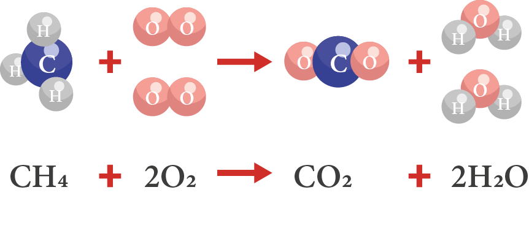

¡Importante! Las relaciones que conforman la ecuación química siempre se representan en moles, nunca en gramos.

### Relaciones estequiométricas

Las reacciones químicas suceden cuando los enlaces químicos entre los átomos de un compuesto se forman o se rompen. En este proceso de cambio interno de la materia existe un reordenamiento de los electrones que generan nuevos compuestos.

Las sustancias que participan en una reacción química se conocen como los reactivos, y las sustancias que se producen al final de la reacción se conocen como los productos.

Así como hablamos de recetas para conocer la cantidad de ingredientes necesarios para cocinar un platillo, las relaciones estequiométricas no son más que una receta que nos permite conocer las proporciones de productos o reactivos que esperamos en las reacciones químicas.

### Signos auxiliares en ecuaciones químicas

En una ecuación química los reactivos se colocan del lado izquierdo de la ecuación y los productos del lado derecho, también se dibuja una flecha entre los reactivos y los productos para indicar la dirección de la reacción. Es importante recordar que las reacciones químicas pueden ser reversibles, por lo que no siempre es una vía de un sólo sentido.

Las ecuaciones químicas representan la reacción química de forma que la explicación se hace abreviadamente y por escrito, mediante símbolos y números.

- En la siguiente figura podemos ver en negro los símbolos químicos que hacen referencia al símbolo de los elementos químicos que participan en la reacción.
- En morado podemos observar el símbolo aritmético, es decir, el símbolo más (+) que significa adicionar, mezclar o combinar.
- En rojo se describe el estado de agregación. Las letras entre paréntesis colocados después de la sustancia nos indican el estado en que se encuentran las sustancias, ya sean sólidos (s), líquidos (l), gaseosos (g) o disueltos en agua (ac).
- En azul podemos identificar los coeficientes, o bien, los números enteros que van situados por delante de todos los símbolos de la fórmula. Los coeficientes indican la cantidad de moléculas presentes en la sustancia.
- En verde observamos los subíndices, o bien, los números enteros que van situados en la parte inferior derecha de cada símbolo químico, y que indican la cantidad de átomos del elemento.

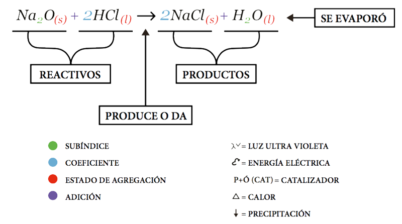

¡Importante! Cuando el coeficiente se multiplica por el subíndice resulta el total de átomos del elemento químico que lo lleva en la fórmula, esto es que el coeficiente afecta a todos los subíndices de una fórmula.

Cuando no aparece un coeficiente o un subíndice en la fórmula es porque se sobreentiende que el valor existente es de uno (1).

Existen otros símbolos que nos permiten conocer algunas situaciones particulares. Una flecha apuntando hacia arriba puede indicarnos que una sustancia se liberará en forma de gas, mientras que una flecha apuntando hacia abajo nos puede indicar que un producto se puede precipitar.

### Tipos de reacciones químicas

Existen distintos tipos de reacciones. Las estudiadas elementalmente en Química son:

- Reacciones de síntesis o adición.
- Reacciones de descomposición.
- Reacciones de sustitución simple.
- Reacciones de sustitución doble.

**Reacciones de síntesis o adición**

Son los casos más simples en donde la reacción de síntesis tiene lugar cuando dos átomos o moléculas diferentes interactúan para formar un compuesto distinto.

**Reacciones de descomposición**

En este caso una sustancia compuesta da lugar a dos o más sustancias más simples. Esta reacción puede generarse de forma espontánea o por un agente externo.

**Reacciones de sustitución simple**

En estas reacciones hay dos centros de reacción que intercambian uno de sus sustituyentes, es decir, un elemento toma el lugar de otro.

**Reacciones de doble sustitución**

En estas reacciones hay dos centros de reacción que intercambian uno de sus sustituyentes. Aquí hay un intercambio de un átomo por sustancia.

### Conceptos de óxido-reducción

Antes de entrar en materia es importante recordar algunos conceptos.

- Oxidación: Es la pérdida de electrones acompañada de un aumento en el número de oxidación de un elemento hacia un valor más positivo.
- Reducción: Es la ganancia de electrones acompañada de una disminución en el número de oxidación hacia un valor menos positivo.
- Agente oxidante: Es el elemento o compuesto que capta electrones para reducirse.
- Agente reductor: Es el elemento o compuesto que cede electrones, oxidándose.

### Método de balanceo óxido-reducción

Para balancear reacciones en las que ocurren reacciones de óxido-reducción es posible usar el método de balanceo redox para aproximar algunos coeficientes estequiométricos. Es probable que sea necesario ajustar algunos coeficientes por tanteo al final de la operación, pero en general este método acelera el proceso de balanceo.

Es importante recordar que en una reacción química la cantidad de átomos de un elemento en los reactivos debe ser igual a la cantidad de átomos del mismo elemento en los productos, esto para que se cumpla la **Ley de la Conservación de la Materia.**

Para explicar el método de balanceo utilizaremos la siguiente ecuación química, en dónde el Óxido Crómico, el Nitrato de Potasio y el Carbonato de Sodio reaccionan para formar Cromato de Sodio, Nitrito de Potasio y Dióxido de Carbono.

**Paso 1**

Coloca sobre cada elemento su respectivo número de oxidación. Aplica la regla de asignación de números de oxidación, en donde el Oxígeno siempre trabajará con un número de oxidación de -2, y los elementos del grupo 1 de la tabla periódica siempre trabajarán con el número de oxidación +1. Recuerda que la sumatoria de carga en un compuesto debe ser mayor a cero, de esta manera sabrás que estás asignando los números de oxidación adecuados.

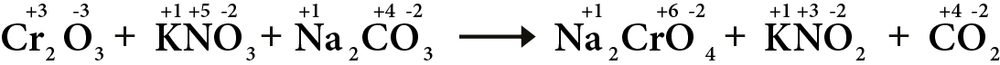

**Paso 2**

Después de obtener el estado de oxidación para cada elemento químico, debemos determinar qué elemento se oxida y cuál se reduce. En esta ecuación:

- El Cromo Cr se oxida al perder tres electrones (pasa de +3 a +6).
- El Nitrógeno N se reduce al ganar dos electrones (pasa de +5 a +3).
- Los demás elementos se mantienen igual dentro de la ecuación.

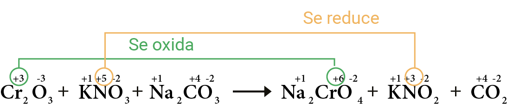

Una vez identificados los elementos, debemos plantear las semiecuaciones correspondientes.

**Paso 3**

Realiza un balance de átomos para cada semirreacción. Observa que tenemos dos átomos de Cromo Cr en los reactivos y uno en los productos. En el caso del Nitrógeno N podemos observar que tenemos uno en los reactivos y uno en los productos, de tal forma que debemos colocar el mismo número de átomos en los dos lados de la ecuación.

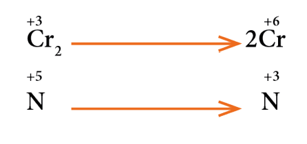

**Paso 4**

Ahora es necesario balancear las cargas. Si observamos la primera semirreacción podemos identificar que el Cr de lado izquierdo tiene una carga neta de +6, este número es resultado de la multiplicación del número de oxidación por el subíndice (3 x 2). Por otro lado, el Cr del lado izquierdo tiene una carga neta de +12, este número se obtiene multiplicando el número de oxidación por el coeficiente (6 x 2). Por lo tanto, la diferencia de electrones entre reactivos y productos es de 6 electrones, valor que deberás colocar en la semirreacción del lado derecho.

En el caso del Nitrógeno N podemos observar que el número de oxidación pasó de 5 a 3, es decir, el Nitrógeno N ganó electrones. La diferencia en este proceso es de 2 electrones, valor que deberás colocar en la semirreacción del lado izquierdo.

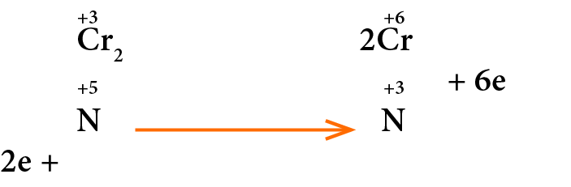

En el proceso de oxidación los electrones perdidos deben colocarse del lado derecho de la semirreacción, mientras que en el proceso de reducción, en donde se ganan electrones, el valor debe colocarse del lado izquierdo. Aquí se muestra de nuevo la importancia de identificar qué elemento se oxida y qué elemento se reduce.

**Paso 5**

En este paso debemos recordar que el número de electrones perdidos debe ser el mismo que el de los electrones ganados en ambas semirreacciones. Si multiplicamos una o ambas ecuaciones podemos hacer que este principio se cumpla. En este caso, si multiplicamos la segunda semirreacción por 3, balancearemos el número de electrones.

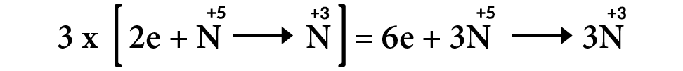

Ahora que tenemos balanceado el número de electrones podemos resolver las semirreacciones. Los electrones se anulan, y los elementos con sus coeficientes y subíndices pueden pasar a una sola semirreacción.

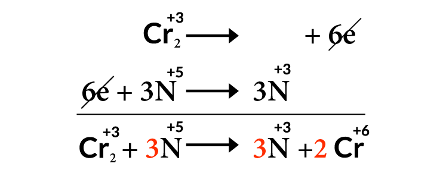

**Paso 6**

Ahora podemos pasar los coeficientes de los elementos que se reducen y de los elementos que se oxidan a sus respectivos compuestos en la ecuación química original.

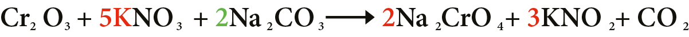

Si al colocar estos coeficientes la reacción no se encuentra balanceada, entonces será necesario terminar de balancearla por el método de tanteo, preferiblemente en el siguiente orden: Metal, No Metal, Oxígeno O y por último Hidrógeno H.

En este caso la ecuación aún no se encuentra balanceada. Observa que del lado de los reactivos tenemos 2 átomos de Sodio Na, y del lado derecho tenemos 4 átomos de Sodio Na. Para lograr balancear este elemento podemos colocar el coeficiente 2 en los reactivos para que al momento de realizar la multiplicación tengamos 4 átomos de Sodio Na.

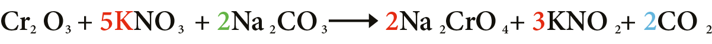

Ahora toca el turno de balancear al No Metal, en este caso se trata del Carbono C, elemento que no cambió su numero de oxidación. El coeficiente 2 que agregamos al Na₂CO₃ afecta al Carbono C de los reactivos, teniendo 2 átomos del lado izquierdo y uno del lado derecho. Para lograr balancear los Carbonos C en ambos lados de la ecuación tendremos que agregar el coeficiente 2 al Dióxido de Carbono CO₂.

Finalmente tenemos que demostrar que el número de Oxígenos O es el mismo en ambos lados de la reacción. Al hacer la suma de los reactivos podemos observar que tenemos 18 átomos de Oxígeno O, de la misma forma, al sumar los Oxígenos O de los productos podemos demostrar que tenemos 18 átomos de Oxígeno O, confirmando así que la ecuación se encuentra balanceada.

La química del examen se gana con práctica: domina los números de oxidación y el balanceo redox paso a paso, y esos reactivos dejarán de ser un dolor de cabeza. ¡Tú puedes con esta materia!

Continúa tu preparación con la siguiente parte de la serie.
