# Guía CENEVAL EXANI-II: Matemáticas (Parte 7 de 12)

_Parte 7 de 12 de la serie Guía CENEVAL EXANI-II._

## Desigualdades

### Notación de desigualdades

Una desigualdad es una **relación de orden que existe entre dos cantidades**, en otras palabras, es una comparación que existe entre dos cantidades para definir cuál tiene mayor magnitud.

Se representa con los signos menor que, mayor que, menor o igual que, y mayor o igual que.

Menor que: <

Mayor que: >

Menor o igual que: ≤

Mayor o igual que: ≥

*Cuando comparamos dos números siempre leemos de izquierda a derecha.*

Empecemos con lo más fácil. Comparemos dos cantidades. Por ejemplo, al comparar el 3 con el 5, podemos decir que 3 es menor que 5.

3 < 5

En otro ejemplo, también podemos decir que -10 es mayor que -20.

-10 > -20

Cuando expresamos una desigualdad algebraica, hablamos del conjunto de valores que satisfacen a la desigualdad.

Por ejemplo, en la desigualdad x > 3, nos referimos a todos los números reales que son mayores que 3. En este caso, hablamos de que la desigualdad tiene una infinidad de soluciones, pues tanto el 4, como el 1 000 000, como el 3.001 cumplen con la condición de ser mayor que tres.

Lo más sencillo es encontrar una desigualdad con un límite, ya sea inferior o superior. Por ejemplo, en la desigualdad x > 3, el 3 es un límite inferior, porque representa el valor donde empieza el conjunto de valores que hace verdadera a la desigualdad.

x > 3

El 3 es el límite inferior.

En la desigualdad x < 0, el cero es un límite superior, pues la desigualdad está representada por todos los números negativos.

x < 0

El 0 es el límite superior.

Pero también existen desigualdades que tienen límite inferior y límite superior. Estos se escriben, empezando con el límite inferior, en medio escribiremos la variable con la que trabajemos y, por último, pondremos el límite superior.

a < x < b

Esta desigualdad representa todo el conjunto de números que se encuentran entre a y b, y se lee como "x es mayor que a y menor que b".

¿Cuál es la diferencia entre < y ≤? ¿y entre > y ≥?

Cuando a una desigualdad se le agrega una línea inferior, la desigualdad tiene un significado diferente. Cuando escribimos, por ejemplo, que x es mayor que tres, hablamos de todos los números que sean mayores que tres, sin incluir al tres. En estos casos, decimos que tenemos un intervalo abierto.

x > 3

Cuando usamos el signo > o <, decimos que tenemos un intervalo abierto.

Cuando ponemos la línea debajo del símbolo de la desigualdad, hacemos un intervalo cerrado. En estos casos, el conjunto de números que hacen verdadera a la igualdad incluye al límite.

≤ ≥

Por ejemplo, en la desigualdad, x ≤ 0, el conjunto que hace verdadera a la desigualdad está formado por todos los números negativos, más el número cero.

x ≤ 0

Cuando usamos los signos de ≤ y de ≥, decimos que tenemos un intervalo cerrado.

Cuando tenemos desigualdades con límite inferior y superior, puede darse el caso de que tengamos intervalos semiabiertos (también pueden llamarse intervalos semicerrados), estos son aquellos en los que utilizamos ambos símbolos.

a < x ≤ b

a ≤ x < b

Cuando tenemos ambos símbolos, decimos que tenemos un intervalo semiabierto.

Una desigualdad puede presentarse de tres formas diferentes: en su notación algebraica, notación de intervalo y notación gráfica.

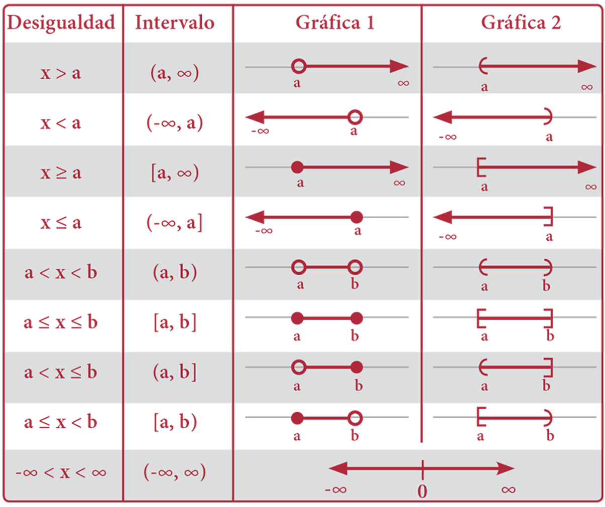

**Notación algebraica**

La notación algebraica es en la que se describe mediante una expresión algebraica, utilizando los símbolos <, >, ≤, ≥.

x < a

x > a

x ≤ a

x ≥ a

a < x < b

a < x ≤ b

a ≤ x < b

a ≤ x ≤ b

**Notación de intervalo**

La notación de intervalo representa a la desigualdad usando una pareja ordenada, donde se expresa primero el límite inferior y después el límite superior. Si el límite se encuentra incluido en el intervalo, se escribe dentro de un corchete. Cuando el límite no forma parte del intervalo, se escribe dentro de un paréntesis.

(-∞, a)

(a, ∞)

(-∞, a]

[a, ∞)

(a, b)

(a, b]

[a, b)

[a, b]

Hagamos algunos ejemplos para explicarlo mejor: si queremos expresar la desigualdad abierta 0 < x < 10, para expresarla como intervalo, escribimos la pareja ordenada (0, 10). Para este caso, recordemos que ni el cero ni el diez forman parte del intervalo que hacen verdadera a la desigualdad.

Si queremos expresar la desigualdad cerrada 10 ≤ x ≤ 20, escribimos [10, 20]. Recordemos que, en esta desigualdad, tanto el 10 como el 20 forman parte del intervalo que hacen verdadera a la desigualdad.

Expresemos ahora, un intervalo semiabierto, si tenemos, por ejemplo, que 20 < x ≤ 30. Para expresar el intervalo escribimos la pareja ordenada (20, 30]. En este caso, el 20 no forma parte del intervalo, pero el 30 sí.

La desigualdad 30 ≤ x < 40 se escribe [30, 40). En este caso, el 30 forma parte del intervalo, pero el 40 no.

Pensemos ahora en una desigualdad que tiene un solo límite. Por ejemplo, x > 9, en este caso, el intervalo se escribe (9, ∞).

Para el ejemplo x ≤ 9, escribimos el intervalo (-∞, 9].

El infinito (∞) siempre se escribe con paréntesis, pues no existe manera de alcanzarlo.

El intervalo que va desde el infinito negativo al infinito positivo es el que incluye a todos los números reales, y se representa como (-∞, ∞).

**Notación gráfica**

La notación gráfica representa los intervalos que hacen verdadera a la igualdad en la recta numérica.

Para expresar la gráfica, empezamos dibujando una recta y marcamos en ella el límite inferior y el límite superior.

Si el límite es abierto, entonces se puede dibujar un paréntesis o una circunferencia; si el límite es cerrado, podemos dibujar un corchete o un círculo.

Cuando tenemos un intervalo de un sólo límite, se dibuja una flecha que vaya del límite hacia el infinito correspondiente. Por ejemplo, en la desigualdad "x menor que tres", dibujamos una flecha que vaya desde el tres hasta el infinito negativo.

### Resolución de desigualdades lineales

Resolver una desigualdad es casi igual que resolver una igualdad, únicamente debemos tomar en cuenta que, cuando un número negativo pasa multiplicando o dividiendo, el sentido de la desigualdad cambia.

Ejemplo: ¿Cuál es el conjunto solución de la desigualdad 2x-6+3x ≥ 8x+21?

Solución: Empecemos pasando todos los términos con x al primer miembro, y los términos semejantes pasarán al segundo miembro.

2x-6+3x ≥ 8x+21

2x+3x-8x ≥ 21+6

Reduciendo términos semejantes:

-3x ≥ 27

Al despejar x, cambiamos el sentido de la desigualdad.

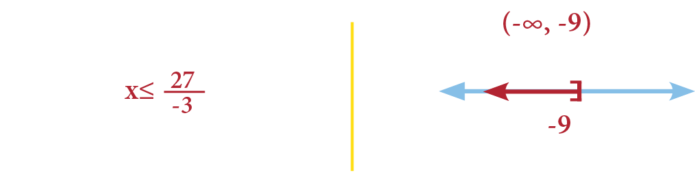

Ejemplo: Encontremos el conjunto solución para la desigualdad:

Solución: Para despejar, debemos pasar el cinco multiplicando a ambos extremos de la desigualdad:

Ahora, pasemos el -3 a ambos extremos de la desigualdad, como está restando, pasa sumando.

15+3 ≤ 2x < 35+3

Despejando la x.

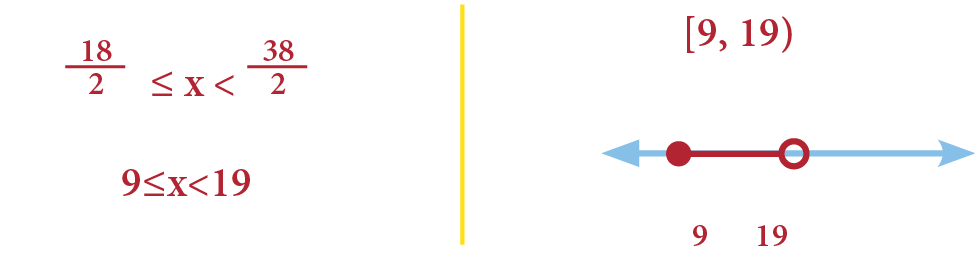

## Límites

### Obtención de límites por: sustitución, simplificación por método de factorizaciones y multiplicación del conjugado

En esencia un límite matemático se refiere a **la aproximación hacia un punto concreto o una función**, es decir, se acercan al valor sin tocarlo.

*Existen tres formas de resolver un límite*

La primera es por medio de sustitución, sustituimos el valor del límite en la función. Si nos da un valor real hemos resuelto el límite, si no, debemos de buscar resolver el límite a través de otros dos métodos: simplificar por método de factorizaciones o multiplicar con el conjugado.

También hay límites cuando:

a → ∞ o a → 0

Por lo tanto es necesario conocer las siguientes reglas:

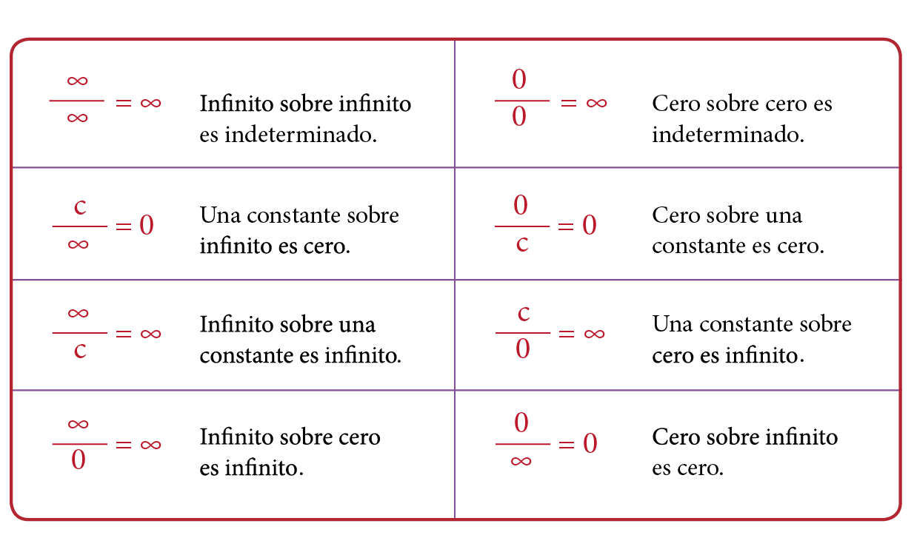

Si las constantes son negativas entonces los infinitos cambiarán a ser menos infinito.

-a → -∞

Resolvamos un ejercicio.

Resuelve el límite:

Lo primero que vamos a hacer es sustituir el 2 por la X. Nos queda:

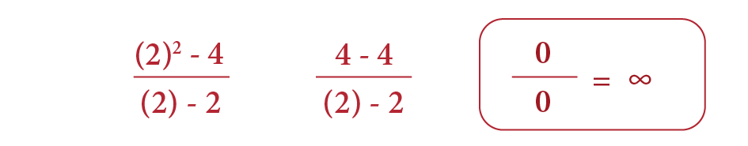

Esto es igual a una forma indeterminada, por lo tanto el límite es indeterminado.

La siguiente ecuación la podemos factorizar como una diferencia de cuadrados, por lo tanto nos queda:

Cancelamos x-2 sobre x-2 ya que esto es igual a 1. Nos queda x+2.

Ahora podemos sustituir el límite cuando x tiende a 2.

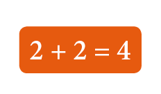

Resolvamos otro ejercicio.

Resuelve el límite cuando:

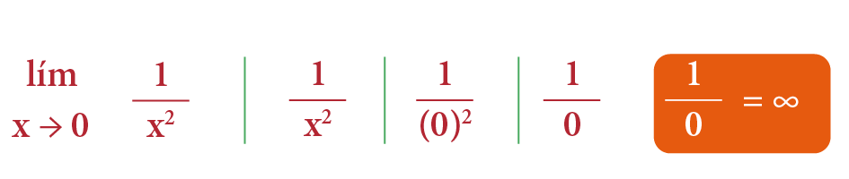

Si sustituimos el cero nos da igual a infinito. Vemos que no podemos factorizar.

Si observamos con atención, la diferencia entre estos dos límites es que el cero, si toma valores muy pequeños, al elevarlos al cuadrado se vuelven positivos y el número tenderá a ser infinito positivo.

Tenemos otro límite cuando x tiende a 0, el cual no existe.

Veamos otro ejercicio.

Resuelve el siguiente límite, cuando x tiende a 3 de la función:

Lo primero que vamos a hacer es sustituir la x por 3. Por lo tanto la función queda de la siguiente manera:

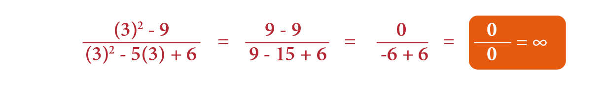

Ahora podemos factorizar ambos términos.

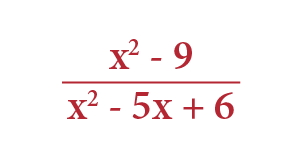

El término de abajo lo vamos a factorizar con dos números que multiplicados nos den 6 y sumados nos den 5. Éstos son: -3 y -2. Una vez factorizados nos queda:

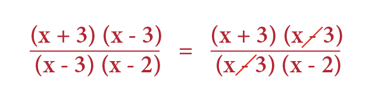

Después de simplificar y sustituir el 3 por la x:

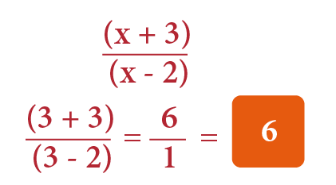

Ahora resolvamos un límite cuando x tiende a infinito.

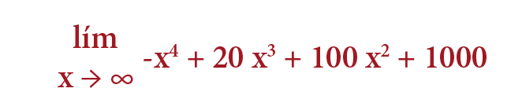

En este caso hay que buscar cuál es el término con mayor grado, el cual es: -x4

Al sumar infinito, el que tenga mayor grado de polinomio va a ser el símbolo que queda.

-(∞)4

Por lo tanto en este caso el límite es negativo infinito.

-∞

Resolvamos otro caso.

Cuando x tiende a negativo infinito de e a la x:

Por definición es igual al límite cuando x tiende a infinito de e -x:

Pasamos el e elevado a la -x y nos queda el límite de x cuando tiende a infinito positivo de 1 sobre ex.

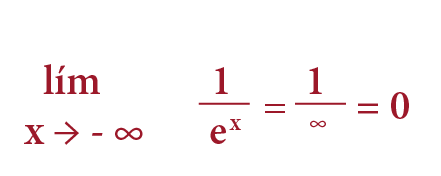

Como resultado en este caso el límite es:

0

## La integral

### Reglas

La integración es el proceso inverso de la derivación, **representa el área bajo una curva.**

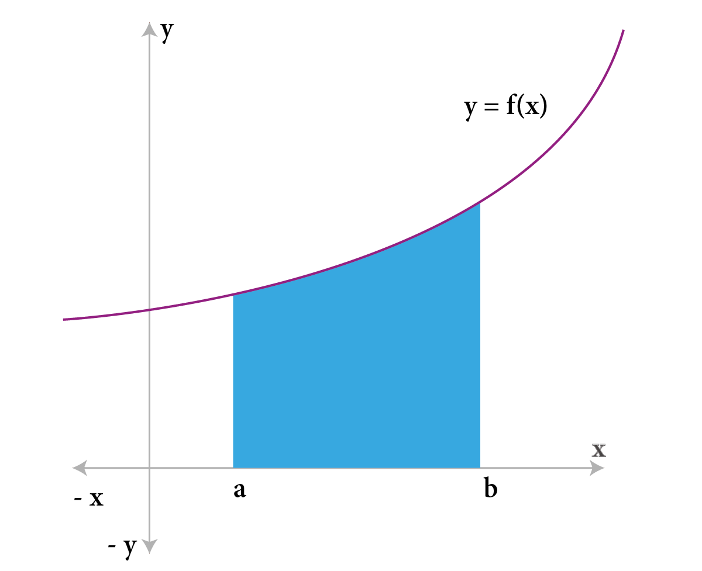

Veamos las principales reglas de las integrales.

La integral de dx es x+C. Siempre que obtengamos una integral, debemos tomar en cuenta que se agrega una constante C, pues al momento de derivar, las constantes se derivaron como cero.

Las constantes que multipliquen a una diferencial no forman parte de la integral, y se pueden escribir a la izquierda.

∫ adx = a∫ dx

La integral de una función polinomial puede separarse en la integral de cada uno de los términos del polinomio.

∫(u+v-w)dx = ∫ udx+∫ vdx-∫ wdx

Una vez que tomamos en cuenta lo anterior, listamos algunas fórmulas básicas de integración:

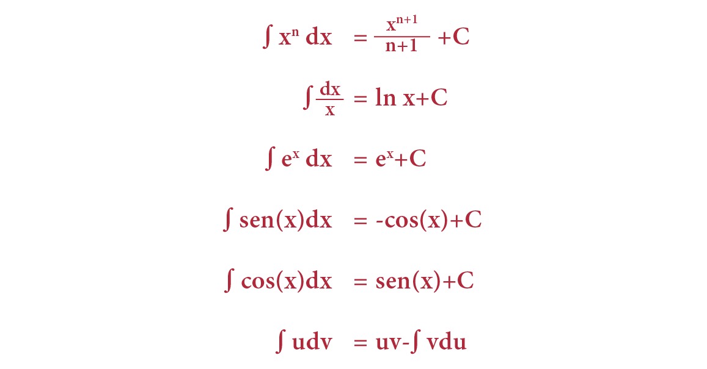

Resolvamos las siguientes integrales.

Resuelve la integral de ∫ 2x3 dx.

Ya que el 2 es una constante, la sacamos de la integral y obtenemos 2 ∫ x3 dx.

Recordemos la fórmula:

2(x4) sobre 4 más una constante.

Simplificamos y nos queda igual a 1/2 de x4 más una constante.

Resuelve la integral ∫ e2x dx.

Si recordamos la fórmula, dice que ∫ ex dx = ex + C, sin embargo no está en esa forma por lo que debemos hacer un cambio de variable. Siendo U = 2x.

Para encontrar DU derivamos la U y nos queda: du = 2dx.

Despejamos DX por lo tanto:

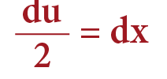

Ahora ya podemos hacer un cambio de variable que:

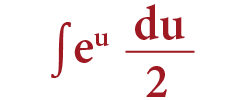

Esto es una constante que podemos sacar de la integral. Nos queda:

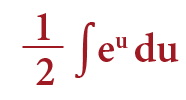

Esta fórmula ya está como lo tenemos en las reglas presentadas al inicio de la lección, por lo que podemos sustituir. Obtenemos:

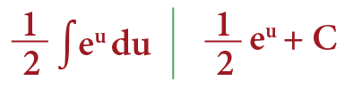

Nuestra integral está en términos de x, no de U. Por esto debemos regresar a nuestra variable original. Recordemos que U es igual a 2x. Nos queda:

Resuelve la integral de:

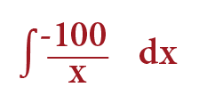

Lo que debemos hacer es sacar el -100 como una constante por la integral de: 1/x

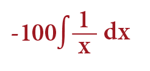

-100 ln(x) + C

Así lo encontramos en las reglas por lo que sabemos que es -100 por logaritmo natural del valor absoluto de x + C:

Resuelve la integral de ∫ y dx.

Recordemos que y es una constante respecto a x, por lo tanto la sacamos de la integral. Obtenemos: y ∫ dx que es igual a:

yx + C

La siguiente integral que veremos es: ∫ 2x cos(5x2) dx.

Ésta la podemos resolver utilizando el cambio de variable. En este caso el cambio de variable es u = 5x2. Lo derivamos y nos queda du = 10xdx.

Despejamos dx, por lo tanto:

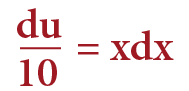

El 2 es una constante, la sacamos de la integral y queda ∫2x cos(5x2) dx es igual a:

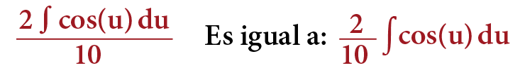

Ya está como lo tenemos en las reglas. ∫ cos x dx = sen x + C. Por lo tanto:

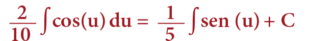

Ahora retomamos la variable original. Es igual a:

Resuelve la siguiente integral ∫ xexdx.

Es necesario aplicar la integración por partes ya que no está completa. Recuerda ser cuidadoso al ver cuál variable tomamos como u y cual tomamos como dv. Una la vamos a derivar y otra la vamos a integrar. Hay que tratar siempre de bajar el polinomio, por lo tanto:

u = x | v = ex.

Si decidimos que u es e a la x al integrar x vamos a obtener x2 sobre 2 y nunca encontraríamos un resultado.

La fórmula es ∫ udv = uv- ∫ vdu. Su integral es directa y nos queda:

∫ xex dx = xex - ∫ exdx

Podemos factorizar el ex ya que ambos términos lo tienen. Factorizamos y nos da la solución: ex (x - 1) + C

Con esto cerramos los temas de desigualdades, límites e integrales. Son temas que aparecen con frecuencia en el examen, así que repasa los ejemplos paso a paso hasta que puedas resolverlos sin mirar. La práctica constante es lo que convierte estos procedimientos en puntos seguros el día del examen.

Continúa tu preparación con la siguiente parte de la serie.
