# Guía CENEVAL EXANI-II: Física (Parte 8 de 12)

_Parte 8 de 12 de la serie Guía CENEVAL EXANI-II._

## Leyes de los gases y energía

### Propiedades de un sistema

Un sistema es una parte del universo que se aísla para su estudio de manera práctica. A la región del universo más cercana al sistema, y con la cual éste interactúa, se le llama alrededores. En un sistema, una propiedad es una característica macroscópica o microscópica que permite describirlo.

Para entender el comportamiento de los gases es importante entender las siguientes cuatro propiedades:

- Cantidad de sustancia: Es la cantidad de átomos o moléculas que contiene un sistema. Se mide en moles.
- Volumen: Es el espacio que ocupa un sistema en el universo. Se mide en unidades de longitud al cubo, como el metro cúbico, aunque también se puede medir en litros o en galones. L, m3, galones.
- Presión: Es el resultado de una fuerza dividida sobre un área. Se mide en Newtons por metro cuadrado, llamados también pascales.
- Temperatura: Esta propiedad permite tener una noción de la energía que contiene un sistema. Si un cuerpo está más caliente que otro, sabemos que tiene más energía.

Para medirla existen tres escalas usadas comúnmente:

- Grados Centígrados o Celsius.
- Grados Fahrenheit, usados en el sistema inglés.
- Grados Kelvin, que es la unidad usada en el sistema internacional.

Es posible convertir las temperaturas entre estas tres escalas.

Para convertir de grados Fahrenheit a grados Celsius multiplicamos cinco novenos por la temperatura en grados Fahrenheit, menos 32.

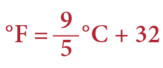

Para convertir de grados Celsius a Fahrenheit multiplicamos nueve quintos por la temperatura en grados Celsius más 32.

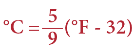

Para convertir de grados Celsius a Kelvin, sólo se le suman 273.15 a la temperatura en grados Celsius.

K = °C + 273.15

Finalmente, para convertir de grados Kelvin a Celsius, se le restan 273.15 a la temperatura en grados Kelvin.

K = °C - 273.15

### Estado de un sistema

El Estado de un sistema es la condición específica en la que éste se encuentra y está completamente descrito por sus propiedades. Por ejemplo, al cocinar en una olla exprés se introducen los alimentos y el agua a temperatura ambiente, al cerrarla establecemos este punto como el Estado 1. Después de un tiempo en el fuego la temperatura se incrementa, lo que hace que el agua comience a evaporarse y que incremente la presión en la olla. Dado que las propiedades del sistema cambiaron, éste se encuentra ahora en un estado diferente, al que llamaremos Estado 2.

A la diferencia entre los Estados 1 y 2 se le conoce como cambio de estado. Y al camino que recorre cualquier cambio de estado se le conoce como proceso.

### Gas ideal y leyes de los gases

El gas ideal es un gas hipotético que tiene características que los gases reales no tienen, por ejemplo:

- La distancia entre sus moléculas es muy grande.
- No existen fuerzas de atracción o repulsión entre sus moléculas.
- Las colisiones entre sus moléculas son elásticas.

El modelo del gas ideal describe el comportamiento empírico de los gases de manera sencilla. Para esto se emplean también ecuaciones de estado, las cuales relacionan las propiedades del sistema en un estado determinado.

Por otra parte, una ecuación que relaciona las propiedades de un sistema antes de atravesar un proceso con las propiedades del sistema después del cambio de estado es conocida como ecuación de proceso.

*Ley de Boyle*

En un sistema con temperatura y cantidad de sustancia constantes, la presión es inversamente proporcional al volumen del sistema.

Su ecuación de estado se expresa así: la presión por el volumen es una constante. PV = K (constante)

Por lo tanto, la ecuación de proceso de la ley de Boyle es: P1V1 = P2V2.

La presión 1 por el volumen 1 es igual a la presión 2 por el volumen 2.

*Ley de Charles*

En un sistema con cantidad de sustancia y presión constantes, el volumen varía de manera proporcional con la temperatura del sistema.

Así, su ecuación de estado dice que el volumen entre la temperatura es igual a una constante.

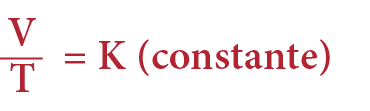

Su ecuación de proceso establece que el volumen 1 entre la temperatura 1, es igual al volumen 2 entre la temperatura 2.

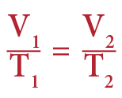

*Ley de Gay-Lussac*

Esta ley dice que en un sistema con volumen y cantidad de sustancia constantes la presión varía proporcionalmente con la temperatura, por lo que su ecuación de estado se puede escribir así:

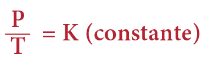

La presión entre la temperatura es igual a una constante.

La ecuación de proceso es presión 1 entre temperatura 1, es igual a la presión 2 entre la temperatura 2.

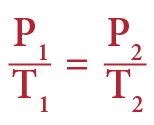

*Ecuación de estado del gas ideal*

La ecuación del gas ideal se expresa de la siguiente manera: la presión por el volumen es igual a la cantidad de sustancia por la constante universal de los gases por la temperatura.

PV = nRT

Donde la constante universal de los gases es igual a 8.314 Joules entre mol Kelvin.

R = 8.314 j / mol K

Esta ecuación describe de manera general a los gases ideales en un estado determinado.

La ecuación de proceso para gases ideales es: presión 1 por volumen 1 entre la temperatura 1 es igual a presión 2 por volumen 2 entre la temperatura 2.

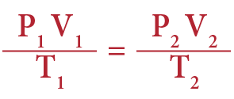

### Concepto de energía

La energía es algo que usamos de manera cotidiana, prácticamente en todas nuestras actividades. Se define como la capacidad para realizar un trabajo, también se puede decir que la energía es la propiedad que tiene la materia para generar cambios, como mover objetos, modificar la presión, cambiar la temperatura, generar trabajo eléctrico. La unidad de medida de la energía es el Joule, que en unidades base del sistema internacional es:

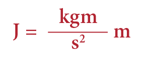

*Tipos de energía*

Existen muchos tipos de energía, entre ellos la energía mecánica, cinética, potencial, interna y calorífica, cuyas definiciones veremos a continuación.

Energía mecánica: Se define como la suma de la energía cinética y la energía potencial.

Em = Ec + Ep

Energía cinética: Es la que posee un cuerpo cuando está en movimiento.

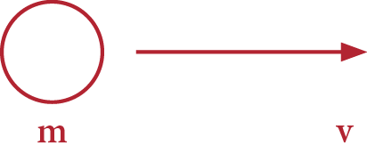

La fórmula para calcularla es:

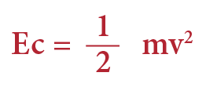

Energía potencial: Está asociada a la altura que ocupa un cuerpo con respecto a un punto de referencia, mientras más alto se encuentre de ese punto de referencia, más energía potencial acumula.

Por lo tanto, la energía potencial es igual a la masa, por la aceleración de la gravedad (9.81 m/s2 ), por la distancia entre el cuerpo y la superficie terrestre, o sea, la altura.

Energía interna: Se encuentra contenida en toda la materia. Es la suma de toda la energía de los átomos y moléculas que conforman a los cuerpos y se representa con la letra "U". La energía interna no se puede conocer debido a su naturaleza, por lo que sólo es posible calcular sus cambios.

∆U = U2 - U1

Calor: Es energía en tránsito y está presente cuando dos cuerpos con distintas temperaturas se ponen en contacto, el que tiene mayor temperatura transfiere energía al de menor temperatura. La energía transferida es conocida como calor.

Ésto quiere decir que el calor es una forma de energía que se transfiere de un cuerpo A a otro B, cuyo único efecto es modificar la temperatura de ambos cuerpos.

El calor transferido a un cuerpo se puede calcular de la siguiente forma: calor es igual a la masa del cuerpo por el calor específico por su cambio de temperatura. Q = mCe∆T

Calor específico: El calor específico se define como la cantidad de energía necesaria para elevar la temperatura de una sustancia un grado por unidad de masa, por lo que es una propiedad característica de cada sustancia. Sus unidades son Joule entre kilogramo por Kelvin en el sistema internacional, o caloría sobre gramo por grado Celsius.

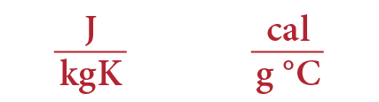

*Formas de transferir el calor*

Cuando la energía se transfiere en forma de calor, lo hace por medio de tres mecanismos:

- Conducción: Consiste en la transferencia de energía debido al choque entre las moléculas y los átomos de los cuerpos, por ejemplo, si se calienta el extremo de una barra metálica, con el paso del tiempo la energía se propagará a lo largo de toda la barra.
- Convección: Se da cuando se transfiere energía por medio del movimiento de los fluidos, por ejemplo, el movimiento del agua cuando ésta está en ebullición.
- Radiación: Es la propagación de la energía en forma de ondas electromagnéticas. La energía que recibimos del Sol o el calor de una fogata son algunos ejemplos.

### Trabajo

El trabajo es el producto de la fuerza por el desplazamiento y su unidad de medida es el Joule. Si una persona mueve un objeto, aplica una fuerza y realiza un desplazamiento está realizando un trabajo.

El trabajo se calcula con la siguiente fórmula:

**Trabajo realizado por un gas**

Un gas puede realizar trabajo si se expande o se comprime. Si un gas cambia su volumen, el trabajo realizado por el sistema es menos la presión por el cambio del volumen. Si el trabajo es positivo, es de compresión, y si es negativo, es de expansión.

## Hidráulica

### Hidrostática

La Hidráulica estudia los fluidos, tanto a los líquidos como a los gases. Se divide en dos ramas: la Hidrostática y la Hidrodinámica.

Se encarga de estudiar los fluidos en reposo. Revisemos los siguientes conceptos básicos y fórmulas que serán necesarios para resolver los problemas de dichos fluidos.

Presión

Se define como la fuerza dividida sobre el área. La unidad de presión en el sistema internacional es el Pascal.

Un Pascal, en unidades base del sistema internacional, es un Newton sobre metro cuadrado.

Existen otras unidades de presión además del Pascal, pero no pertenecen al sistema internacional. Algunos ejemplos son atmósferas, Bar, milímetros de mercurio, entre otros.

Para convertir las distintas unidades de presión se tienen los siguientes factores de conversión.

1 Atm = 101325 Pa 1 Atm = 760 mmHg

*El principio de Pascal*

Este principio dice lo siguiente:

"La presión que se le aplica a un fluido encerrado se transmite a todos los puntos de dicho fluido".

La principal aplicación de este principio es la prensa hidráulica, un dispositivo que sirve para levantar cosas pesadas y que consta de dos émbolos de diferente tamaño conectados entre sí por medio de un recipiente cerrado que contiene fluido hidráulico.

La fórmula para calcular una prensa hidráulica es la siguiente:

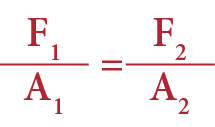

Donde F1 es la fuerza que se aplica en el pistón 1, a1 es el área circular del pistón 1, F2 es la fuerza que se obtiene en el pistón 2, y A2 es el área circular del pistón 2.

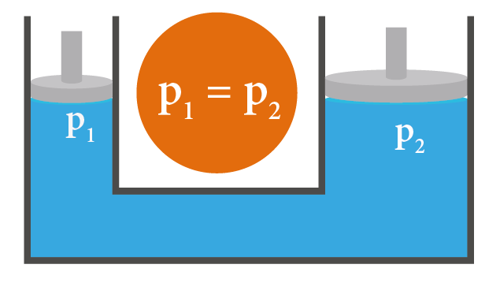

Ahora resolvamos el siguiente problema:

Se desea elevar un cuerpo de 10 kilogramos utilizando una prensa hidráulica con un émbolo circular grande de 40 centímetros de diámetro, y un émbolo circular pequeño de 10 centímetros de diámetro. ¿Cuánta fuerza se debe hacer en el émbolo pequeño para levantar los 10 kg?

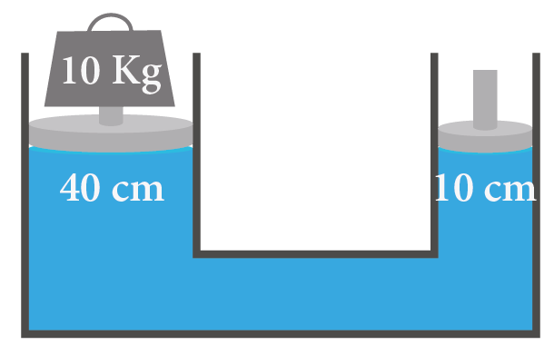

Conocemos que:

La masa es igual a 10 kilogramos y la fuerza 1 es igual a la masa por la gravedad: 10 por 9.81 que nos da 98.1.

Peso = F1 = mg = (10 kg) (9.81m/s2) = 98.1 N

El diámetro 1 es de 40 centímetros que, convertido en el sistema internacional, es igual a 0.4 metros. Recordemos que el radio es la mitad del diámetro, por lo tanto, es igual a 0.2 metros.

El área 1, al tratarse de un círculo, es igual a π por radio al cuadrado, lo cual nos da 0.125 metros cuadrados.

A1 = πr2 = π(0.2m)2 = 0.125 m2

*La fuerza 2 no la conocemos, es la pregunta del problema.*

El diámetro 2 es de 10 centímetros, o 0.1 metros en el sistema internacional. Podemos obtener el radio 2 dividiendo el diámetro entre 2, y es igual a 0.05 metros.

El área 2, siendo también circular, se obtiene de la fórmula π por radio al cuadrado, lo cual da 7.85 x 10 -3 m2.

A2 = πr2 = π(0.05m)2 = 7.85×10−3 m2

Despejamos F1 de la fórmula:

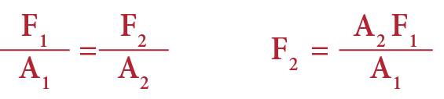

Sustituyamos los valores:

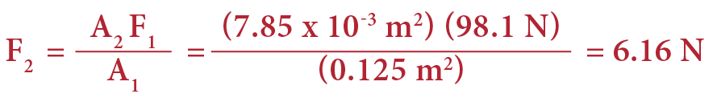

Por lo tanto la fuerza necesaria para levantar el objeto es de 6.16 N.

*Principio de Arquímedes*

Este principio dice lo siguiente:

"Todo cuerpo parcial o totalmente sumergido en un fluido experimenta un empuje vertical y hacia arriba igual al peso del fluido desplazado".

Según el principio de Arquímedes al sumergir un objeto en un fluido, por ejemplo una pelota en el agua, se genera una fuerza que intenta sacarla del agua llamada empuje hidrostático, fuerza de flotación o fuerza boyante.

Para calcular esta fuerza usamos la siguiente fórmula:

E = ρgv

Donde E es la fuerza de flotación y se mide en Newtons, ρ es la densidad y se mide en kg/m3, g es el valor de la gravedad igual a 9.8 m/s2 y v es el volumen desplazado por el objeto.

Ejemplo:

Revisemos el siguiente problema: una bola de acero de 10 centímetros de radio se sumerge en agua. Calcula el empuje hidrostático y su peso dentro del agua. Considera que la densidad del agua es 1,000 kg/m3 y la densidad del acero es igual a 7,900 kg/m3.

Lo primero que haremos será recabar los datos:

Nos dicen que el radio es igual a 10 centímetros, en el sistema internacional es igual a 0.1 metros.

La gravedad es 9.8 metros sobre segundo cuadrado.

La densidad del agua es igual a 1,000 Kg sobre metro cúbico.

Y la densidad del acero es de 7,900 kg sobre metro cúbico.

El empuje es igual a la densidad del agua por la gravedad por el volumen desplazado. E = ρgv

Queda como incógnita el volumen desplazado y el empuje.

Conociendo que la figura en cuestión es una esfera y está completamente sumergida, podemos sacar el volumen con la siguiente fórmula:

El volumen de la esfera es igual a cuatro tercios de π, por radio al cubo, lo que da como resultado 4.188 x 10- 3 m3.

E = pgv = (1000 ) (9.8 ) (4.188 x 10-3 m3) = 41.04 N

Sustituyendo el volumen en la fórmula de empuje, tenemos que la densidad del agua por la gravedad por el volumen desplazado, son 1,000 por 9.8 por 4.188 x 10-3 m3, que da como resultado 41.04 Newtons.

Para conocer el peso dentro del agua, también llamado peso aparente, lo primero que haremos será calcular el peso de la bola de acero, que es la densidad, por la gravedad por el volumen.

Peso = pgv = (7900 ) (9.8 ) (4.188 x 10-3 m3) = 324 N

La densidad es igual a 7,900, por la gravedad igual a 9.8 por el volumen es 4.188 x 10- 3 m3, lo cual da como resultado 324 Newtons.

El peso dentro del agua lo obtendremos de la resta del peso menos el empuje. 324 - 41.1 es igual a 282.9 hacia abajo.

Peso aparente = Peso − E = 324 − 41.04N = 282.9 N

### Hidrodinámica

La Hidrodinámica, rama de la Hidráulica, estudia los fluidos en movimiento, como sería el agua fluyendo por una tubería, un río, entre otros. Revisemos los siguientes conceptos básicos y fórmulas que serán necesarios para resolver los problemas de fluidos en movimiento:

Caudal o gasto: Se define como la cantidad de volumen total de fluido que circula sobre unidad de tiempo. En la fórmula, el caudal o gasto es igual a área por velocidad.

Q = AV

Donde Q es caudal o gasto y se mide en m3/s, A es el área y se mide en m2, y V es velocidad del fluido y se mide en m/s.

Principio de continuidad: Este principio plantea que si tenemos un fluido que viaja a través de una tubería con dos diámetros diferentes, las velocidades en ambos diámetros también serán diferentes.

La fórmula del principio de continuidad es: A1v1 = A2v2.

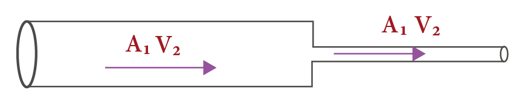

El área de la sección 1 de la tubería por la velocidad de la sección 1 de la tubería, es igual al área de la sección 2 de la tubería por la velocidad de la sección 2 de la tubería.

Ejemplo:

Una tubería horizontal transporta agua y tiene una sección de 0.02 m2 de área transversal, también tiene un estrechamiento que reduce su área a 0.01 m2. La velocidad del agua en la sección 1 es de 3 m/s. Determina la velocidad en la sección 2.

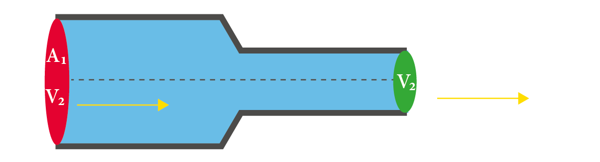

Lo primero que haremos será recabar los datos:

Nos dicen que tiene una sección de 0.02 m2 eso es el área 1. También que se reduce a 0.01 m2, eso es el área 2.

Sabemos que la velocidad de agua en la sección 1 es de 3 m/s, eso es la velocidad 1.

Nos piden determinar la velocidad 2. Ahora, considerando la fórmula del principio de continuidad hay que despejar la velocidad de la sección 2.

A1v1 = A2v2

Sustituyendo los datos obtenemos como resultado:

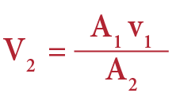

Observa que la velocidad del agua al momento en que se reduce a la mitad, el área aumenta al doble.

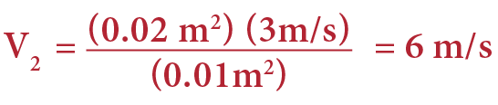

## Óptica

### Propiedades de la luz

La Óptica estudia las siguientes propiedades de la luz.

Velocidad: La velocidad de la luz en el vacío es una constante universal, equivale a 300 000 km/s.

Reflexión: Cuando una onda choca con un medio y rebota es llamada reflexión. De esta manera, el haz de luz viaja con un ángulo de incidencia con respecto al plano horizontal, choca en un medio y es reflejado sobre el mismo medio con su respectivo ángulo de reflexión.

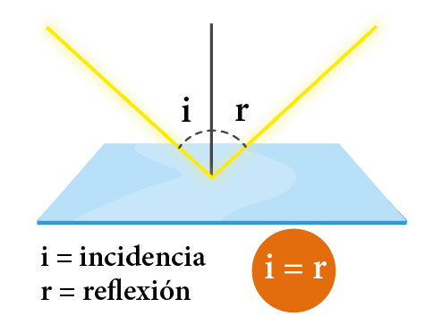

Un ejemplo de reflexión es observarse en un espejo, ya que la luz viaja del ojo al espejo, rebota en el mismo y regresa de nuevo a tus ojos.

### Espejos planos, cóncavos y convexos

Se definen como una superficie lisa y pulida que refleja la luz.

Existen tres tipos de espejos.

1. Planos: Es una superficie sin curvatura en la que la imagen formada tiene las mismas dimensiones que la imagen real.

2. Cóncavos: Es una parte de un cuerpo esférico, donde la luz incide en una superficie interior.

3. Convexos: Es una parte de un cuerpo esférico, donde la luz incide en una superficie exterior.

Características de los espejos esféricos (cóncavos y convexos)

Tienen un vértice, un foco, una distancia focal, un centro y un radio.

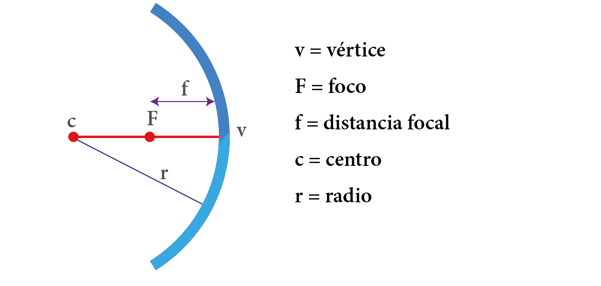

Para describir las características de la imagen formada por los espejos se pueden usar dos métodos: el método gráfico, que describiremos más adelante; o el método analítico, que se calcula usando la siguiente fórmula:

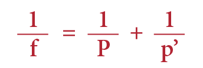

Donde f simboliza distancia focal, P distancia del objeto al espejo, y P’ distancia de la imagen al espejo.

Método gráfico: Para conocer el tamaño de la imagen y la forma en un espejo hay que proyectar rayos de luz; tenemos tres rayos importantes: el paralelo, el principal y el focal, estos rayos se cruzan en donde se forma la imagen.

Ejemplo 1

Si el objeto se encuentra entre el centro y el foco, la imagen se verá invertida, será real y se verá mayor al objeto.

El rayo verde se llama paralelo, y el morado, principal.

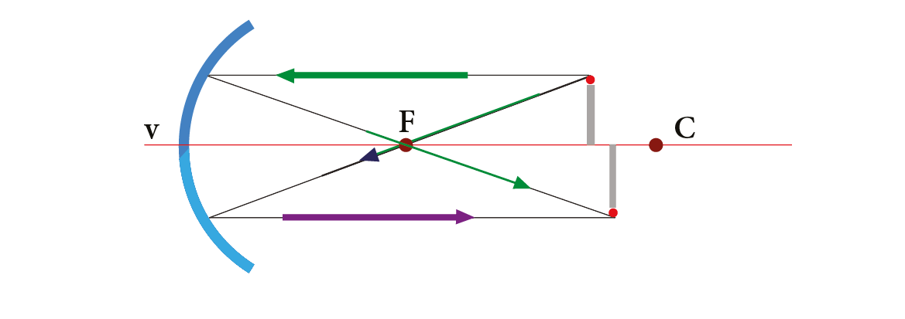

Ejemplo 2

Si el objeto se encuentra exactamente en el foco, entonces no vamos a ver la imagen. Esto se debe a que los rayos de luz no se cruzan, pues sus trayectorias son paralelas. El rayo morado se llama principal, y el verde, paralelo.

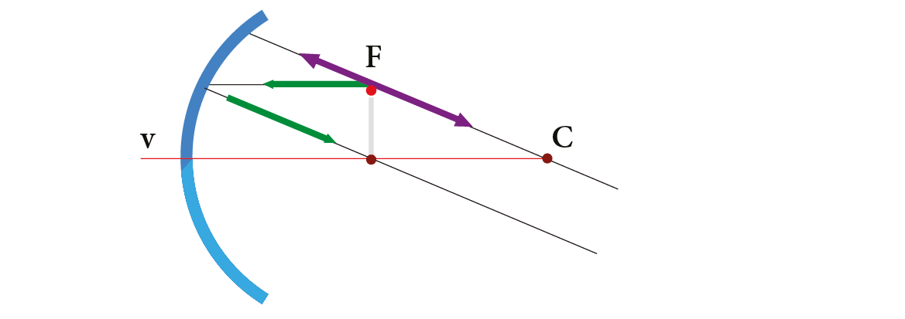

Ejemplo 3

Si el objeto se encuentra en el centro de curvatura, la imagen se va a ver invertida, será real y el tamaño con el que la vamos a ver será igual al tamaño del objeto. El rayo verde se llama paralelo, el morado, focal.

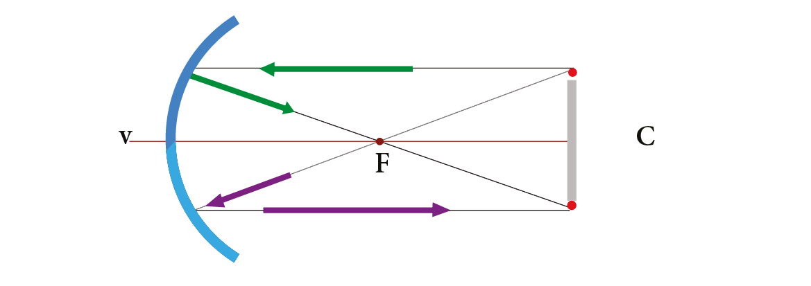

Ejemplo 4

Cuando el objeto se encuentra entre el foco y el espejo, la imagen que vamos a ver será virtual y de mayor tamaño. El rayo morado se llama focal, y el verde, paralelo.

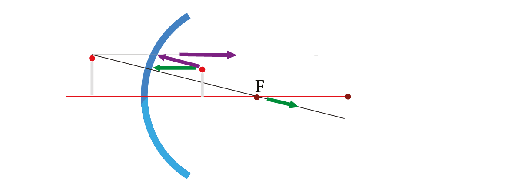

### Refracción de la luz

Es el cambio de velocidad y dirección de la luz al cambiar de medio.

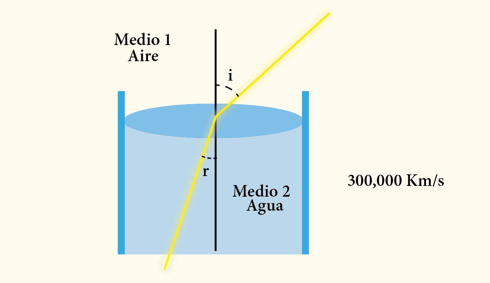

Supongamos que apuntamos un rayo láser contra el agua. El haz de luz al viajar por el aire y al momento de llegar al agua formará un ángulo de incidencia con la superficie y al atravesar el agua. En otras palabras, al cambiar de medio cambiará su dirección viajando ahora con un ángulo de refracción.

La refracción es la responsable de que la luz blanca se separe en todos los colores del arcoíris.

Un ejemplo de refracción es la luz que atraviesa un lente y corrige la visión de una persona.

*Lentes delgadas*

Las lentes delgadas son cuerpos transparentes que utilizan la refracción para funcionar, se dividen en convergentes y divergentes.

Lentes convergentes: Son más gruesas en el centro que en los bordes y desvían la luz hacia un punto llamado foco.

Lentes divergentes: Son más delgadas en el centro que en los bordes y desvían la luz separándola.

*Características de los lentes*

Tienen centro (C1 y C2), focos (F1 y F2), distancia focal (df) y centro óptico.

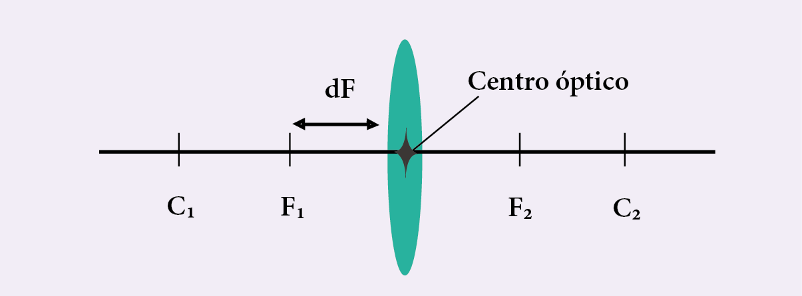

Para conocer el tamaño de la imagen y la forma en un lente hay que proyectar rayos de luz, tenemos tres rayos importantes llamados paralelo, principal y focal, igual que en los espejos. El lugar donde estos rayos se cruzan es donde se forma la imagen.

Ejemplo de lente convergente:

Si el objeto se encuentra entre el centro y el foco la imagen se va a ver invertida, será real y se verá mayor al objeto. El rayo verde se llama paralelo, y el morado, principal.

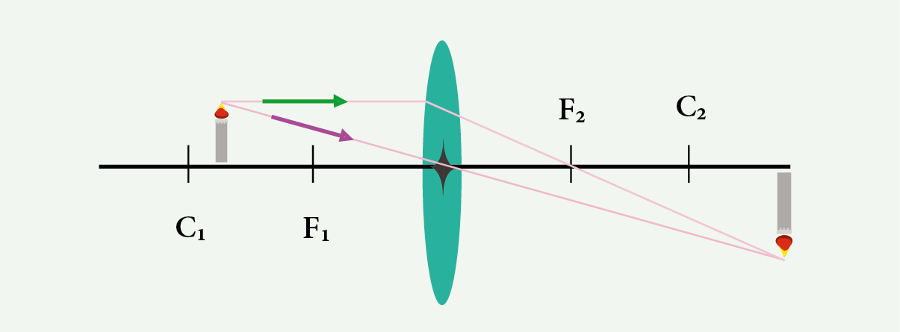

Con esto cerramos los temas de gases, energía, hidráulica y óptica. La física del examen premia a quien domina las fórmulas y sabe aplicarlas: memoriza cada ecuación con sus unidades y practica los problemas paso a paso hasta que el procedimiento te salga natural.

Continúa tu preparación con la siguiente parte de la serie.
