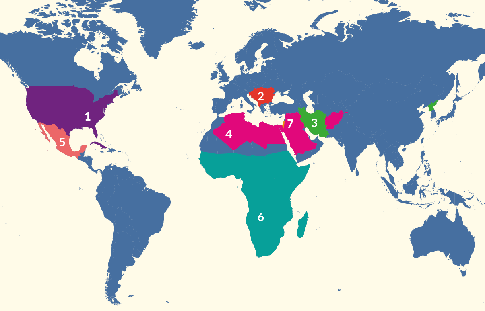
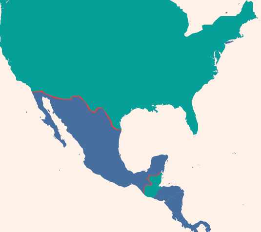

# Guía CENEVAL EXANI-II: Geografía (Parte 11 de 12)

_Parte 11 de 12 de la serie Guía CENEVAL EXANI-II._

## Geografía humana: el espacio geográfico

### El espacio geográfico

Es un concepto muy utilizado para medir la relación entre la sociedad y el espacio que se desenvuelven. Para hablar del espacio geográfico podemos hablar también del paisaje que, como concepto, se puede estudiar de varias maneras y con varias visiones distintas, por ejemplo: podríamos estudiar el paisaje humano si queremos conocer la relación entre el espacio geográfico de una ciudad y la sociedad, o bien estudiar el paisaje industrial, si los que nos interesa es entender de qué manera están estructuradas las industrias en un espacio geográfico determinado.

### Las regiones naturales

Son regiones del planeta delimitadas de manera natural debido a diversos criterios geográficos. Las principales son:

- Orográficas: Ésta divide a las zonas geográficas de acuerdo con el relieve predominante, por ejemplo: montañas, llanuras, mesetas o colinas.
- Climáticas: Como lo dice su nombre, divide a las zonas geográficas de acuerdo con el clima predominante, por ejemplo: secos, templados, de nieve, lluviosos, tropicales y polares.
- Hidrográficas: Divide a las zonas geográficas de acuerdo con la presencia de lluvias y agua durante el año, incluye regiones delimitadas, por ríos, mares lagos y cualquier tipo de agua existente en una región.

Distribución de las regiones naturales

Las regiones naturales se distribuyen en el mundo de diferente manera, dando diferentes tonos al panorama geográfico mundial. De hecho, México cuenta con una única e increíble diversidad en sus regiones naturales. Las principales son las siguientes: la selva seca y húmeda, los matorrales y pastizales, los bosques y las regiones marinas.

### Los recursos naturales

En cada región del mundo existen distintos recursos naturales que pueden ser renovables o no renovables. Los recursos renovables son aquellos que una vez utilizados pueden regenerarse ya sea de manera natural o con intervención humana. Para que un recurso sea renovable debe ser sustentable, es decir, que se pueda regenerar con mayor velocidad de la que es utilizado. Por ejemplo: los alimentos orgánicos, la madera y el cuero. Además, es común que los recursos renovables sean utilizados por la agricultura, la ganadería y para el desarrollo de las materias primas en diferentes industrias.

Por otro lado, los recursos no renovables son aquellos que una vez utilizados no pueden regenerarse y por lo tanto existe un número limitado de éstos en el planeta. Los derivados del petróleo y minerales, así como el gas, son los principales ejemplos de estos recursos. Por lo regular son utilizados en industrias de manufactura, como la construcción, la producción de plástico y la industria automotriz.

La alteración de los recursos naturales

Al entrar en contacto con el ser humano los recursos naturales se ven afectados por su uso y explotación. La manera en que los seres humanos se han aprovechado del medio ambiente en los últimos años no ha sido positiva y, de hecho, ha creado varios conflictos ecológicos como la pérdida de biodiversidad, el calentamiento global derivado de las emisiones de gases del efecto invernadero a la atmósfera, el uso irracional de recursos y la falta de planeación en cuanto al tiempo de regeneración de estos y la erosión o desprendimiento de la capa superior del suelo.

### Zonas de riesgo y deterioro

Zonas de riesgo y fenómenos meteorológicos

Existen en el planeta zonas de riesgo, es decir partes que han sido mayormente afectadas debido a fenómenos naturales. A continuación, te hablaremos de los ciclones y la marea negra como fenómenos naturales que suelen afectar a poblaciones y zonas localizadas cerca de las costas.

Marea negra

Es un fenómeno causado por los seres humanos cuando, al transportar combustibles fósiles sobre los océanos, ocurre un derrame accidental sobre el agua que es extremadamente dañino para la fauna que existe en los océanos, ya que destruye la armonía del ecosistema marino y afecta a los peces, mamíferos y aves marinas.

Las zonas geográficas con mayor riesgo de un escenario de marea negra se encuentran en latitudes más alejadas del Ecuador, por ejemplo en las zonas de tundra y taiga, comunes en los polos, en donde los procesos de degradación son mucho más lentos.

En ocasiones, las plataformas de extracción tanto en tierra como en aguas profundas pueden derramar el petróleo causando considerables daños.

Ciclones

Los ciclones son conjuntos masivos de nubes que se agrupan en las zonas de la tierra donde la presión atmosférica es baja, éstos provocan fuertes lluvias y vientos en las regiones que se desarrollan. En general nacen en el océano y se mueven hacia las zonas costeras. Existen dos tipos principales de ciclones: los ciclones de latitud media y los ciclones tropicales. Explicaremos en qué consiste cada uno.

- Los ciclones de latitud media se forman debido al choque entre los vientos templados del Oeste y los vientos polares. Por su ubicación no suelen generar peligro a los seres humanos.
- Se le conoce como ciclones tropicales a los que se forman en latitudes entre 23 y 27 grados; sin embargo, pueden presentar peligros para el ser humano ya que su ubicación coincide con asentamientos y ciudades.

Estos últimos se clasifican de acuerdo con la velocidad que poseen: van desde depresión tropical, tormenta tropical y hasta huracán. Se le llama depresión tropical a los ciclones que se mueven a menos de 60 kilómetros por hora, mientras que la tormenta tropical va de 64 a 118 kilómetros por hora. Finalmente, se le llama huracán a los ciclones que alcanzan velocidades de hasta 118 kilómetros por hora. En México, las principales zonas de riesgo se encuentran en los estados que colindan tanto con el Océano Pacífico como con el Océano Atlántico.

Deterioro ambiental

Distintas consecuencias negativas en el medio ambiente, gracias al desarrollo industrial y al incremento de la población, han alterado la composición química del aire generando contaminación. Además, los recursos naturales no renovables se han ido agotando poco a poco, creando problemas de deterioro ambiental como el cambio climático global, el efecto invernadero y el adelgazamiento de la capa de ozono.

Cambio climático global

Se trata de un cambio en el historial del clima de un área o región, que pueden suceder debido a condiciones naturales o antropogénicas. En contraste, el efecto invernadero es como se le conoce a la acumulación de gases CO2 o clorofluorocarbonos entre la capa de ozono y la Tierra, causando un incremento acelerado en la temperatura del planeta.

El uso de productos que contienen hidrocarburos ha sido prohibido en la mayoría de los países con tal de frenar la contaminación

Si no se detiene el aumento puede afectar a las temperaturas regionales, en un escenario extremo podría provocar el deshielo completo de los polos, provocando inundaciones a lo largo del planeta o el adelgazamiento de la capa de ozono.

El ozono es producto de la acción de la luz solar sobre el oxígeno y sirve para proteger a la vida de la radiación ultravioleta cancerígena procedente del Sol. Actualmente, se encuentra en peligro ya que los líquidos fluorocarbonos, utilizados en muchos productos industriales, son liberados en la atmósfera y al entrar en contacto con las moléculas de ozono las destruyen.

Contaminación, sobreexplotación y desperdicio de agua

Otros de los sistemas naturales que peligra debido a la actividad humana es la hidrósfera del planeta, gracias sobre todo a dos fenómenos particulares: **la contaminación** y **el uso desmedido del agua**.

En primer lugar, la contaminación del agua proviene principalmente de los desechos industriales, en particular, de los plaguicidas y fertilizantes que son conducidos por corrientes marinas alterando la retención de la humedad así como pérdidas en la vegetación y daños a la flora y fauna marina.

Y en segundo lugar, el uso desmedido de agua desalinizada en los hogares, en la industria y en la agricultura que podría significar el agotamiento de ésta en el planeta. Por lo tanto es importante tomar conciencia sobre el uso y ahorrar este líquido en la medida de lo posible.

## Organización política actual del mundo y de México

Las dos Guerras Mundiales y la Guerra Fría transformaron las instituciones políticas del mundo, tanto el desplazamiento de personas como la creación de nuevas naciones y nuevos sistemas políticos llevaron a una transformación del planeta, no sólo en los niveles socioeconómicos sino en los políticoculturales.

### La desintegración y los nuevos países de Europa

Antes de adentrarnos a los cambios que sucedieron en el mundo durante el siglo XX es importante definir qué es un Estado.

La definición de Estado ha cambiado a lo largo del tiempo; sin embargo, en la actualidad entendemos por Estado a todo organismo político soberano en un territorio determinado, así como al conjunto de instituciones de gobierno que lo rigen. Cabe mencionar que todos los Estados poseen un conjunto de instituciones que tienen la autoridad y capacidad para definir las normas que regulan una sociedad, manteniendo la soberanía interna y externa sobre un territorio definido.

Los nuevos países de Europa

Durante el siglo XX surgieron nuevos países en el continente europeo a partir de la caída del muro de Berlín en 1989 y su creación está estrechamente relacionada con la desaparición de la Unión Soviética y la toma del sistema económico capitalista en los países del este de Europa. Los nuevos países surgieron de la desintegración de Yugoslavia, Checoslovaquia y la Unión Soviética.

### Principales zonas de tensión política en el mundo

En la actualidad existen diversas zonas del planeta que se encuentran en un estado de tensión política. Las causas de estos conflictos provienen tanto de rivalidades históricas como territoriales y se han derivado principalmente de la creación de nuevos Estados que se vivió durante el siglo XX.

En su mayoría, la comunidad internacional ha tenido que intervenir mediante organismos como la ONU (Organización de las Naciones Unidas) para intentar mediar los conflictos que en ocasiones han llegado a escalar con rapidez. Mencionemos algunas de ellas:

- Bloqueo económico de Estados Unidos hacia Cuba.
- Guerras balcánicas: Conflictos territoriales derivados de la separación de Yugoslavia. Anteriormente las guerras entre Croacia, Serbia y Bosnia, y la proclamación de independencia de Kosovo de Serbia en 2009.
- Conflicto atómico: Enriquecimiento de Uranio por parte de Irán y Corea del Norte.
- ISIS: Avance de grupos terroristas islamistas en África y el Oriente.
- Guerra contra el narcotráfico en México.
- África Subsahariana: Genocidios, violencia, hambruna y pobreza en el continente africano.
- Oriente Medio: Conflicto territorial entre la Autoridad Nacional Palestina y las fuerzas de ocupación militar del Estado de Israel.

### División política de México: límites y fronteras

México se encuentra ubicado en el continente americano, y es considerado como parte de América del Norte. Mantiene fronteras al norte con Estados Unidos (3,152 km), al sur con Guatemala (956 km) y Belice (193 km), al este con el Océano Atlántico y al Oeste con el Océano Pacífico. Asimismo, se ubica en el Hemisferio Norte y en el Hemisferio Occidental.

El Ecuador divide México en dos zonas térmicas: la zona térmica norte, presenta un clima templado, y la zona térmica sur que presenta un clima tropical.

Su división política consta de 32 entidades federativas. A excepción de la Ciudad de México, que está dividida en 16 delegaciones, los estados tienen su propia capital y están divididos en municipios. Éstos poseen cierta autonomía legislativa, sin embargo, están unidos a la Federación por medio de la Constitución Política de los Estados Unidos Mexicanos (CPEUM), por lo que deben acatar la legislación federal que les concierne.

## Actividades económicas de México

De acuerdo con el Fondo Monetario Internacional, México es la catorceava economía más grande del mundo con un PIB (Producto Interno Bruto) de 1.3 millones de dólares en 2014.

No obstante, la alta desigualdad de la distribución del ingreso que existe en nuestro país dificulta el comparar nuestra calidad de vida con economías como Australia, Corea del Sur o Canadá.

México se encuentra en un proceso fundamental en cuanto a sus características económicas, pues pasó de ser una economía exportadora de materias primas a ser una potencia en la manufactura de bienes simples, por ejemplo textiles. Sin embargo, en las últimas décadas la economía mexicana ha entrado en un proceso de transición para convertirse en una economía exportadora de bienes complejos como automóviles.

### Principales áreas de producción

Producción agropecuaria

Se refiere a los productos que provienen de la tierra y de la actividad ganadera. La producción agropecuaria puede ser: temporal, de acuerdo con el ciclo de las lluvias; de riego, con base en los canales de distribución de agua diseñados por el hombre; intensiva, cuando se lleva a cabo en pequeñas parcelas o grandes terrenos produciendo grandes cantidades con ayuda de tecnologías modernas; o bien, extensiva, cuando se lleva a cabo en grandes terrenos pero utilizando técnicas tradicionales.

Agricultura

En México se cosechan distintos productos que provienen de la tierra en distintas zonas geográficas del país, entre los alimentos que destacan se encuentran el maíz, el chile, el frijol y distintas frutas y legumbres.

Ganadería

La ganadería en México se utiliza principalmente para el consumo; sin embargo, también se utiliza en las actividades de agricultura como instrumento para el campo.

Pesca

México tiene un lugar privilegiado para la actividad pesquera ya que se encuentra ubicado entre el Océano Atlántico y el Océano Pacífico y ha aprovechado los bancos de Baja California y el Golfo de México.

Minería y recursos energéticos

La actividad minera se puede dividir en extracción de minerales metálicos y no metálicos. Los minerales metálicos son oro, plata, cobre, zinc, estaño, mercurio, entre otros. De hecho, la mina con mayor producción de plata del mundo se encuentra en Fresnillo en el estado de Zacatecas.

La distribución de los minerales metálicos en México se da de la siguiente manera: Zacatecas: zinc, plomo, oro y plata; Hidalgo: oro y plata; Michoacán: oro, plata y hierro; Jalisco: oro y plata.

Además, los minerales no metálicos son esenciales para la industria en México. Entre los principales podemos ubicar: uranio, azufre, sal, yeso, fluorita, sílice, caolín, talco y grafito.

Por otra parte, los recursos energéticos son sustancias de la naturaleza de las cuales es posible obtener energía a través de diversos procesos. Algunos ejemplos y su distribución son: petróleo en Tamaulipas, Tabasco, Veracruz y Campeche, y carbonilla en Coahuila.

### Áreas industriales del país

Principales áreas industriales de México

La industria mexicana se ha desarrollado de manera significativa en los últimos años. México ha dejado de ser un país exportador de insumos para convertirse en un país transformador de materias primas en bienes de consumo y su industria es una de las más avanzadas en América Latina.

En México se realizan muchas actividades industriales, desde el ensamblaje de automóviles, fabricación de maquinaria y equipo electrónico, refinerías de petróleo, fundidoras de metal, plantas de empacado, hasta producción de papel y algodón, entre otros.

Las principales áreas industriales del país son:

- Textil en Estado de México, Ciudad de México, Puebla, Nuevo León, Jalisco, Aguascalientes y San Luis Potosí.
- Siderurgia en Michoacán, Coahuila y Nuevo León.
- Petrolera en Tamaulipas y Tabasco.

### Comercio exterior

El comercio exterior en México

El comercio exterior es fundamental en la economía de cualquier país. De acuerdo con las leyes de oferta y demanda, así como las ventajas comparativas de ciertos países para producir algunos bienes y servicios, todos los países exportan los bienes que producen de manera más eficiente e importan aquellos en los cuales son menos eficientes.

México importa maquinaria pesada de Rusia puesto que producirlo en nuestro país sería extremadamente costoso.

De acuerdo con el Banco de México los principales productos de exportación de México son: máquinas y material eléctrico, vehículos terrestres y sus partes, aparatos mecánicos, combustibles, minerales y derivados, perlas, piedras y metales preciosos.

Por otro lado, los principales productos de importación a México son: gasolina, circuitos integrados y partes de monitores, materias plásticas y maquinaria pesada, entre otras.

En cambio, México exporta chiles a Rusia ya que éstos no se cosechan en aquel país debido a su temperatura y calidad de suelo.

### Importación y exportación

La importancia de las vías

La existencia de infraestructura de calidad que permita la comunicación y el movimiento eficaz de las personas y productos a lo largo de un territorio es fundamental para el desarrollo y el crecimiento económico de un país.

En general existen tres medios de comunicación y de transporte: terrestre, marítimo y aéreo. Veamos en qué consiste cada uno de ellos.

- Terrestre: Es útil para transportar mercancías pesadas y pasajeros a bajo costo. En México el transporte terrestre sucede gracias a carreteras y ferrovías, se utiliza en trenes y camiones tanto para el transporte de personas como de productos y materiales para la industria.
- Marítimo: Funciona como principal medio de transporte para el comercio internacional y también se utiliza en menor medida para el transporte turístico. México tiene diferentes puertos, entre los que destacan el puerto de Veracruz, el de Manzanillo, el de Coatzacoalcos y el de Lázaro Cárdenas.
- Aéreo: Es ocupado principalmente para el transporte de personas ya que es muy costoso, y por lo mismo no es eficiente ocuparlo para el transporte de mercancías. Sin embargo, se utiliza como método de envío de alta velocidad para correspondencia y mercancías frágiles.

Con esto cubres la geografía humana, la organización política del mundo y de México, y las actividades económicas del país. Ubica los datos en un mapa mental: regiones naturales, fronteras y zonas industriales son los temas favoritos del examen. ¡Vas muy bien, no te detengas!

Continúa tu preparación con la siguiente parte de la serie.
